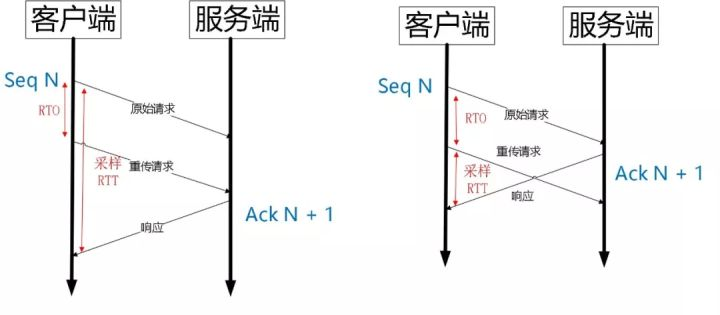
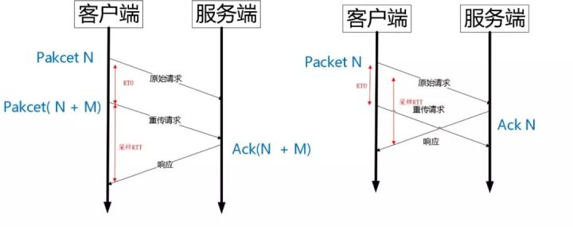

QUIC

  * Quick UDP Internet Connection【快速 UDP 互联网连接】

----

## 优势
相比现在广泛应用的`http2+tcp+tls`协议有如下优势：
  * 减少了 TCP 三次握手及 TLS 握手时间；
  * 改进的拥塞控制；
  * 避免队头阻塞的多路复用；
  * 连接迁移；
  * 前向冗余纠错。

## 使用QUIC的理由
`http2+tcp+tls`协议的问题：  
  * <strong>协议历史悠久导致中间设备僵化。</strong>包括防火墙、`NAT`网关，整流器等出现了一些约定俗成的行为。
  * <strong>依赖于操作系统的实现导致协议本身僵化。</strong>移动端或PC端的操作系统升级具有滞后性，无法快速支持TCP等协议的新特性，如 TCP Fast Open。
  * <strong>建立连接的握手延迟大。</strong>TCP 三次握手导致的 TCP 连接建立的延迟；TLS 完全握手需要至少 2 个 RTT 才能建立，简化握手需要 1 个 RTT 的握手延迟。
  * <strong>队头阻塞。</strong>TCP 使用序列号来标识数据的顺序，数据必须按照顺序处理，如果前面的数据丢失，后面的数据就算到达了也不会通知应用层来处理。另外 TLS 协议层面也有一个队头阻塞，因为 TLS 协议都是按照 record 来处理数据的，如果一个 record 中丢失了数据，也会导致整个 record 无法正确处理。

`QUIC`协议选择了`UDP`，因为`UDP`本身没有连接的概念，不需要三次握手，优化了连接建立的握手延迟，同时在应用程序层面实现了`TCP`的可靠性，`TLS`的安全性和`HTTP2`的并发性，只需要用户端和服务端的应用程序支持`QUIC`协议，完全避开了操作系统和中间设备的限制。

## 核心特性
`QUIC`核心特性连接建立延时低。  
`0RTT`建连可以说是`QUIC`相比`HTTP2`最大的性能优势。【注：这里的`0RTT`指的是零个`RTT(Round-Trip Time)`（来回通信延迟）】  

## 改进的拥塞控制
QUIC协议相对于TCP的改进点：  

**可插拔**  
  * 应用程序层面就能实现不同的拥塞控制算法，不需要操作系统，不需要内核支持。
  * 即使是单个应用程序的不同连接也能支持配置不同的拥塞控制。
  * 应用程序不需要停机和升级就能实现拥塞控制的变更，只需要在服务端修改一下配置，`reload`一下，完全不需要停止服务就能实现拥塞控制的切换。

**单调递增的 Packet Number**  
  * `TCP`为了保证可靠性，使用了基于字节序号的`Sequence Number`及`Ack`来确认消息的有序到达。
  * `QUIC`同样是一个可靠的协议，它使用`Packet Number`代替了`TCP`的`sequence number`，并且每个`Packet Number`都严格递增，也就是说就算`Packet N`丢失了，重传的`Packet N`的`Packet Number`已经不是`N`，而是一个比`N`大的值。而`TCP`呢，重传`segment`的`sequence number`和原始的`segment`的`Sequence Number`保持不变，也正是由于这个特性，引入了`Tcp`重传的歧义问题。

`Tcp`重传歧义性：  
  
如上图所示，超时事件 RTO 发生后，客户端发起重传，然后接收到了 Ack 数据。由于序列号一样，这个 Ack 数据到底是原始请求的响应还是重传请求的响应呢？不好判断。  
如果算成原始请求的响应，但实际上是重传请求的响应（上图左），会导致采样 RTT 变大。如果算成重传请求的响应，但实际上是原始请求的响应，又很容易导致采样 RTT 过小。  

`Quic`重传没有歧义性：  
  
如上图所示，RTO 发生后，根据重传的 Packet Number 就能确定精确的 RTT 计算。如果 Ack 的 Packet Number 是 N+M，就根据重传请求计算采样 RTT。如果 Ack 的 Pakcet Number 是 N，就根据原始请求的时间计算采样 RTT，没有歧义性。  
但是单纯依靠严格递增的 Packet Number 肯定是无法保证数据的顺序性和可靠性。QUIC 又引入了一个 Stream Offset 的概念。  
即一个 Stream 可以经过多个 Packet 传输，Packet Number 严格递增，没有依赖。但是 Packet 里的 Payload 如果是 Stream 的话，就需要依靠 Stream 的 Offset 来保证应用数据的顺序。如错误! 未找到引用源。所示，发送端先后发送了 Pakcet N 和 Pakcet N+1，Stream 的 Offset 分别是 x 和 x+y。  
假设 Packet N 丢失了，发起重传，重传的 Packet Number 是 N+2，但是它的 Stream 的 Offset 依然是 x，这样就算 Packet N + 2 是后到的，依然可以将 Stream x 和 Stream x+y 按照顺序组织起来，交给应用程序处理。  

**不允许 Reneging**  
`Reneging`：就是接收方丢弃已经接收并且上报给`SACK`选项的内容。`TCP`协议不鼓励这种行为，但是协议层面允许这样的行为。主要是考虑到服务器资源有限，比如`Buffer`溢出，内存不够等情况。  

`Reneging`对数据重传会产生很大的干扰。因为`Sack`都已经表明接收到了，但是接收端事实上丢弃了该数据。  

QUIC 在协议层面禁止 Reneging，一个 Packet 只要被 Ack，就认为它一定被正确接收，减少了这种干扰。

**更多的 Ack 块**  
CP 的 Sack 选项能够告诉发送方已经接收到的连续 Segment 的范围，方便发送方进行选择性重传。  
由于 TCP 头部最大只有 60 个字节，标准头部占用了 20 字节，所以 Tcp Option 最大长度只有 40 字节，再加上 Tcp Timestamp option 占用了 10 个字节，所以留给 Sack 选项的只有 30 个字节。  
每一个 Sack Block 的长度是 8 个，加上 Sack Option 头部 2 个字节，也就意味着 Tcp Sack Option 最大只能提供 3 个 Block。  
但是 Quic Ack Frame 可以同时提供 256 个 Ack Block，在丢包率比较高的网络下，更多的 Sack Block 可以提升网络的恢复速度，减少重传量。  

**Ack Delay 时间**  
Tcp 的 Timestamp 选项存在一个问题，它只是回显了发送方的时间戳，但是没有计算接收端接收到 segment 到发送 Ack 该 segment 的时间。这个时间可以简称为 Ack Delay。

**基于 stream 和 connecton 级别的流量控制**  
QUIC 的流量控制类似 HTTP2，即在 Connection 和 Stream 级别提供了两种流量控制。为什么需要两类流量控制呢？主要是因为 QUIC 支持多路复用。  

Stream 可以认为就是一条 HTTP 请求。  
Connection 可以类比一条 TCP 连接。多路复用意味着在一条 Connetion 上会同时存在多条 Stream。既需要对单个 Stream 进行控制，又需要针对所有 Stream 进行总体控制。  
QUIC 实现流量控制的原理比较简单：  

通过 window_update 帧告诉对端自己可以接收的字节数，这样发送方就不会发送超过这个数量的数据。  

通过 BlockFrame 告诉对端由于流量控制被阻塞了，无法发送数据。  

QUIC 的流量控制和 TCP 有点区别，TCP 为了保证可靠性，窗口左边沿向右滑动时的长度取决于已经确认的字节数。如果中间出现丢包，就算接收到了更大序号的 Segment，窗口也无法超过这个序列号。  

但 QUIC 不同，就算此前有些 packet 没有接收到，它的滑动只取决于接收到的最大偏移字节数。  

**没有队头阻塞的多路复用**  
QUIC 的多路复用和 HTTP2 类似。在一条 QUIC 连接上可以并发发送多个 HTTP 请求 (stream)。但是 QUIC 的多路复用相比 HTTP2 有一个很大的优势。  

QUIC 一个连接上的多个 stream 之间没有依赖。这样假如 stream2 丢了一个 udp packet，也只会影响 stream2 的处理。不会影响 stream2 之前及之后的 stream 的处理。  

这也就在很大程度上缓解甚至消除了队头阻塞的影响。  

HTTP2 在一个 TCP 连接上同时发送 4 个 Stream。其中 Stream1 已经正确到达，并被应用层读取。但是 Stream2 的第三个 tcp segment 丢失了，TCP 为了保证数据的可靠性，需要发送端重传第 3 个 segment 才能通知应用层读取接下去的数据，虽然这个时候 Stream3 和 Stream4 的全部数据已经到达了接收端，但都被阻塞住了。  

不仅如此，由于 HTTP2 强制使用 TLS，还存在一个 TLS 协议层面的队头阻塞。  

QUIC 多路复用可能避免上述问题：
  * QUIC 最基本的传输单元是 Packet，不会超过 MTU 的大小，整个加密和认证过程都是基于 Packet 的，不会跨越多个 Packet。这样就能避免 TLS 协议存在的队头阻塞。
  * Stream 之间相互独立，比如 Stream2 丢了一个 Pakcet，不会影响 Stream3 和 Stream4。不存在 TCP 队头阻塞。

当然，并不是所有的 QUIC 数据都不会受到队头阻塞的影响，比如 QUIC 当前也是使用 Hpack 压缩算法，由于算法的限制，丢失一个头部数据时，可能遇到队头阻塞。  

总体来说，QUIC 在传输大量数据时，比如视频，受到队头阻塞的影响很小。  

**加密认证的报文**  
TCP 协议头部没有经过任何加密和认证，所以在传输过程中很容易被中间网络设备篡改，注入和窃听。比如修改序列号、滑动窗口。这些行为有可能是出于性能优化，也有可能是主动攻击。  

但是 QUIC 的 packet 可以说是武装到了牙齿。除了个别报文比如 PUBLIC_RESET 和 CHLO，所有报文头部都是经过认证的，报文 Body 都是经过加密的。  

这样只要对 QUIC 报文任何修改，接收端都能够及时发现，有效地降低了安全风险。  

**连接迁移**  
连接迁移：当其中任何一个元素发生变化时，这条连接依然维持着，能够保持业务逻辑不中断。当然这里面主要关注的是客户端的变化，因为客户端不可控并且网络环境经常发生变化，而服务端的 IP 和端口一般都是固定的。  

QUIC的连接迁移：任何一条 QUIC 连接不再以 IP 及端口四元组标识，而是以一个 64 位的随机数作为 ID 来标识，这样就算 IP 或者端口发生变化时，只要 ID 不变，这条连接依然维持着，上层业务逻辑感知不到变化，不会中断，也就不需要重连。  

**QUIC 还能实现前向冗余纠错，在重要的包比如握手消息发生丢失时，能够根据冗余信息还原出握手消息。**

**QUIC 还能实现证书压缩，减少证书传输量，针对包头进行验证等。**