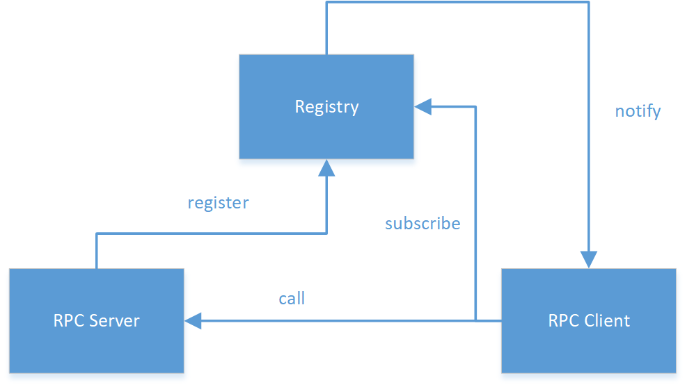
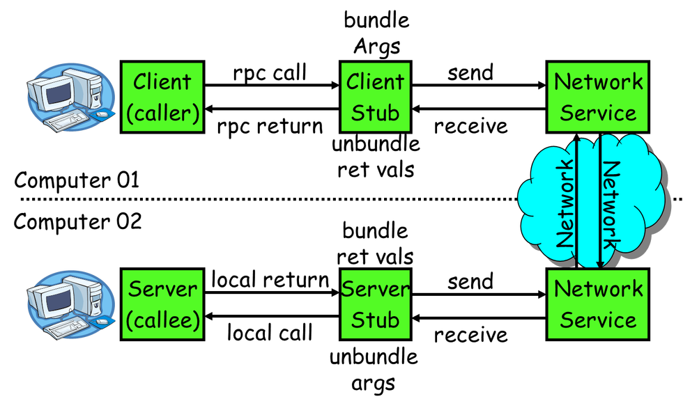

# RPC
RPC(Remote Procedure Call)即远程过程调用，允许一台计算机调用另一台计算机上的程序得到结果，而代码中不需要做额外的编程，就像在本地调用一样。  

----
## RPC框架原理
在RPC框架中主要有三个角色：Provider、Consumer和Registry。如下图所示：  
  
  * Server: 暴露服务的服务提供方。 
  * Client: 调用远程服务的服务消费方。 
  * Registry: 服务注册与发现的注册中心。

## RPC调用流程
基本流程图：  
  
单次完整的RPC调用（同步调用）流程： 
  * (1)服务消费方（`client`）调用以本地调用方式调用服务； 
  * (2)`client stub`接收到调用后负责将方法、参数等组装成能够进行网络传输的消息体； 
  * (3)`client stub`找到服务地址，并将消息发送到服务端； 
  * (4)`server stub`收到消息后进行解码； 
  * (5)`server stub`根据解码结果调用本地的服务； 
  * (6)本地服务执行并将结果返回给`server stub`； 
  * (7)`server stub`将返回结果打包成消息并发送至消费方； 
  * (8)`client stub`接收到消息，并进行解码； 
  * (9)服务消费方得到最终结果。
而RPC框架的目标就是要2~8这些步骤都封装起来，让用户对这些细节透明。