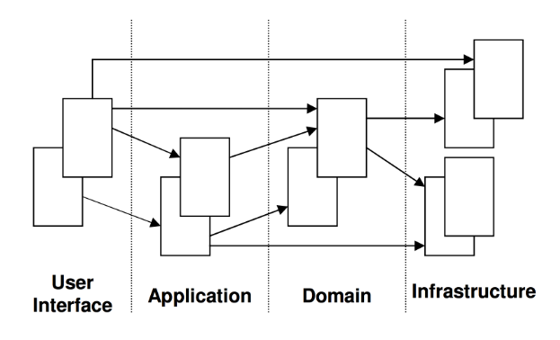
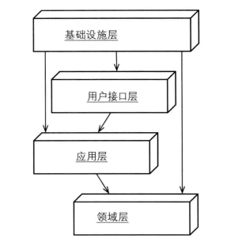

# 领域驱动设计（DDD）

----
## 统一建模语言（UML）
  * 点击[进入UML详情](uml.md)。
  * 可用于描述领域模型。

## 什么是领域驱动设计
在开发前，需进行大量的业务知识梳理，然后到达软件设计层面，最后进行开发。  
而在业务知识梳理过程中，必回形成某个领域知识，而**根据领域知识来驱动软件（程序）设计**，就是**领域驱动设计**。  

## 领域驱动设计的阶段
主要分为两个阶段：  
  * 以一种领域专家、设计人员、开发人员都能理解的通用语言作为相互交流的工具，在交流的过程中发现领域概念，然后将这些概念设计成一个领域模型；
  * 由领域模型驱动软件设计，用代码来实现该领域模型。
故，领域驱动设计的核心是建立正确的领域模型。

## 领域模型的特点
  * 领域模型是对具有某个边界的领域的一个抽象，反映了领域内用户业务需求的本质；领域模型是有边界的，只反应了我们在领域内所关注的部分；
  * 领域模型只反映业务，和任何技术实现无关；领域模型不仅能反映领域中的一些实体概念，如货物，书本，应聘记录，地址，等；还能反映领域中的一些过程概念，如资金转账，等；
  * 领域模型确保了我们的软件的业务逻辑都在一个模型中，都在一个地方；这样对提高软件的可维护性，业务可理解性以及可重用性方面都有很好的帮助；
  * 领域模型能够帮助开发人员相对平滑地将领域知识转化为软件构造；
  * 领域模型贯穿软件分析、设计，以及开发的整个过程；领域专家、设计人员、开发人员通过领域模型进行交流，彼此共享知识与信息；因为大家面向的都是同一个模型，所以可以防止需求走样，可以让软件设计开发人员做出来的软件真正满足需求；
  * 要建立正确的领域模型并不简单，需要领域专家、设计、开发人员积极沟通共同努力，然后才能使大家对领域的认识不断深入，从而不断细化和完善领域模型；
  * 为了让领域模型看的见，我们需要用一些方法来表示它；图是表达领域模型最常用的方式，但不是唯一的表达方式，代码或文字描述也能表达领域模型；
  * 领域模型是整个软件的核心，是软件中最有价值和最具竞争力的部分；设计足够精良且符合业务需求的领域模型能够更快速的响应需求变化。

## 领域建模的思考角度
  * 不以用户为绝对中心，而应从一个客观的角度，根据用户需求挖掘出领域内的相关事物，思考这些事物的本质关联及其变化规律作为出发点去思考问题。
  * 领域建模是建立虚拟模型让我们现实的人使用，而不是建立虚拟空间，去模仿现实。

## DDD的层架构（Layered Architecture）
  

### User Interface【用户界面/展现层】
负责向用户展现信息，并且会解析用户行为。即：
  * 请求应用层以获取用户所需要展现的数据；
  * 发送命令给应用层要求其执行某个用户命令。

### Application Layer【应用层】
无任何的业务逻辑代码，定义软件要完成的所有任务。对外为展现层提供各种应用功能（包括查询或命令），对内调用领域层（领域对象或领域服务）完成各种业务逻辑，应用层不包含业务逻辑。

### Domain Layer【领域层】
包含有关领域的信息，是业务的核心，领域模型的状态都直接或间接（持久化至数据库）存储在这一层。

### Infrastructure Layer【基础设施层】
本层为其他层提供通用的技术能力；提供了层间的通信；为领域层实现持久化机制；总之，基础设施层可以通过架构和框架来支持其他层的技术需求。

### 扩展
MVC模式就是一种分层架构，我们尽可能去设计每一层，使其保持高度内聚性，让它们只对下层进行依赖，体现了高内聚低耦合的思想。  
用户界面层我们可以理解成web层的Controller，应用层和业务无关，它负责协调领域层进行工作，领域层是DDD的业务核心，包含领域模型和领域服务，领域层的重点放在如何表达领域模型上，无需考虑显示和存储问题，基础实施层是最底层，提供基础的接口和实现，领域层和应用服务层通过基础实施层提供的接口实现类如持久化、发送消息等功能。  

#### 改进DDD分层架构和DIP依赖倒置原则
**DIP依赖倒置原则**：高层模块不应该依赖于低层模块，两者都应该依赖于抽象，抽象不应该依赖于细节，细节应该依赖于抽象。  
  
由上图可知，基础实施层位于其他所有层的上方，接口定义在其它层，基础实施实现这些接口。  
依赖原则的定义在DDD设计中可以改述为：领域层等其他层不应该依赖于基础实施层，两者都应该依赖于抽象，具体落地的时候，这些抽象的接口定义放在了领域层等下方层中。  
这也就是意味着一个重要的落地指导原则： 所有依赖基础实施实现的抽象接口，都应该定义在领域层或应用层中。  
这种分层结构更加地高内聚低耦合。每一层只依赖于抽象，因为具体的实现在基础实施层，无需关心。只要抽象不变，就无需改动那一层，实现如果需要改变，只需要修改基础实施层就可以了。  

## DDD的模型关系图（Model-Driven Design）
  
**对象的关联的设计可以遵循如下的一些原则**：  
  * 关联尽量少，对象之间的复杂的关联容易形成对象的关系网，这样对于我们理解和维护单个对象很不利，同时也很难划分对象与对象之间的边界；另外，同时减少关联有助于简化对象之间的遍历；
  * 对多的关联也许在业务上是很自然的，通常我们会用一个集合来表示1对多的关系。但我们往往也需要考虑到性能问题，尤其是当集合内元素非常多的时候，此时往往需要通过单独查询来获取关联的集合信息；
  * 关联尽量保持单向的关联；
  * 在建立关联时，我们需要深入去挖掘是否存在关联的限制条件，如果存在，那么最好把这个限制条件加到这个关联上；往往这样的限制条件能将关联化繁为简，即可以将多对多简化为1对多，或将1对多简化为1对1。

### 实体（Entity）
实体就是领域中需要**唯一标识**的领域概念。

### 值对象（Value Object）
相当于没有唯一标识符的实体。  
值对象在判断是否是同一个对象时是通过它们的所有属性是否相同，如果相同则认为是同一个值对象；而我们在区分是否是同一个实体时，只看实体的唯一标识是否相同，而不管实体的属性是否相同；值对象另外一个明显的特征是不可变，即所有属性都是只读的。因为属性是只读的，所以可以被安全的共享；当共享值对象时，一般有复制和共享两种做法，具体采用哪种做法还要根据实际情况而定。  

### 服务（Services）
本质上就是一些操作，一些动作，而不是事物。这些操作或动作往往会涉及到多个领域对象，并且需要协调这些领域对象共同完成这个操作或动作。  
**一般的领域对象都是有状态和行为的，而领域服务没有状态只有行为。**  
**服务具有以下特点**：
  * 服务中体现的行为一定是不属于任何实体和值对象的，但它属于领域模型的范围内；
  * 服务的行为一定涉及其他多个对象；
  * 服务的操作是无状态的。
  
领域服务还有一个很重要的功能就是可以避免领域逻辑泄露到应用层。因为如果没有领域服务，那么应用层会直接调用领域对象完成本该是属于领域服务该做的操作，这样一来，领域层可能会把一部分领域知识泄露到应用层。  
因为应用层需要了解每个领域对象的业务功能，具有哪些信息，以及它可能会与哪些其他领域对象交互，怎么交互等一系列领域知识。因此，引入领域服务可以有效的防治领域层的逻辑泄露到应用层。  
  
**软件中一般有三种服务：应用层服务、领域层服务、基础层服务。**

#### 应用层服务
  * 获取输入（如一个XML请求）；
  * 发送消息给领域层服务，要求其实现业务逻辑；
  * 领域层服务处理成功，则调用基础层服务发送逻辑。

#### 领域层服务
  * 获取源帐号和目标帐号，分别通知源帐号和目标帐号进行哪种操作；
  * 提供返回结果给应用层。

#### 基础层服务
  * 按照应用层的请求，执行相应逻辑。

### 模块(Moudles)
模块应当有对外的统一接口供其他模块调用，比如有三个对象在模块a中，那么模块b不应该直接操作这三个对象，而是操作暴露的接口。模块的命名也很有讲究，最好能够深层次反映领域模型。  

### 聚合及聚合根（Aggregate，Aggregate Root）
聚合，它通过定义对象之间清晰的所属关系和边界来实现领域模型的内聚，并避免了错综复杂的难以维护的对象关系网的形成。聚合定义了一组具有内聚关系的相关对象的集合，我们把聚合看作是一个修改数据的单元。  

#### 聚合的特点
  * 每个聚合有一个根和一个边界，边界定义了一个聚合内部有哪些实体或值对象，根是聚合内的某个实体；
  * 聚合内部的对象之间可以相互引用，但是聚合外部如果要访问聚合内部的对象时，必须通过聚合根开始导航，绝对不能绕过聚合根直接访问聚合内的对象，也就是说聚合根是外部可以保持 对它的引用的唯一元素；
  * 聚合内除根以外的其他实体的唯一标识都是本地标识，也就是只要在聚合内部保持唯一即可，因为它们总是从属于这个聚合的；
  * 聚合根负责与外部其他对象打交道并维护自己内部的业务规则；
  * 基于聚合的以上概念，我们可以推论出从数据库查询时的单元也是以聚合为一个单元，也就是说我们不能直接查询聚合内部的某个非根的对象；
  * 聚合内部的对象可以保持对其他聚合根的引用；
  * 删除一个聚合根时必须同时删除该聚合内的所有相关对象，因为他们都同属于一个聚合，是一个完整的概念。
  
#### 怎样算是聚合
从业务的角度深入分析哪些对象它们的关系是内聚的，即我们会把他们看成是一个整体来考虑的；然后这些对象我们就可以把它们放在一个聚合内。  
所谓关系是内聚的，是指这些对象之间必须保持一个固定规则，固定规则是指在数据变化时必须保持不变的一致性规则。当我们在修改一个聚合时，我们必须在事务级别确保整个聚合内的所有对象满足这个固定规则。  
**聚合尽量不要太大，否则即便能够做到在事务级别保持聚合的业务规则完整性，也可能会带来一定的性能问题。**  

#### 怎样算是聚合根
如果一个聚合只有一个实体，那么这个实体就是聚合根；如果有多个实体，那么我们可以思考聚合内哪个对象有独立存在的意义并且可以和外部直接进行交互。  

### 工厂(Factories)
工厂将创建对象的细节封装起来，巧妙的实现了依赖反转。当然对聚合也适用（当建立了聚合根时，其他对象可以自动创建）。  
  
工厂在创建一个复杂的领域对象时，通常会知道该满足什么业务规则（它知道先怎样实例化一个对象，然后在对这个对象做哪些初始化操作，这些知识就是创建对象的细节），如果传递进来的参数符合创建对象的业务规则，则可以顺利创建相应的对象；但是如果由于参数无效等原因不能创建出期望的对象时，应该抛出一个异常，以确保不会创建出一个错误的对象。  
  
**以下场景不需要工厂**：  
  * 构造器很简单
  * 构造对象时不依赖于其他对象的创建
  * 用策略模式就可以解决

### 仓库(Repository)
  * 仓库封装了获取对象的逻辑，领域对象无须和底层数据库交互，它只需要从仓库中获取对象即可。仓库可以存储对象的引用，当一个对象被创建后，它可能会被存储到仓库中，那么下次就可以从仓库取。如果用户请求的数据没在仓库中，则会从数据库里取，这就减少了底层交互的次数。
  * 仓库里面存放的对象一定是聚合，原因是之前提到的领域模型中是以聚合的概念去划分边界的；聚合是我们更新对象的一个边界，事实上我们把整个聚合看成是一个整体概念，要么一起被取出来，要么一起被删除。我们永远不会单独对某个聚合内的子对象进行单独查询或做更新操作。**因此，我们只对聚合设计仓库。**
  * 仓库还有一个重要的特征就是分为仓库定义部分和仓库实现部分，在领域模型中我们定义仓库的接口，而在基础设施层实现具体的仓库。（通过接口来隔离封装变化）
  * 仓库一般不负责事务处理。一般事务处理会交给工作单元（Unit Of Work）。
  * 仓库在设计查询接口时，可能还会用到规格模式（Specification Pattern），（如，LINQ、DLINQ查询）。一般会根据项目中查询的灵活度要求来选择适合的仓库查询接口设计。通常情况下只需要定义简单明了的具有固定查询参数的查询接口就可以了。只有是在查询条件是动态指定的情况下才可能需要用到Specification等模式。

### 工作单元（Unit Of Work）
实现方法有：  
  * 基于快照的实现，即领域对象被取出来后，会先保存一个备份的对象，然后当在做持久化操作时，将最新的对象的状态和备份的对象的状态进行比较，如果不相同，则认为有做过修改，然后进行持久化；这种设计的好处是对象不用告诉工作单元自己的状态修改了，而缺点也是显而易见的，那就是性能可能会低，备份对象以及比较对象的状态是否有修改的过程在当对象本身很复杂的时候，往往是一个比较耗时的步骤，而且要真正实现对象的深拷贝以及判断属性是否修改还是比较困难的；
  * 不基于快照，而是仓储的相关更新或新增或删除接口被调用时，仓储通知工作单元某个对象被新增了或更新了或删除了。这样工作单元在做数据持久化时也同样可以知道需要持久化哪些对象了；这种方法理论上不需要ORM框架的支持，对领域模型也没有任何倾入性，同时也很好的支持了工作单元的模式。对于不想用高级ORM框架的朋友来说，这种方法挺好；
  * 不基于快照，也不用仓储告诉工作单元数据更改了。而是采用AOP的思想，采用透明代理的方式进行一个拦截。在NHibernate中，我们的属性通常要被声明为virtual的，一个原因就是NHibernate会生成一个透明代理，用于拦截对象的属性被修改时，自动通知工作单元对象的状态被更新了。这样工作单元也同样知道需要持久化哪些对象了。这种方法对领域模型的倾入性不大，并且能很好的支持工作单元模式，如果用NHibernate作为ORM，这种方法用的比较多；
  * 一般是微软用的方法，那就是让领域对象实现.NET框架中的INotifiyPropertyChanged接口，然后在每个属性的set方法的最后一行调用OnPropertyChanged的方法从而显示地通知别人自己的状态修改了。这种方法相对来说对领域模型的倾入性最强。

## 设计领域模型的一般步骤
  * (1) 根据需求建立一个初步的领域模型，识别出一些明显的领域概念以及它们的关联，关联可以暂时没有方向但需要有（1：1，1：N，M：N）这些关系；可以用文字精确的没有歧义的描述出每个领域概念的涵义以及包含的主要信息；
  * (2) 分析主要的软件应用程序功能，识别出主要的应用层的类；这样有助于及早发现哪些是应用层的职责，哪些是领域层的职责；
  * (3) 进一步分析领域模型，识别出哪些是实体，哪些是值对象，哪些是领域服务；
  * (4) 分析关联，通过对业务的更深入分析以及各种软件设计原则及性能方面的权衡，明确关联的方向或者去掉一些不需要的关联；
  * (5) 找出聚合边界及聚合根，这是一件很有难度的事情；因为你在分析的过程中往往会碰到很多模棱两可的难以清晰判断的选择问题，所以，需要我们平时一些分析经验的积累才能找出正确的聚合根；
  * (6) 为聚合根配备仓储，一般情况下是为一个聚合分配一个仓储，此时只要设计好仓储的接口即可；
  * (7) 走查场景，确定我们设计的领域模型能够有效地解决业务需求；
  * (8) 考虑如何创建领域实体或值对象，是通过工厂还是直接通过构造函数；
  * (9) 停下来重构模型。寻找模型中觉得有些疑问或者是蹩脚的地方，比如思考一些对象应该通过关联导航得到还是应该从仓储获取？聚合设计的是否正确？考虑模型的性能，等等；  
  
**领域建模是一个不断重构，持续完善模型的过程，大家会在讨论中将变化的部分反映到模型中，从而是模型不断细化并朝正确的方向走。领域建模是领域专家、设计人员、开发人员之间沟通交流的过程，是大家工作和思考问题的基础。**

### 领域层与其他层交互
#### 对于会影响领域层中领域对象状态的应用层功能
一般应用层会先启动一个工作单元，然后：
  * 对于修改领域对象的情况，通过仓储获取领域对象，调用领域对象的相关业务方法以完成业务逻辑处理；
  * 对于新增领域对象的情况，通过构造函数或工厂创建出领域对象，如果需要还可以继续对该新创建的领域对象做一些操作，然后把该新创建的领域对象添加到仓储中；
  * 对于删除领域对象的情况，可以先把领域对象从仓储中取出来，然后将其从仓储中删除，也可以直接传递一个要删除的领域对象的唯一标识给仓储通知其移除该唯一标识对应领域对象；
  * 如果一个业务逻辑涉及到多个领域对象，则调用领域层中的相关领域服务完成操作；

注意，以上所说的所有领域对象都是指聚合根，另外在应用层需要获取仓储接口以及领域服务接口时，都可以通过IOC容器获取。  
最后通知工作单元提交事务从而将所有相关的领域对象的状态以事务的方式持久化到数据库。

#### 对于不会影响领域层中领域对象状态的查询功能
可以直接通过仓储查询出所需要的数据。  
但一般领域层中的仓储提供的查询功能也许不能满足界面显示的需要，则可能需要多次调用不同的仓储才能获取所需要显示的数据；其实针对这种查询的情况，我在后面会讲到可以直接通过**CQRS**的架构来实现。即对于查询，我们可以在应用层不调用领域层的任何东西，而是直接通过某个其他的用另外的技术架构实现的查询引擎来完成查询，比如直接通过构造参数化SQL的方式从数据库一个表或多个表中查询出任何想要显示的数据。这样不仅性能高，也可以减轻领域层的负担。  
领域模型不太适合为应用层提供各种查询服务，因为往往界面上要显示的数据是很多对象的组合信息，是一种非对象概念的信息，就像报表。

## 领域驱动设计的其他主题
  * 模型上下文、上下文映射、上下文共享；
  * 如何将分析模式和设计模式运用到DDD中；
  * 一些关于柔性设计的技巧；
  * 如果保持模型完整性，以及持续集成方面的知识；
  * 如何精炼模型，识别核心模型以及通用子领域；