# 统一建模语言（UML）
  * 原文参考[什么是统一建模语言（UML）？](https://www.visual-paradigm.com/cn/guide/uml-unified-modeling-language/what-is-uml/)

----
## 什么是UML
是一种由一整套图表组成的标准化建模语言。  
UML用于帮助系统开发人员阐明，展示，构建和记录软件系统的产出。  
UML主要使用图形符号来表示软件项目的设计，使用UML可以帮助项目团队沟通、探索潜在的设计和验证软件的架构设计。  

## UML 的主要目的
  * 为用户提供现成的、有表现力的可视化建模语言，以便他们开发和交换有意义的模型。
  * 为核心概念提供可扩展性 (Extensibility) 和特殊化 (Specialization) 机制。
  * 独立于特定的编程语言和开发过程。
  * 为了解建模语言提供一个正式的基础。
  * 鼓励面向对象工具市场的发展。
  * 支持更高层次的开发概念，如协作，框架，模式和组件。
  * 整合最佳的工作方法 (Best Practices)。

## UML 图表
UML 图表可大致分为结构性图表和行为性图表两种。  

结构性图表显示了系统在不同抽象层次和实现层次上的静态结构以及它们之间的相互关系。结构性图表中的元素表示系统中具意义的概念，可能包括抽象的、现实的和實作的概念。结构性图表有七种类型：  
  * 类图 (Class Diagram)
  * 组件图 (Component Diagram)
  * 部署图 (Deployment Diagram)
  * 对象图 (Object Diagram)
  * 包图 (Package Diagram)
  * 复合结构图 (Composite Structure Diagram)
  * 轮廓图 (Profile Diagram)

行为性图表显示了系统中对象的动态行为 ，可用以表达系统随时间的变化。行为性图表有七种类型：  
  * 用例图 (Use Case Diagram)
  * 活动图 (Activity Diagram)
  * 状态机图 (State Machine Diagram)
  * 序列图 (Sequence Diagram)
  * 通訊图 (Communication Diagram)
  * 交互概述图 (Interaction Overview Diagram)
  * 时序图 (Timing Diagram)

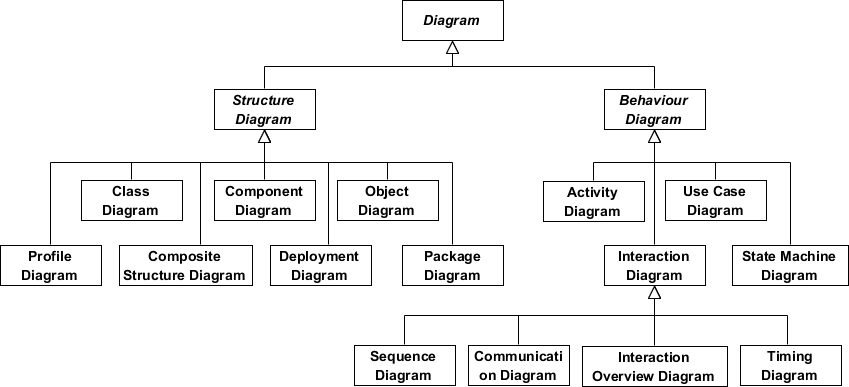  

### 类图
类图是一切面向对象方法的核心建模工具。该图描述了系统中对象的类型以及它们之间存在的各种静态关系。  
**类图有三种主要的关系**：  
  * 关联 - 代表类型之间的关系（一个人为公司工作，一间公司有多个办事处）。
  * 继承 - 专为将实例关系图 (ERD) 应用于面向对象设计而设的一种关系。它在面向对象设计中的继承概念互相呼应。
  * 聚合 - 面向对象设计中的一种对象组合 的形式。

**类图的目的**：  
  * 显示系统中分类器的静态结构
  * 图为UML规定的其他结构图提供了基本的表示法
  * 对开发人员和其他团队成员也有帮助
  * 业务分析师可以使用类图从业务角度为系统建模

**示例**  
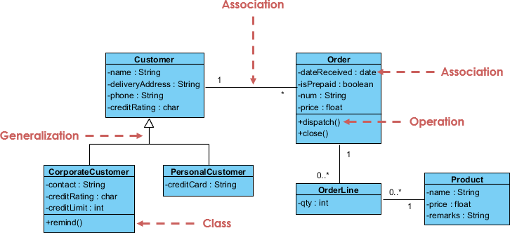  

### 组件图
组件图描绘了组件如何连接在一起以形成更大的组件或软件系统。它展示了软件组件的体系结构以及它们之间的依赖关系。那些软件组件包括运行时组件，可执行组件和源代码组件。  

**示例**  
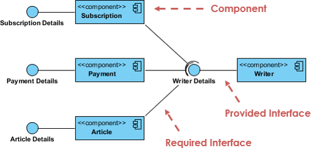  

### 部署图
是一个结构性图表，显示了软件产出于系统架构内如何被分发至指定目标。产出即现实生活中各种通过开发过程产生的产品。部署图对运行时配置进行建模，并可视化应用程序中 产出的分布。在大多数情况下，它表达了硬件配置以及和软件组件之间的关系。  

**示例**  
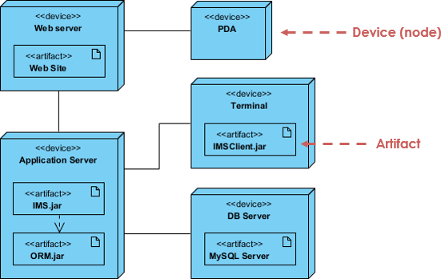  

### 对象图
对象图是实例 (Instance) 的表达，包括对象和数据值。静态的对象图是类图的一个实例，它是系统在某个时间点的详细状态的快照，不同之处在于类图表示了一个由类及其关系组成的抽象模型，而对象图则表达了特定时刻的实例。对象图的使用是相当有限的，它常被用作展示数据结构例子。  

**类图与对象图的关系**  
UML 对象图可以被看作是如何在特定状态下使用类（在 UML 类图中绘制）的表达。  
  
**类图示例**  
以下类图示例代表两个类 - 用户和附件。用户可以上传多个附件，因此这两个类都以一个关联连接，在附件方侧以0 .. *作为多重性。  
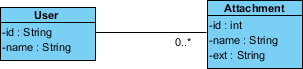  

**对象图示例**  
下面的对象图示例显示了當Peter （即用户）上载两个附件时 User 和 Attachment 类的对象实例如何。因上传两个附件，所以有两个附件对象。  
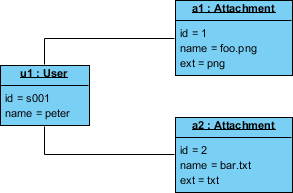  

### 包图
包图是 UML 一種用以显示包和包之间的依赖关系的结构性图表。模型图能显示系统的不同视图，例如，多层应用程序。  

**示例**  
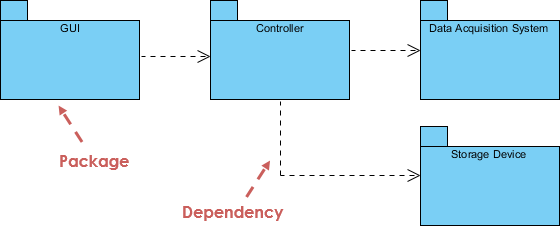  

### 组合结构图
与类图相似，是一种用于微观视角的系统建模组件图，而不是整个类的组成部分。它是一种静态结构图，显示了一个类的内部结构和这个结构所实现的协作。  
组合结构图可以包括内部零件，零件通过其互相交互或通过端口与外界交互。复合结构是一组相互关联的元素，它们在运行时进行协作以达到某种目的。每个元素在协作中都有一些定义的角色。  

**示例**  
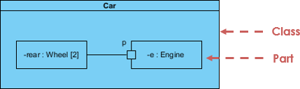  

### 轮廓图
轮廓图 使您能够创建特定于域和平台的原型，并定义它们之间的关系。  

**示例**  
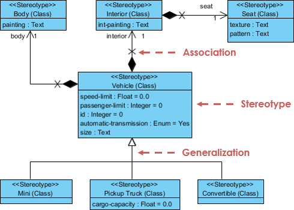  

### 用例图
用例模型从用例的角度描述系统的功能需求，它是系统预期功能（用例）及其环境（参与者）的模型。用例使您能够将系统需要与系统如何满足这些需求相关联。  

**示例**  
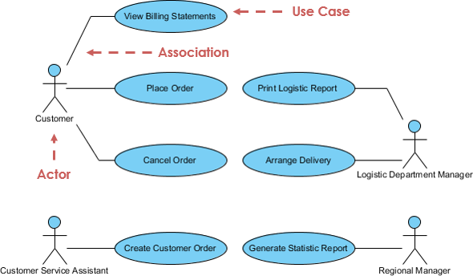  

### 活动图
活动图用于展示工作流程，它支持选择 (Choice)，迭代 (Iteration)和并发 (Concurrency)。活动图描述了目标系统的控制流程，比如探索复杂的业务规则和操作，描述用例和业务流程。在统一建模语言中，活动图旨在模拟计算和组织过程（即工作流程）。  

**示例**  
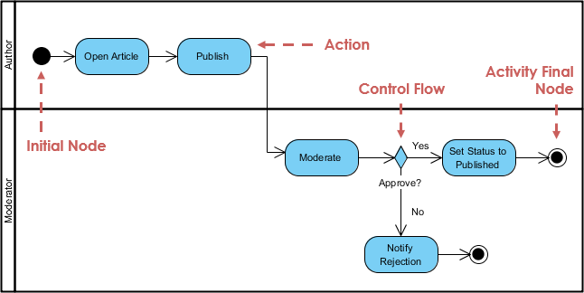  

### 状态机图
状态图是 UML 中用来描述基于 David Harel 的状态图概念的系统行为的一种图表。状态图描绘允许的状态和转换以及影响这些转换的事件，它有助于可视化对象的整个生命周期，从而更好地理解以状态主導 (State-based) 的系统。  

**示例**  
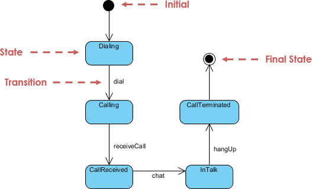  

### 序列图
序列图根据时间序列展示对象如何进行协作。它展示了在用例的特定场景中，对象如何与其他对象交互。凭借先进的可视化建模功能，您只需点击几下即可创建复杂的顺序图。另外，Visual Paradigm 可以根据用例描述中定义的事件流生成序列图。  

**示例**  
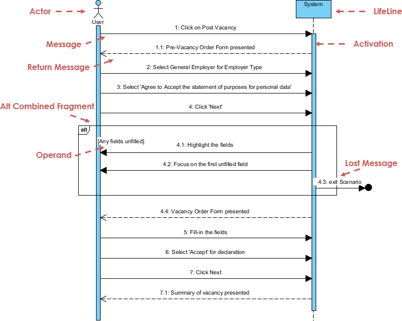  

### 通訊图
与序列图类似，通訊图也用于模拟用例的动态行为。与序列图相比，通訊图更侧重于显示对象的协作而不是时间顺序。它们实际上在语义上是等价的，因此一些建模工具（如 Visual Paradigm）允许您从一个模型生成一个到另一个。  

**示例**  
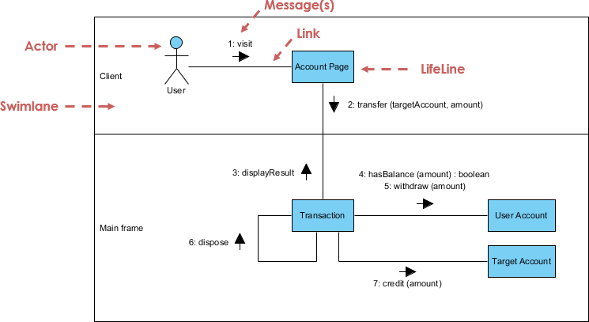  

### 交互概览图
交互概述图侧重于交互控制流程的概述，它是活动图的变体，其中节点是交互 (Interactions) 或交互发生 (Interaction Occurrences)。交互概述图描述了隐藏於消息 (Message) 和生命线 (Lifeline) 間的交互。  

**示例**  
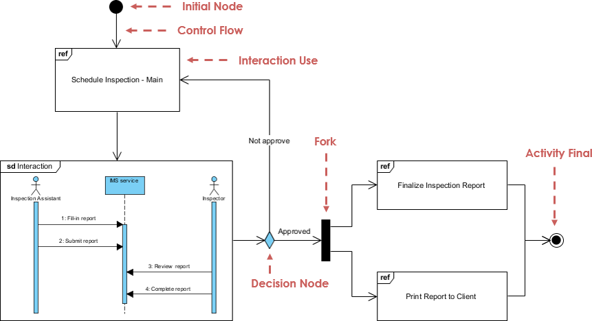  

### 时序图
时序图显示了既定时间内对象的行为。时序图是序列图的一种特殊形式，它俩之间的差异是轴反转，时间从左到右增加，生命线显示在垂直排列的独立隔间中。  

**示例**  
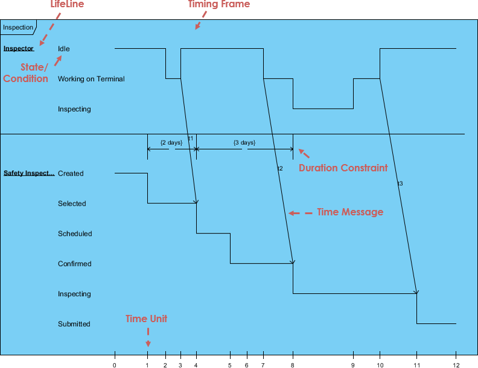  

## UML词汇表和术语
  * **抽象类**：一个永远不会被实例化的类。这个类的一个实例永远不会存在。
  * **Actor（演员）**：发起系统参与的事件的对象或人物。
  * **活动**：活动图中的步骤或行动。表示系统或演员采取的行动。
  * **活动图**：一个美化的流程图，显示了流程中的步骤和决定以及并行操作，如算法或业务流程。
  * **聚合**：是另一类的一部分。图中的包含类旁边有一个空心钻石。
  * **工件**：描述设计过程中某个步骤输出的文档。描述是图形，文字或其他组合。
  * **关联**：一个模型的两个元素之间的联系。这可能代表代码中的成员变量，或者人员记录与其所代表的人之间的关联，或者两类工作人员之间的关系，或者任何类似的关系。默认情况下，一个关联中的两个元素是相等的，并且通过该关联知道对方。一个协会也可以是一个可导航的协会，这意味着协会的来源端知道目标端，但反之亦然。
  * **关联类**：表示两个其他类之间的关联信息的类。
  * **属性**：可用于引用其他对象或保存对象状态信息的对象的特征。
  * **基类**：定义由子类通过泛化关系继承的属性和操作的类。
  * **分支**：活动图中的决策点。分支出现多个转变，每个都有一个保护条件。当控制到达分支时，恰好一个保护条件必须为真; 并且控制遵循相应的转换。
  * **类**：类似对象的类别，全部由相同的属性和操作描述，并且所有的赋值兼容。
  * **类图**：显示系统类和它们之间的关系。
  * **分类器**：具有属性和操作的UML元素。具体来说，Actor，Classes和Interfaces。
  * **协作**：通信图中两个对象之间的关系，指示消息可以在对象之间来回传递。
  * **通信图**：显示如何在强调对象角色的同时完成操作的图表。
  * **组件**：系统中可部署的代码单元。
  * **组件图**：显示各种组件和接口之间关系的图表。
  * **概念**：要包含在域模型中的名词或抽象概念。
  * **构建阶段**：Rational统一过程的第三阶段，在这个阶段中，正在构建的系统中内置了多个功能迭代。这是主要工作完成的地方。
  * **依赖关系**：指示一个分类器的关系知道另一个分类器的属性和操作，但不直接连接到第二个分类器的任何实例。
  * **部署图**：显示各种处理器之间关系的图表。
  * **域**：系统所涉及的宇宙的一部分。
  * **精化阶段**：Rational统一过程的第二阶段，允许额外的项目计划，包括构建阶段的迭代。
  * **元素**：出现在模型中的任何项目。
  * **封装**：对象中的数据是私有的。
  * **泛化**：指示一个类是另一个类（超类）的子类。一个空心箭头指向超类。
  * **事件**：在状态图中，这表示导致系统采取行动或切换状态的信号或事件或输入。
  * **最终状态**：在状态图或活动图中，这表示图完成的点。
  * **叉**：活动图中的一个点，多个并行控制线程开始。
  * **泛化**：继承关系，其中一个子类继承并添加到基类的属性和操作。
  * **GoF**：四人帮设计模式。
  * **高凝聚力**：GRASP评估模式，确保课程不是太复杂，做不相关的功能。
  * **低耦合**：GRASP评估模式，衡量一个类别依赖于另一个类别或与另一个类别相关联。
  * **启动阶段**：Rational统一过程的第一阶段，处理原始概念化和项目开始阶段。
  * **继承**：子类继承父类（超类）类的属性或特性。这些属性可以在子类中重写。
  * **初始状态**：在状态图或活动图中，这表示图开始的点。
  * **实例**：一个类像模板一样用来创建一个对象。这个对象被称为类的一个实例。可以创建任何数量的该类的实例。
  * **接口**：定义形成行为契约的属性和操作的分类器。提供者类或组件可以选择实现接口（即实现其属性和操作）。客户端类或组件可以依赖于接口，并因此使用提供者而不提供提供者的真实类别的任何细节。
  * **迭代**：一个小项目部分，在这个小项目中，一小部分功能被添加到项目中。包括分析，设计和编码的开发循环。
  * **加入**：活动图中的一个点，多个并行控制线程同步并重新加入。
  * **成员**：分类器中的属性或操作。
  * **合并**：活动图中的一个点，不同的控制路径汇集在一起​​。
  * **消息**：从一个对象到另一个对象的请求，要求接收消息的对象执行某些操作。这基本上是对接收对象中的方法的调用。
  * **方法**：对象中的函数或过程。
  * **模型**：中央UML神器。由各个元素组成的层次结构，以及元素之间的关系。
  * **多重性**：显示在领域模型中，表示外部概念框，表示与其他对象的分位数的对象数量关系。
  * **可导航性**：指示关系的哪一端知道另一端。关系可以具有双向可导航性（每一端意识到另一端）或单向导航（一端意识到另一端，但反之亦然）。
  * **符号**：创建分析和设计方法的图形化文档。
  * **注意**：文字注释已添加到图表中以更详细地解释图表。
  * **对象**：对象：在活动图中，从活动接收信息或向活动提供信息的对象。在“协作图”或“序列图”中，参与图中所示场景的对象。通常：给定分类器（Actor，Class或Interface）的一个实例或示例。
  * **包**：逻辑上应该组合在一起的一组UML元素。
  * **包图**：所有元素都是包和依赖关系的类图。
  * **模式**：用于确定交互对象责任分配的解决方案。这是一个成功解决众所周知的常见问题的名称。
  * **参数**：一个操作的参数。
  * **多态性**：相同的消息，不同的方法。也用作模式。
  * **私有**：应用于属性或操作的可见性级别，指示只有包含该成员的分类器的代码才可以访问该成员。
  * **处理器**：在部署图中，代表可以部署代码的计算机或其他可编程设备。
  * **受保护**：应用于属性或操作的可见性级别，指示只有包含该成员或其子类的分类器的代码才能访问该成员。
  * **公开**：应用于属性或操作的可见性级别，指示任何代码都可以访问该成员。
  * **读取方向箭头**：指示领域模型中关系的方向。
  * **实现**：表示组件或类提供给定的接口。
  * **角色**：用于域模型，是关于角色角色的可选描述。
  * **顺序图**：一个图表，显示随着时间的推移对象的存在，以及随着时间的推移在这些对象之间传递的消息来执行一些行为。状态图图 - 显示所有可能的对象状态的图。
  * **状态**：在状态图中，这表示系统或子系统的一种状态：它在某个时间点所做的事情，以及其数据的值。
  * **状态图**：显示系统或子系统的状态，状态之间的转换以及导致转换的事件的图表。
  * **静态**：一个属性的修饰符，用于指示分类器的所有实例之间共享的属性只有一个副本。“操作”的修饰符，用于指示“操作”独立运行并且不在分类器的一个特定实例上操作。
  * **刻板印象（Stereotype）**：一个应用于Model元素的修饰符，用于指示它通常不能用UML表示的东西。从本质上讲，定型允许你定义你自己的UML“方言”。
  * **子类**：继承由子类通过泛化关系定义的属性和操作的类。
  * **互動區**：活动图的一个元素，指示系统或域的哪些部分执行特定的活动。泳道内的所有活动都由泳道所代表的对象，组件或者演员负责。
  * **时间拳击**：每次迭代都会有特定目标的时间限制。
  * **过渡**：在活动图中，表示从一个活动或分支或合并或分叉或连接到另一个的控制流程。在国家图中，代表着一个国家向另一个国家的转变。
过渡阶段 - Rational 统一过程的最后一个阶段，在这个阶段，用户接受使用新系统和系统的培训，用户可以使用这个阶段。
  * **统一建模语言（ UML）**：统一建模语言（ UML）利用文本和图形文档，通过在对象之间建立更紧密的关系，来增强软件项目的分析和设计
  * **用例**：在用例图中，表示系统响应来自Actor的某个请求所采取的操作。
  * **用例图**：显示参与者和用例之间关系的图表。
  * **可见性**：对属性或操作的修饰符，指示哪些代码可以访问成员。可见性级别包括公共，受保护和私有。
  * **工作流程**：一组产生特定结果的活动。