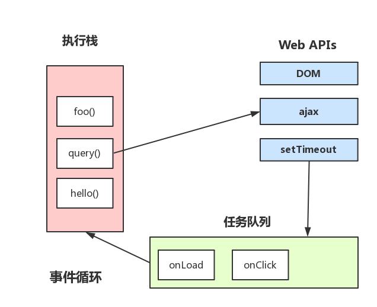
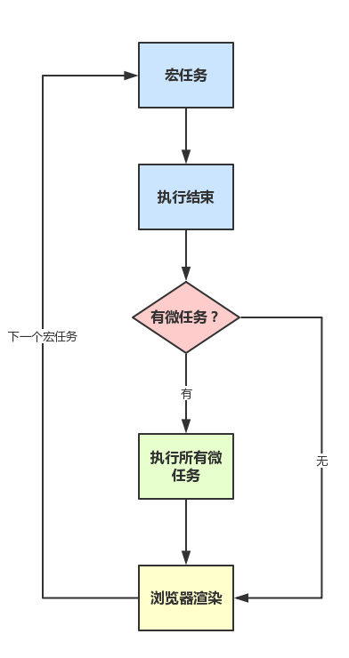

# js运行原理与机制

----
## 渲染进程
**浏览器的4个进程：**  
  * 主进程（Browser进程）：浏览器只有一个主进程，负责资源下载，界面展示等主要基础功能
  * GPU进程，负责3D图示绘制
  * 第三方插件进程，负责第三方插件处理
  * 渲染进程（Renderer进程）：负责js执行，页面渲染等功能，也是本章重点内容

渲染进程主要包括**GUI渲染线程、Js引擎线程、事件循环线程、定时器线程、http异步线程**。  

### GUI渲染线程
主要工作：  
  * 首先浏览器会解析html代码（实际上html代码本质是字符串）转化为浏览器认识的节点，生成DOM树，也就是DOM Tree
  * 然后解析css，生成CSSOM（CSS规则树）
  * 把DOM Tree 和CSSOM结合，生成Rendering Tree(渲染树)

在GUI中，如果修改了一些元素的颜色或者背景色，页面就会重绘（Repaint），如果修改元素的尺寸，页面就会回流（Reflow），当页面需要Repaing和Reflow时GUI多会执行，进行页面绘制。  

### JS引擎线程
js引擎线程就是js内核，负责解析与执行js代码，也称为主线程。浏览器同时只能有一个JS引擎线程在运行JS程序，所以js是单线程运行的。  

需要注意的是，js引擎线程和GUI渲染线程同时只能有一个工作，js引擎线程会阻塞GUI渲染线程。  

在浏览器渲染的时候遇到`<script>`标签，就会停止GUI的渲染，然后js引擎线程开始工作，执行里面的js代码，等js执行完毕，js引擎线程停止工作，GUI继续渲染下面的内容。所以如果js执行时间太长就会造成页面卡顿的情况，这也是后面性能优化的点。  

### 事件循环线程
事件循环线程用来管理控制事件循环，并且管理着一个事件队列（task queue），当js执行碰到事件绑定和一些异步操作时，会把对应的事件添加到对应的线程中（比如定时器操作，便把定时器事件添加到定时器线程），等异步事件有了结果，便把他们的回调操作添加到事件队列，等待js引擎线程空闲时来处理。  

### 定时器线程
由于js是单线程运行，所以不能抽出时间来计时，只能另开辟一个线程来处理定时器任务，等计时完成，把定时器要执行的操作添加到事件任务队列尾，等待js引擎线程来处理。这个线程就是定时器线程。  

### 异步请求线程
当执行到一个http异步请求时，便把异步请求事件添加到异步请求线程，等收到响应（准确来说应该是http状态变化），把回调函数添加到事件队列，等待js引擎线程来执行。  

### Event Loop
同步操作运行在js引擎线程（主线程）上，会形成一个执行栈，而异步操作则在他们对应的异步线程上处理（比如：定时操作在定时器线程上；http请求则在异步请求线程上处理）。  

而事件循环线程则监视着这些异步线程们，等异步线程们里面的操作有了结果（比如：定时器计时完成，或者http请求获取到响应），便把他们的毁掉函数添加到事件队列尾部，整个过程中执行栈、事件队列就构成Event Loop。  



### 关于定时器（setTimeout、setInterval）
js执行中不会准确无误的按照预期的时间去执行定时器里面的代码。  

**原因：**  
1) W3C标准规定setTimeout中最小的时间周期是4毫秒，凡是低于4ms的时间间隔都按照4ms来处理。  
2) 主线程碰到定时器的时候，是不会直接处理的，应该是先把定时器事件交给定时器线程去处理，这时主线程继续执行下面的代码，同时定时器线程开始计时处理，等到计时完毕，事件循环线程会把定时器要执行的操作放在事件队列末尾，等主线程空闲的时候再来执行事件队列里面的操作。  

**setTimeout模拟setInterval代码:**  
```js
var say = function() {
    setTimeout(say, 1000)
    console.log('hello world')
}

setTimeout(say, 1000)
```
以上代码会在每一次定时器执行完毕才开始下一个定时器，其中的误差只是等待主线程空闲所需要等待的时间。  

而setInterval是规定每隔固定的时间就往定时器线程中推入一个事件，这样做有一个问题，就是累积效应（即，如果定时器里面的代码执行所需的时间大于定时器的执行周期，就会出现累计效应，简单来说就是上一次定时器里面的操作还没执行完毕，下一次定时器事件又来了）。  

### macrotask与microtask
js运行过程：
  * 执行一个宏任务[macrotask]（栈中没有就从事件队列中获取）
  * 执行过程中如果遇到微任务[microtask]，就将它添加到微任务的任务队列中
  * 宏任务执行完毕后，立即执行当前微任务队列中的所有微任务（依次执行）
  * 当前宏任务执行完毕，开始检查渲染，然后GUI线程接管渲染
  * 渲染完毕后，JS线程继续接管，开始下一个宏任务（从事件队列中获取）

