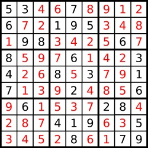
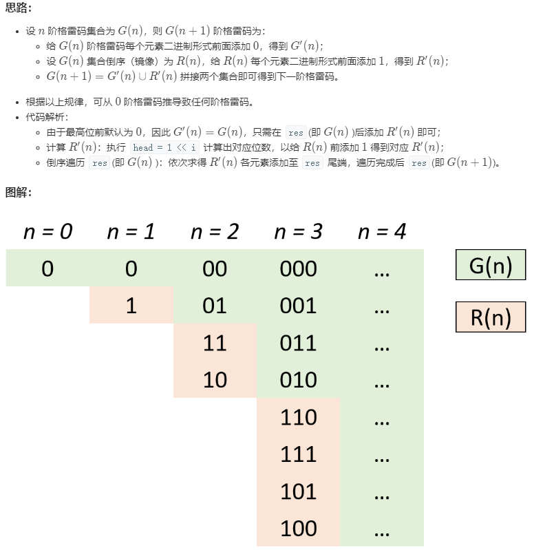
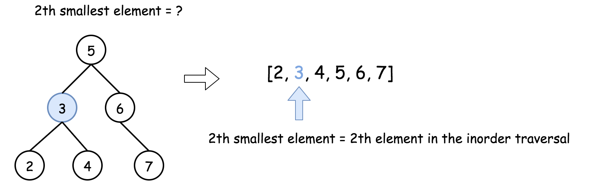
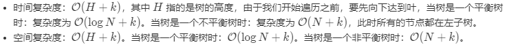

# LeetCode题解合集
  * 程序实现参考[https://github.com/JDreamHeart/DailyCodes/csharp/LeetCode](https://github.com/JDreamHeart/DailyCodes/tree/master/csharp/LeetCode)

----
合集内容：  
  * [三数之和](#三数之和)
  * [两个有序数组的中位数](#两个有序数组的中位数)
  * [正则表达式匹配](#正则表达式匹配)
  * [两两交换链表中的节点](#两两交换链表中的节点)
  * [K个一组翻转链表](#K个一组翻转链表)
  * [两数相除](#两数相除)
  * [串联所有单词的子串](#串联所有单词的子串)
  * [下一个排列](#下一个排列)
  * [最长有效括号](#最长有效括号)
  * [搜索旋转排序数组](#搜索旋转排序数组)
  * [在排序数组中查找元素的第一个和最后一个位置](#在排序数组中查找元素的第一个和最后一个位置)
  * [解数独](#解数独)
  * [组合总和](#组合总和)
  * [缺失的第一个正数](#缺失的第一个正数)
  * [接雨水](#接雨水)
  * [字符串相乘](#字符串相乘)
  * [通配符匹配](#通配符匹配)
  * [跳跃游戏II](#跳跃游戏II)
  * [二叉树中的最大路径和](#二叉树中的最大路径和)
  * [格雷编码](#格雷编码)
  * [LRU缓存机制](#LRU缓存机制)
  * [二叉搜索树中第K小的元素](#二叉搜索树中第K小的元素)
  * [除自身以外数组的乘积](#除自身以外数组的乘积)

## 三数之和
```csharp
// 给你一个包含 n 个整数的数组 nums，判断 nums 中是否存在三个元素 a，b，c ，使得 a + b + c = 0 ？请你找出所有满足条件且不重复的三元组。

// 注意：答案中不可以包含重复的三元组
```
思路：  
  * (1)题目中明确规定要三个元素的组合，因此得先判定传入参数是否足够三个元素；
  * (2)相对于查找无序的数组来说，从有序的数组中进行查找，比较有迹可循；【因此最好对传入的数组参数进行排序（这里进行升序排序）】
  * (3)排完序后的数组，如果其头部大于总和，或尾部小于总和，则判定不存在有效结果；
  * (4)从数组的头部开始，一直遍历到数组的倒数第三个数据，该位置定义为`i`；【需要注意的是得确保第一个数不能大于总和，且新位置的值不等于旧值（为了避免重复）】
  * (5)然后定义后面两个元素，先是初始化中间位置（`j`初始化为`i`的下一位置）和第三个数的位置（`k`初始化为数组的最后一个）
  * (6)在保证`j`的位置一直在`k`前面的情况下，每当三数之和小于0，则将`j`位置往后偏移1位；每当三数之和大于0，则将`k`位置往前偏移1位；每当三数之和等于0，则进行下一步处理；【需要注意的是得确保最后一个数不能小于总和】
  * (7)当三数之和等于0，则将数据添加到结果中，并更新`j`和`k`（仍需确保`j`的位置一直在`k`前面，且两个新位置的值不等于旧值（为了避免重复））；

Github链接：[https://github.com/JDreamHeart/DailyCodes/csharp/LeetCode/Solution6.cs](https://github.com/JDreamHeart/DailyCodes/tree/master/csharp/LeetCode/Solution6.cs)


## 两个有序数组的中位数
```csharp
// 给定两个大小为 m 和 n 的有序数组 nums1 和 nums2。

// 请你找出这两个有序数组的中位数，并且要求算法的时间复杂度为 O(log(m + n))。

// 你可以假设 nums1 和 nums2 不会同时为空。
```
思路：  
  * (1)题目中要求了算法复杂度，一般要求时间复杂度为`O(log(n))`的，基本上都是使用二分的思想进行求解；
  * (2)先根据数组的大小，来获取两个数组中的中位数所在位置；
  * (3)将较小位置数值作为间隔，来得到两个数组分别跟头和尾相同间隔的元素值（`h1,r1,h2,r2`）；比较`h1`和`h2`数值，删除较小的值在对应数组中到头部的元素；比较`r1`和`r2`数值，删除较大的值在对应数组中到尾部的元素；
  * (4)然后从(2)重新开始，直到其中一个数组没有元素或只有一个元素；
  * (5)当其中一个数组中没有元素时，返回另一个数组的中位数即可；
  * (6)当其中一个数组中只有一个元素时，则依次比较另一个数组的头尾数值（大于头部，则去除头部；小于尾部，则去除尾部），当其中一个数组没有元素时，返回另一个数组的中位数即可；
  
Github链接：[https://github.com/JDreamHeart/DailyCodes/csharp/LeetCode/Solution7.cs](https://github.com/JDreamHeart/DailyCodes/tree/master/csharp/LeetCode/Solution7.cs)

## 正则表达式匹配
```csharp
// 给你一个字符串 s 和一个字符规律 p，请你来实现一个支持 '.' 和 '*' 的正则表达式匹配。

// '.' 匹配任意单个字符
// '*' 匹配零个或多个前面的那一个元素
// 所谓匹配，是要涵盖 整个 字符串 s的，而不是部分字符串。

// 说明:

// s 可能为空，且只包含从 a-z 的小写字母。
// p 可能为空，且只包含从 a-z 的小写字母，以及字符 . 和 *。
```
有三种方法：  
  * 分段匹配法。把任何一个给定的`p`字符串 分割为“尾星串”和“无星串”的组合，然后依次匹配即可。
  * 回溯法。以`p`为主串，从左向右去匹配`s`，匹配成功的部分都去掉，也就是说 若最终`s`与`p`都变成了空串，则匹配成功。
  * 动态规划法。

回溯法：  
出口和递归分支`->`  
  * 出口EXIT：p变成空串时，若s也变成了空串，则匹配成功，否则匹配失败。
  * 分支A：p[1]为星号，直接去掉p的前两位，并递归。如 s="b",p="a*b".
  * 分支B：p[1]为星号时，若s第一位与p第一位匹配，去掉s第一位 , 并递归，如 "s=aab",p="a*b"。否则匹配失败，如 s="bba",p="a*b".
  * 分支C：p[1]不为星号时，若s与p第一位匹配成功, 则都去掉第一位,并递归，如 s="aab",p="aab*". 否则匹配失败，如 s="bab", p="aab*" .

其中，当p[1]为星号时，分支A与分支B是【或】的关系，只要有一条成功，则匹配成功； 当p[1]不为星号时，就走C。  


动态规划法：  
table[0,0]=true表示s与p是匹配的，而且在table种我们可以得到一条通路from右下角to左上角（忽略2个星列），这条通路的走向有3种：
  * 1) 格星左跳一位，例如table[4,6]到table[4,4],  【A】
  * 2) 向上走一位，例如tble[3,1]到table[2,1], 【B】
  * 3) 向左上走一位，例如 table[1,1]到 table[0,0] , 【C】

```csharp
public bool IsMatch(string s, string p) {
    bool[,] dp = new bool[s.Length + 1, p.Length + 1];
    dp[s.Length, p.Length] = true;
    for (int i = s.Length; i >= 0; i--)
    {
        for (int j = p.Length - 1; j >= 0; j--)
        {
            bool first_match = (i < s.Length && (p[j] == s[i] || p[j] == '.'));
            if (j + 1 < p.Length && p[j + 1] == '*')
            {
                dp[i, j] = dp[i, j + 2]    //A
                    || first_match && dp[i + 1, j]; //B
            }
            else
            {
                dp[i, j] = first_match && dp[i + 1, j + 1]; // C
            }
        }
    }
    return dp[0, 0];
}
```


## 两两交换链表中的节点
循环往复的进行两两交换，直至最后没有next节点了。  

交换的逻辑是：  
  * 第一个节点的`next`指向第二个节点的`next`，如`1->3（3是2的next)`
  * 第二个节点的`next`指向第一个节点，如`2->1`，此时结果是`2->1->3`
  * 将`pre`节点的`next`指向上面子链表的头结点，也就是第二个节点


```csharp
// 给定一个链表，两两交换其中相邻的节点，并返回交换后的链表。

// 你不能只是单纯的改变节点内部的值，而是需要实际的进行节点交换。

// 示例:

// 给定 1->2->3->4, 你应该返回 2->1->4->3.

public class Solution {
    public ListNode SwapPairs(ListNode head) {
        if(head == null || head.next == null)
        {
            return head;
        }

        ListNode dummy = new ListNode(0);
        dummy.next = head;

        ListNode pre = dummy;
        ListNode first = head;
        ListNode second = head.next;
        while(first != null && second !=null)
        {
            first.next = second.next;
            second.next = first;
            pre.next = second;

            pre = first;
            first = first.next;
            if(first != null )
            {
                second = first.next;
            }
        }

        return dummy.next;
        
    }
}
```

## K个一组翻转链表
```csharp
// 给你一个链表，每 k 个节点一组进行翻转，请你返回翻转后的链表。

// k 是一个正整数，它的值小于或等于链表的长度。

// 如果节点总数不是 k 的整数倍，那么请将最后剩余的节点保持原有顺序。

// 示例：

// 给你这个链表：1->2->3->4->5

// 当 k = 2 时，应当返回: 2->1->4->3->5

// 当 k = 3 时，应当返回: 3->2->1->4->5

// 说明：
// 你的算法只能使用常数的额外空间。
// 你不能只是单纯的改变节点内部的值，而是需要实际进行节点交换。

public class Solution
{
        public ListNode ReverseKGroup(ListNode head, int k)
    {
        List<ListNode> list = new List<ListNode>();
        ListNode p = head;
        for (int i = 0; i < k; i++)
        {
            if (head == null) { return p; }
            list.Add(head);
            head = head.next;
        }
        for (int i = 1; i < k; i++)
        {
            list[i].next = list[i - 1];
        }
        list[0].next = ReverseKGroup(head, k);
        return list[k - 1];
    }
}
```

## 两数相除
```csharp
// 给定两个整数，被除数 dividend 和除数 divisor。将两数相除，要求不使用乘法、除法和 mod 运算符。

// 返回被除数 dividend 除以除数 divisor 得到的商。

// 整数除法的结果应当截去（truncate）其小数部分，例如：truncate(8.345) = 8 以及 truncate(-2.7335) = -2

// 示例 1:

// 输入: dividend = 10, divisor = 3
// 输出: 3
// 解释: 10/3 = truncate(3.33333..) = truncate(3) = 3
// 示例 2:

// 输入: dividend = 7, divisor = -3
// 输出: -2
// 解释: 7/-3 = truncate(-2.33333..) = -2

// 提示：

// 被除数和除数均为 32 位有符号整数。
// 除数不为 0。
// 假设我们的环境只能存储 32 位有符号整数，其数值范围是 [−231,  231 − 1]。本题中，如果除法结果溢出，则返回 231 − 1。
```
减去一个2的幂次，不能用乘法运算，但是可以用移位运算来形成2的幂次，然后使用被除数减去2的幂次来加快计算效率，实际执行如下：（search递归函数）  
  * 被除数 = 除数 * 2^a + b
  * 满足公式的最大a，然后递归将b作为被除数
  * 直到被除数小于除数为止
  * 将所有的2^a进行求和

另外，为了防止整数溢出的情况，使用了负数进行减法运算。

```csharp
public class Solution {

    public int search(int m,int n)
    {
        if(m > n) return 0;//当被除数比除数的绝对值还小的时候结束

        int k = -1, t = n;
        while(m < t && m - t < t)
        {//使用2的幂次进行求解
            t <<= 1;
            k <<= 1;
        }
        return  k + search(m - t,n);
    }

    public int search2(int m, int n) {
        int r=0, k = 0;
        while(m<n && m-n<=n)
        {//找最大的幂次
            n <<= 1;
            k ++;
        }
        while(k>=0)
        {
            if(m<=n)
            {//第k个二进制位为1
                m -= n;
                r += (-1 << k);
            }
            n >>= 1;
            k--;
        }
        return r;
    }

    public int Divide(int dividend, int divisor) {
        int mFlag = dividend>0?-1:1;
        int nFlag = divisor>0?-1:1;
        int flag = -1* mFlag * nFlag;
        //将值转换为负值进行计算
        int m = dividend * mFlag, n = divisor * nFlag;

        int r = search(m,n);

        // // 省去了递归的栈空间消耗
        // int r = search2(m,n);

        if(r == -2147483648 && flag == -1)
        {//只有一种情况溢出，就是最小负值转换为正值时
            return 2147483647;
        }

        return r * flag;
    }
}
```

**位运算**  
1) 异或（^）
```csharp
// 交换
int a=10100001, b=00000110;
a = a^b; 　　//a=10100111
b = b^a; 　　//b=10100001
a = a^b; 　　//a=00000110

// 快速判断两个值是否相等
return ((a ^ b) == 0)
```

2) 移位运算(左移和右移)
```csharp
x<<1 = x*2
x<<2 = x*4
x<<3 = x*8
x<<4 = x*16

x>>1 = x/2
x>>2 = x/4
x>>3 = x/8
x>>4 =x/16
```

**使用位运算实现加减乘除**  
加法：`a+b=a^b+(a&b)<<1`【进行异或运算，代表两个不考虑进位的加法运算；进行与运算后再往左移动一位，代表只考虑进位的两个数相加结果】  

减法：`a-b=a+~b+1`【一个数的相反数对于其各位取反加1，即a的相反数等于~a+1】  

乘法：将b个a相加  

除法：a最多能被多少个b减  


## 串联所有单词的子串
```csharp
// 给定一个字符串 s 和一些长度相同的单词 words。找出 s 中恰好可以由 words 中所有单词串联形成的子串的起始位置。

// 注意子串要与 words 中的单词完全匹配，中间不能有其他字符，但不需要考虑 words 中单词串联的顺序。

// 示例 1：

// 输入：
//   s = "barfoothefoobarman",
//   words = ["foo","bar"]
// 输出：[0,9]
// 解释：
// 从索引 0 和 9 开始的子串分别是 "barfoo" 和 "foobar" 。
// 输出的顺序不重要, [9,0] 也是有效答案。
// 示例 2：

// 输入：
//   s = "wordgoodgoodgoodbestword",
//   words = ["word","good","best","word"]
// 输出：[]
```

滑动窗口`=>`【一直在`s`维护着所有单词长度总和的一个长度队列】

```py
class Solution:
    def findSubstring(self, s: str, words: List[str]) -> List[int]:
        from collections import Counter
        if not s or not words:return []
        one_word = len(words[0])
        word_num = len(words)
        n = len(s)
        if n < one_word:return []
        words = Counter(words)
        res = []
        for i in range(0, one_word):
            cur_cnt = 0
            left = i
            right = i
            cur_Counter = Counter()
            while right + one_word <= n:
                w = s[right:right + one_word]
                right += one_word
                if w not in words:
                    left = right
                    cur_Counter.clear()
                    cur_cnt = 0
                else:
                    cur_Counter[w] += 1
                    cur_cnt += 1
                    while cur_Counter[w] > words[w]:
                        left_w = s[left:left+one_word]
                        left += one_word
                        cur_Counter[left_w] -= 1
                        cur_cnt -= 1
                    if cur_cnt == word_num :
                        res.append(left)
        return res
```

## 下一个排列
```csharp
// 实现获取下一个排列的函数，算法需要将给定数字序列重新排列成字典序中下一个更大的排列。

// 如果不存在下一个更大的排列，则将数字重新排列成最小的排列（即升序排列）。

// 必须原地修改，只允许使用额外常数空间。

// 以下是一些例子，输入位于左侧列，其相应输出位于右侧列。
// 1,2,3 → 1,3,2
// 3,2,1 → 1,2,3
// 1,1,5 → 1,5,1
```


```csharp
public class Solution {
    public void NextPermutation(int[] nums) {
        bool find = false;
        int index = 0;
        for(int i=nums.Length-1; i>0;i--){
            if(nums[i]>nums[i-1]){
                index = i-1;
                find = true;
                break;
            }
        }
        
        //说明全部是降序 进行翻转然后输出
        if(!find){ 
            SwitchLoHi(nums,0,nums.Length-1);
            return;
        }
        
        int index2 = 0;
        for(int j=nums.Length-1;j>index;j--){
            if(nums[j]>nums[index]){index2=j; break;}
        }
        
        Switch(nums, index, index2);
        SwitchLoHi(nums, index+1, nums.Length-1);
    }
    
    public void SwitchLoHi(int[] nums, int lo, int hi){
         while(lo<hi){
               Switch(nums, lo++,hi--);
         }
    }
    
    public void Switch(int[] nums, int i, int j){
        int m=0;
        m=nums[i];
        nums[i] = nums[j];
        nums[j]= m;
    }
}
```

## 最长有效括号
```csharp
// 给定一个只包含 '(' 和 ')' 的字符串，找出最长的包含有效括号的子串的长度。

// 示例 1:

// 输入: "(()"
// 输出: 2
// 解释: 最长有效括号子串为 "()"
// 示例 2:

// 输入: ")()())"
// 输出: 4
// 解释: 最长有效括号子串为 "()()"
```
**不需要额外的空间**  
利用两个计数器 left 和 right 。  
  * 首先，我们从左到右遍历字符串，对于遇到的每个‘(’，我们增加 left 计算器，对于遇到的每个‘)’ ，我们增加 right 计数器。
  * 每当 left 计数器与 right 计数器相等时，我们计算当前有效字符串的长度，并且记录目前为止找到的最长子字符串。如果 right 计数器比 left 计数器大时，我们将 left 和 right 计数器同时变回 0 。


**栈**  
  * 与找到每个可能的子字符串后再判断它的有效性不同，我们可以用栈在遍历给定字符串的过程中去判断到目前为止扫描的子字符串的有效性，同时能的都最长有效字符串的长度。我们首先将 -1 放入栈顶。
  * 对于遇到的每个 ‘(’ ，我们将它的下标放入栈中。
  * 对于遇到的每个 ‘)’ ，我们弹出栈顶的元素并将当前元素的下标与弹出元素下标作差，得出当前有效括号字符串的长度。通过这种方法，我们继续计算有效子字符串的长度，并最终返回最长有效子字符串的长度。

```csharp
public class Solution {

    public int longestValidParentheses(String s) {
        int maxans = 0;
        Stack stack = new Stack();
        stack.Push(-1);
        for (int i = 0; i < s.length(); i++) {
            if (s.charAt(i) == '(') {
                stack.Push(i);
            } else {
                stack.Pop();
                if (stack.Count == 0) {
                    stack.Push(i);
                } else {
                    maxans = Math.max(maxans, i - stack.Peek());
                }
            }
        }
        return maxans;
    }
}
```

**动态规划**  
  * 定义一个 dp 数组，其中第 i 个元素表示以下标为 i 的字符结尾的最长有效子字符串的长度。
  * 将 dp 数组全部初始化为 0 。现在，很明显有效的子字符串一定以 ‘)’ 结尾。
  * 进一步可以得出结论：以 ‘(’ 结尾的子字符串对应的 dp 数组位置上的值必定为 0 。
  * 所以说只需要更新 ‘)’ 在 dp 数组中对应位置的值。

```csharp
public class Solution {
    public int longestValidParentheses(String s) {
        int maxans = 0;
        int dp[] = new int[s.length()];
        for (int i = 1; i < s.length(); i++) {
            if (s.charAt(i) == ')') {
                if (s.charAt(i - 1) == '(') {
                    dp[i] = (i >= 2 ? dp[i - 2] : 0) + 2;
                } else if (i - dp[i - 1] > 0 && s.charAt(i - dp[i - 1] - 1) == '(') {
                    dp[i] = dp[i - 1] + ((i - dp[i - 1]) >= 2 ? dp[i - dp[i - 1] - 2] : 0) + 2;
                }
                maxans = Math.max(maxans, dp[i]);
            }
        }
        return maxans;
    }
}
```


## 搜索旋转排序数组
```csharp
// 假设按照升序排序的数组在预先未知的某个点上进行了旋转。

// ( 例如，数组 [0,1,2,4,5,6,7] 可能变为 [4,5,6,7,0,1,2] )。

// 搜索一个给定的目标值，如果数组中存在这个目标值，则返回它的索引，否则返回 -1 。

// 你可以假设数组中不存在重复的元素。

// 你的算法时间复杂度必须是 O(log n) 级别。

// 示例 1:

// 输入: nums = [4,5,6,7,0,1,2], target = 0
// 输出: 4
// 示例 2:

// 输入: nums = [4,5,6,7,0,1,2], target = 3
// 输出: -1
```
利用中点左右的区间始终有一边有序的性质可以排除掉一边，如果目标在有序的一边，那么就是普通的二分。

```csharp
public class Solution {
    public int Search(int[] nums, int target) {
       int len = nums.Length;
       int l = 0;
       int r = len - 1;
       while(l <= r) {
          int mid = (l+r)>>1;
          if(nums[mid] == target) return mid; //排除mid位置方便书写
          if(nums[l] <= nums[r]) { //有序
              if(nums[mid] > target) {
                  r  = mid - 1;
              } else {
                  l = mid + 1;
              }
          } else { //无序
              if(nums[l] <= nums[mid] && nums[mid] > nums[r]) { //左边有序
                  if(target >= nums[l] && target < nums[mid]) { //在左边
                      r = mid-1;
                  } else {
                      l = mid +1;
                  }
              } else if(nums[l] >= nums[mid] && nums[mid] < nums[r]) { //右边有序
                  if(target > nums[mid] && target <= nums[r]) { //在右边
                      l = mid + 1;
                  } else {
                      r = mid - 1;
                  }
              } 
          }
       }
       return -1;
    }
}
```


## 在排序数组中查找元素的第一个和最后一个位置
```csharp
// 给定一个按照升序排列的整数数组 nums，和一个目标值 target。找出给定目标值在数组中的开始位置和结束位置。

// 你的算法时间复杂度必须是 O(log n) 级别。

// 如果数组中不存在目标值，返回 [-1, -1]。

// 示例 1:

// 输入: nums = [5,7,7,8,8,10], target = 8
// 输出: [3,4]
// 示例 2:

// 输入: nums = [5,7,7,8,8,10], target = 6
// 输出: [-1,-1]
```
二分查找第一个大于target的位置，然后线性查找最后一个相等值的位置。

```csharp
public class Solution {
    public int[] SearchRange(int[] nums, int target) {
        int len = nums.Length;
        int[] ans = new int[]{-1,-1};
        if(len == 0) return ans;
        int l = 0;
        int r = len;
        while(l < r) {
            int mid = (l+r) >> 1;
            if(nums[mid] >= target) {
                r = mid;
            } else {
                l = mid + 1;
            }
        }
        if(r < len &&nums[r] == target) {
            ans[0] = r;
            for(; r < len; r ++) {
                if(nums[r] != target) break;
            }
            ans[1] = r-1;
            return ans; 
        } else {
            return ans;
        }
    }
}
```

## 解数独
```csharp
// 编写一个程序，通过已填充的空格来解决数独问题。

// 一个数独的解法需遵循如下规则：

// 数字 1-9 在每一行只能出现一次。
// 数字 1-9 在每一列只能出现一次。
// 数字 1-9 在每一个以粗实线分隔的 3x3 宫内只能出现一次。
// 空白格用 '.' 表示。


// 注意:
// 给定的数独序列只包含数字 1-9 和字符 '.' 。
// 你可以假设给定的数独只有唯一解。
// 给定数独永远是 9x9 形式的。
```
  

**回溯法**  
约束编程：基本的意思是在放置每个数字时都设置约束。在数独上放置一个数字后立即排除当前`行`，`列`和`子方块`对该数字的使用。  

回溯：在成功放置了几个数字在数独上之后，由于该组合不是最优，且不能继续放置数字了，则进行`回溯`。  

枚举子方块：`方块索引= (行 / 3) * 3 + 列 / 3`，其中`/`表示整数除法。

```java
class Solution {
  // box size
  int n = 3;
  // row size
  int N = n * n;

  int [][] rows = new int[N][N + 1];
  int [][] columns = new int[N][N + 1];
  int [][] boxes = new int[N][N + 1];

  char[][] board;

  boolean sudokuSolved = false;

  public boolean couldPlace(int d, int row, int col) {
    int idx = (row / n ) * n + col / n;
    return rows[row][d] + columns[col][d] + boxes[idx][d] == 0;
  }

  public void placeNumber(int d, int row, int col) {
    int idx = (row / n ) * n + col / n;

    rows[row][d]++;
    columns[col][d]++;
    boxes[idx][d]++;
    board[row][col] = (char)(d + '0');
  }

  public void removeNumber(int d, int row, int col) {
    int idx = (row / n ) * n + col / n;
    rows[row][d]--;
    columns[col][d]--;
    boxes[idx][d]--;
    board[row][col] = '.';
  }

  public void placeNextNumbers(int row, int col) {
    if ((col == N - 1) && (row == N - 1)) {
      sudokuSolved = true;
    }
    else {
      if (col == N - 1) backtrack(row + 1, 0);
      else backtrack(row, col + 1);
    }
  }

  public void backtrack(int row, int col) {
    if (board[row][col] == '.') {
      for (int d = 1; d < 10; d++) {
        if (couldPlace(d, row, col)) {
          placeNumber(d, row, col);
          placeNextNumbers(row, col);
          if (!sudokuSolved) removeNumber(d, row, col);
        }
      }
    }
    else placeNextNumbers(row, col);
  }

  public void solveSudoku(char[][] board) {
    this.board = board;

    for (int i = 0; i < N; i++) {
      for (int j = 0; j < N; j++) {
        char num = board[i][j];
        if (num != '.') {
          int d = Character.getNumericValue(num);
          placeNumber(d, i, j);
        }
      }
    }
    backtrack(0, 0);
  }
}
```

## 组合总和
```csharp
// 给定一个无重复元素的数组 candidates 和一个目标数 target ，找出 candidates 中所有可以使数字和为 target 的组合。

// candidates 中的数字可以无限制重复被选取。

// 说明：

// 所有数字（包括 target）都是正整数。
// 解集不能包含重复的组合。 
// 示例 1:

// 输入: candidates = [2,3,6,7], target = 7,
// 所求解集为:
// [
//   [7],
//   [2,2,3]
// ]
// 示例 2:

// 输入: candidates = [2,3,5], target = 8,
// 所求解集为:
// [
//   [2,2,2,2],
//   [2,3,3],
//   [3,5]
// ]
```

采用**回溯算法**。  
为了减少重复搜索，可先对数据进行排序，在程序中，跳过数值不满足要求的数据，从而减少递归次数。  


## 缺失的第一个正数
```csharp
// 给你一个未排序的整数数组，请你找出其中没有出现的最小的正整数。

// 示例 1:

// 输入: [1,2,0]
// 输出: 3
// 示例 2:

// 输入: [3,4,-1,1]
// 输出: 2
// 示例 3:

// 输入: [7,8,9,11,12]
// 输出: 1
```

**索引作为哈希表**  
```c++
class Solution {
public:
    int firstMissingPositive(vector<int>& nums) {
        if(nums.size()==0)
            return 1;
        for(size_t i=0;i<nums.size();i++)
            if(nums[i]<=0 || nums[i]>nums.size())
                nums[i]=nums.size()+1;//排除干扰值
        for(size_t i=0;i<nums.size();i++)
        {
            int ptr=abs(nums[i]);
            if(ptr<nums.size()+1)
                nums[ptr-1]=-abs(nums[ptr-1]);
        }
        // 若 nums[i] 元素为负，则意味着数字 i+1 出现在 nums 中，否则表示 i+1 没有出现在 nums 中。
        for(size_t i=0;i<nums.size();i++)
            if(nums[i]>0)
                return i+1;
        return nums.size()+1;
    }
};
```

## 接雨水
```csharp
// 给定 n 个非负整数表示每个宽度为 1 的柱子的高度图，计算按此排列的柱子，下雨之后能接多少雨水。

// 上面是由数组 [0,1,0,2,1,0,1,3,2,1,2,1] 表示的高度图，在这种情况下，可以接 6 个单位的雨水（蓝色部分表示雨水）。 感谢 Marcos 贡献此图。

// 示例:

// 输入: [0,1,0,2,1,0,1,3,2,1,2,1]
// 输出: 6
```
  

算法思路：  
  * 找到数组中从下标 i 到最左端最高的条形块高度 left_max；
  * 找到数组中从下标 i 到最右端最高的条形块高度 right_max；
  * 扫描数组 height 并更新答案：累加`min(left_max[i], right_max[i]) - height[i]`到`ans`上。


## 字符串相乘
```csharp
// 给定两个以字符串形式表示的非负整数 num1 和 num2，返回 num1 和 num2 的乘积，它们的乘积也表示为字符串形式。

// 示例 1:

// 输入: num1 = "2", num2 = "3"
// 输出: "6"
// 示例 2:

// 输入: num1 = "123", num2 = "456"
// 输出: "56088"
// 说明：

// num1 和 num2 的长度小于110。
// num1 和 num2 只包含数字 0-9。
// num1 和 num2 均不以零开头，除非是数字 0 本身。
// 不能使用任何标准库的大数类型（比如 BigInteger）或直接将输入转换为整数来处理。
```

该算法是通过两数相乘时，乘数某位与被乘数某位相乘，与产生结果的位置的规律来完成。具体规律如下：  
  * 乘数 num1 位数为 M，被乘数 num2 位数为 N， num1 x num2 结果 res 最大总位数为 M+N；
  * num1[i] x num2[j] 的结果为 tmp(位数为两位，"0x","xy"的形式)，其第一位位于 res[i+j]，第二位位于 res[i+j+1]。

```java
class Solution {
    public String multiply(String num1, String num2) {
        if (num1.equals("0") || num2.equals("0")) {
            return "0";
        }
        int[] res = new int[num1.length() + num2.length()];
        for (int i = num1.length() - 1; i >= 0; i--) {
            int n1 = num1.charAt(i) - '0';
            for (int j = num2.length() - 1; j >= 0; j--) {
                int n2 = num2.charAt(j) - '0';
                int sum = (res[i + j + 1] + n1 * n2);
                res[i + j + 1] = sum % 10;
                res[i + j] += sum / 10;
            }
        }

        StringBuilder result = new StringBuilder();
        for (int i = 0; i < res.length; i++) {
            if (i == 0 && res[i] == 0) continue;
            result.append(res[i]);
        }
        return result.toString();
    }
}
```

## 通配符匹配
```csharp
// 给定一个字符串 (s) 和一个字符模式 (p) ，实现一个支持 '?' 和 '*' 的通配符匹配。

// '?' 可以匹配任何单个字符。
// '*' 可以匹配任意字符串（包括空字符串）。
// 两个字符串完全匹配才算匹配成功。

// 说明:

// s 可能为空，且只包含从 a-z 的小写字母。
// p 可能为空，且只包含从 a-z 的小写字母，以及字符 ? 和 *。
// 示例 1:

// 输入:
// s = "aa"
// p = "a"
// 输出: false
// 解释: "a" 无法匹配 "aa" 整个字符串。
// 示例 2:

// 输入:
// s = "aa"
// p = "*"
// 输出: true
// 解释: '*' 可以匹配任意字符串。
// 示例 3:

// 输入:
// s = "cb"
// p = "?a"
// 输出: false
// 解释: '?' 可以匹配 'c', 但第二个 'a' 无法匹配 'b'。
// 示例 4:

// 输入:
// s = "adceb"
// p = "*a*b"
// 输出: true
// 解释: 第一个 '*' 可以匹配空字符串, 第二个 '*' 可以匹配字符串 "dce".
// 示例 5:

// 输入:
// s = "acdcb"
// p = "a*c?b"
// 输入: false
```

**带记忆的递归**  
  * 清理输入数据用一个星号代替多个星号：p = remove_duplicate_stars(p)。
  * 初始化记忆哈希表 dp。
  * 返回 helper 函数，用清理后的输入作为参数。
  * helper(s,p)：
    * 如果 (s,p) 已经计算过存储在 dp 中，则返回 dp 中的值。
    * 如果字符串相等 p == s 或 p == '*'，在 dp 添加 dp[(s, p)] = True。
    * 反之如果 p 或 s 为空，则 dp[(s, p)] = False。
    * 反之如果当前字符匹配，即 p[0] == s[0] 或 p[0] == '?'，则继续检查下一个字符并 dp[(s, p)] = helper(s[1:], p[1:])。
    * 反之如果当前字符模式是一个星号 p[0] == '*'，则有两种情况，要么不匹配字符要么匹配一个或多个，符，则 dp[(s, p)] = helper(s, p[1:]) or helper(s, p[1:])。
    * 反之如果 p[0] != s[0]，则 dp[(s, p)] = False。
    * 返回 dp[(s, p)]。


**动态规划**  
参考[正则表达式匹配](#正则表达式匹配)。  

**回溯**  
从匹配 0 个字符开始，如果这个假设导致不匹配，则回溯：回到前一个星号，假设它匹配一个字符，然后一直重复。  

我们使用两个指针：s_idx 遍历输入字符串，p_idx 遍历字符模式。当 s_idx < s_len：

  * 如果字符模式仍有字符 p_idx < p_len 且指针下的字符匹配 p[p_idx] == s[s_idx] 或 p[p_idx] == '?'，则两个指针向前移动。
  * 反之如果字符模式仍有字符 p_idx < p_len 且 p[p_idx] == '*'，则首先检查匹配 0 字符的情况，即只增加模式指针 p_idx++。记下可能回溯的位置 star_idx 和当前字符串的位置 s_tmp_idx。
  * 反之如果出现不匹配的情况：
    * 如果字符模式中没有星号，则返回 False。
    * 如果有星号，则回溯：设置 p_idx = star_idx + 1 和 s_idx = s_tmp_idx + 1，假设这次的星匹配多个字符。则可能的回溯为 s_tmp_idx = s_idx。
  * 如果字符模式的所有剩余字符都是星号，则返回 True。


## 跳跃游戏II
```csharp
// 给定一个非负整数数组，你最初位于数组的第一个位置。

// 数组中的每个元素代表你在该位置可以跳跃的最大长度。

// 你的目标是使用最少的跳跃次数到达数组的最后一个位置。

// 示例:

// 输入: [2,3,1,1,4]
// 输出: 2
// 解释: 跳到最后一个位置的最小跳跃数是 2。
//      从下标为 0 跳到下标为 1 的位置，跳 1 步，然后跳 3 步到达数组的最后一个位置。
```
**思路：**  
  * 如果某一个作为 起跳点 的格子可以跳跃的距离是 3，那么表示后面 3 个格子都可以作为 起跳点。
    * 可以对每一个能作为 起跳点 的格子都尝试跳一次，把 能跳到最远的距离 不断更新。
  * 如果从这个 起跳点 起跳叫做第 1 次 跳跃，那么从后面 3 个格子起跳 都 可以叫做第 2 次 跳跃。
  * 所以，当一次 跳跃 结束时，从下一个格子开始，到现在 能跳到最远的距离，都 是下一次 跳跃 的 起跳点。
    * 对每一次 跳跃 用 for 循环来模拟。
    * 跳完一次之后，更新下一次 起跳点 的范围。
    * 在新的范围内跳，更新 能跳到最远的距离。
  * 记录 跳跃 次数，如果跳到了终点，就得到了结果。


## 二叉树中的最大路径和
```csharp
// 给定一个非空二叉树，返回其最大路径和。

// 本题中，路径被定义为一条从树中任意节点出发，达到任意节点的序列。该路径至少包含一个节点，且不一定经过根节点。

// 示例 1:

// 输入: [1,2,3]

//        1
//       / \
//      2   3

// 输出: 6
// 示例 2:

// 输入: [-10,9,20,null,null,15,7]

//    -10
//    / \
//   9  20
//     /  \
//    15   7

// 输出: 42

int max = Integer.MIN_VALUE;
public int maxPathSum(TreeNode root) {
    helper(root);
    return max;
} 
int helper(TreeNode root) {
    if (root == null) return 0;

    int left = Math.max(helper(root.left), 0);
    int right = Math.max(helper(root.right), 0);
    
    //求的过程中考虑包含当前根节点的最大路径
    max = Math.max(max, root.val + left + right);
    
    //只返回包含当前根节点和左子树或者右子树的路径
    int m =Math.max(left, right);    //！！！！！需要考虑Math.max(left, right) 为负数的情况
    if(m<=0)
        return root.val;
    else
        return root.val+m;
}
```


## 格雷编码
```csharp
// 格雷编码是一个二进制数字系统，在该系统中，两个连续的数值仅有一个位数的差异。

// 给定一个代表编码总位数的非负整数 n，打印其格雷编码序列。即使有多个不同答案，你也只需要返回其中一种。

// 格雷编码序列必须以 0 开头。

//  

// 示例 1:

// 输入: 2
// 输出: [0,1,3,2]
// 解释:
// 00 - 0
// 01 - 1
// 11 - 3
// 10 - 2

// 对于给定的 n，其格雷编码序列并不唯一。
// 例如，[0,2,3,1] 也是一个有效的格雷编码序列。

// 00 - 0
// 10 - 2
// 11 - 3
// 01 - 1
// 示例 2:

// 输入: 0
// 输出: [0]
// 解释: 我们定义格雷编码序列必须以 0 开头。
//      给定编码总位数为 n 的格雷编码序列，其长度为 2^n。当 n = 0 时，长度为 2^0 = 1。
//      因此，当 n = 0 时，其格雷编码序列为 [0]。
```

```py
class Solution:
    def grayCode(self, n: int) -> List[int]:
        res, head = [0], 1
        for i in range(n):
            for j in range(len(res) - 1, -1, -1):
                res.append(head + res[j])
            head <<= 1
        return res
```

最重要的是，要进行归纳汇总！
规律：  
  * n = 0, [0]
  * n = 1, [0,1] //新的元素1，为0+2^0
  * n = 2, [0,1,3,2] // 新的元素[3,2]为[0,1]->[1,0]后分别加上2^1
  * n = 3, [0,1,3,2,6,7,5,4] // 新的元素[6,7,5,4]为[0,1,3,2]->[2,3,1,0]后分别加上2^2->[6,7,5,4]

```csharp
class Solution {
    public vector<int> grayCode(int n) {
        int shift = 1;
        vector<int> res;
        while(n >= 0){
            if(res.size() == 0){
                res.push_back(0);
            }else{
                for(int i = shift-1; i >= 0; --i){
                    res.push_back(res[i] + shift);
                }
                shift *= 2;
            }
            --n;
        }
        return res;
    }
}
```


## LRU缓存机制
```csharp
// 运用你所掌握的数据结构，设计和实现一个  LRU (最近最少使用) 缓存机制。它应该支持以下操作： 获取数据 get 和 写入数据 put 。

// 获取数据 get(key) - 如果密钥 (key) 存在于缓存中，则获取密钥的值（总是正数），否则返回 -1。
// 写入数据 put(key, value) - 如果密钥已经存在，则变更其数据值；如果密钥不存在，则插入该组「密钥/数据值」。当缓存容量达到上限时，它应该在写入新数据之前删除最久未使用的数据值，从而为新的数据值留出空间。

//  

// 进阶:

// 你是否可以在 O(1) 时间复杂度内完成这两种操作？

//  

// 示例:

// LRUCache cache = new LRUCache( 2 /* 缓存容量 */ );

// cache.put(1, 1);
// cache.put(2, 2);
// cache.get(1);       // 返回  1
// cache.put(3, 3);    // 该操作会使得密钥 2 作废
// cache.get(2);       // 返回 -1 (未找到)
// cache.put(4, 4);    // 该操作会使得密钥 1 作废
// cache.get(1);       // 返回 -1 (未找到)
// cache.get(3);       // 返回  3
// cache.get(4);       // 返回  4
```
首先实现一个可以存储 key-value 形式数据的数据结构，并且可以记录最近访问的 key 值。首先想到的就是用字典来存储 key-value 结构，这样对于查找操作时间复杂度就是 O(1)。  

但是因为字典本身是无序的，所以我们还需要一个类似于队列的结构来记录访问的先后顺序，这个队列需要支持如下几种操作：  
  * 在末尾加入一项
  * 去除最前端一项
  * 将队列中某一项移到末尾
  * 首先考虑列表结构


## 二叉搜索树中第K小的元素
```csharp
// 给定一个二叉搜索树，编写一个函数 kthSmallest 来查找其中第 k 个最小的元素。

// 说明：
// 你可以假设 k 总是有效的，1 ≤ k ≤ 二叉搜索树元素个数。

// 示例 1:

// 输入: root = [3,1,4,null,2], k = 1
//    3
//   / \
//  1   4
//   \
//    2
// 输出: 1
// 示例 2:

// 输入: root = [5,3,6,2,4,null,null,1], k = 3
//        5
//       / \
//      3   6
//     / \
//    2   4
//   /
//  1
// 输出: 3
// 进阶：
// 如果二叉搜索树经常被修改（插入/删除操作）并且你需要频繁地查找第 k 小的值，你将如何优化 kthSmallest 函数？
```
**遍历树：**  

  * 深度优先搜索（DFS）

在这个策略中，我们从根延伸到某一片叶子，然后再返回另一个分支。根据根节点，左节点，右节点的相对顺序，DFS 还可以分为前序，中序，后序。

  * 广度优先搜索（BFS）

在这个策略中，我们逐层，从上到下扫描整个树。


下图展示了不同的遍历策略：


为了解决这个问题，可以使用 BST 的特性：BST 的中序遍历是升序序列。

**递归**  
通过构造 BST 的中序遍历序列，则第 k-1 个元素就是第 k 小的元素。  
  
```java
class Solution {
  public ArrayList<Integer> inorder(TreeNode root, ArrayList<Integer> arr) {
    if (root == null) return arr;
    inorder(root.left, arr);
    arr.add(root.val);
    inorder(root.right, arr);
    return arr;
  }

  public int kthSmallest(TreeNode root, int k) {
    ArrayList<Integer> nums = inorder(root, new ArrayList<Integer>());
    return nums.get(k - 1);
  }
}
```
复杂度分析  
  * 时间复杂度：O(N)O(N)，遍历了整个树。
  * 空间复杂度：O(N)O(N)，用了一个数组存储中序序列。

**迭代**  
在栈的帮助下，可以将方法一的递归转换为迭代，这样可以加快速度，因为这样可以不用遍历整个树，可以在找到答案后停止。  
  
```java
class Solution {
  public int kthSmallest(TreeNode root, int k) {
    LinkedList<TreeNode> stack = new LinkedList<TreeNode>();

    while (true) {
      while (root != null) {
        stack.add(root);
        root = root.left;
      }
      root = stack.removeLast();
      if (--k == 0) return root.val;
      root = root.right;
    }
  }
}
```
复杂度分析  
  


## 除自身以外数组的乘积
```csharp
// 给你一个长度为 n 的整数数组 nums，其中 n > 1，返回输出数组 output ，其中 output[i] 等于 nums 中除 nums[i] 之外其余各元素的乘积。

//  

// 示例:

// 输入: [1,2,3,4]
// 输出: [24,12,8,6]
//  

// 提示：题目数据保证数组之中任意元素的全部前缀元素和后缀（甚至是整个数组）的乘积都在 32 位整数范围内。

// 说明: 请不要使用除法，且在 O(n) 时间复杂度内完成此题。

// 进阶：
// 你可以在常数空间复杂度内完成这个题目吗？（ 出于对空间复杂度分析的目的，输出数组不被视为额外空间。）
```
