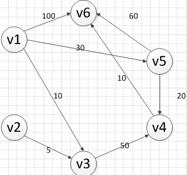
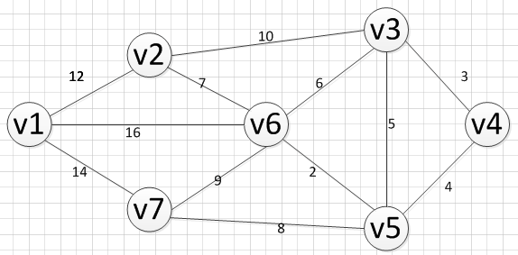

# 寻路算法

----

## Dijkstra算法
参考文章：[Dijkstra算法详解](https://blog.csdn.net/qq_35644234/article/details/60870719)
### 特点
Dijkstra算法使用了广度优先搜索解决赋权有向图或者无向图的单源最短路径问题，算法最终得到一个最短路径树。该算法常用于路由算法或者作为其他图算法的一个子模块。

### 思路
Dijkstra算法采用的是一种贪心的策略，声明一个数组dis来保存源点到各个顶点的最短距离和一个保存已经找到了最短路径的顶点的集合：T，初始时，原点 s 的路径权重被赋为 0 （dis[s] = 0）。若对于顶点 s 存在能直接到达的边（s,m），则把dis[m]设为w（s, m）,同时把所有其他（s不能直接到达的）顶点的路径长度设为无穷大。初始时，集合T只有顶点s。  

然后，从dis数组选择最小值，则该值就是源点s到该值对应的顶点的最短路径，并且把该点加入到T中，OK，此时完成一个顶点，然后，我们需要看看新加入的顶点是否可以到达其他顶点，并且看看通过该顶点到达其他点的路径长度是否比源点直接到达短，如果是，那么就替换这些顶点在dis中的值。  

然后，又从dis中找出最小值，重复上述动作，直到T中包含了图的所有顶点。  

  

**先声明一个dis数组**  
顶点集T的初始化为：T={v1}  
Dis：  
| v1 | v2 | v3 | v4 | v5 | v6 |
| -- | -- | -- | -- | -- | -- |
| 0 | ∞ | 10 | ∞ | 30 | 100 |

通过数组 dis 可知当前离v1顶点最近是 v3顶点。当选择了 2 号顶点后，dis[2]（下标从0开始）的值就已经从“估计值”变为了“确定值”，即 v1顶点到 v3顶点的最短路程就是当前 dis[2]值。将V3加入到T中。  
因为目前离 v1顶点最近的是 v3顶点，并且这个图所有的边都是正数，那么肯定不可能通过第三个顶点中转，使得 v1顶点到 v3顶点的路程进一步缩短了。因为 v1顶点到其它顶点的路程肯定没有 v1到 v3顶点短。  
Dis：  
| v1 | v2 | v3 | v4 | v5 | v6 |
| -- | -- | -- | -- | -- | -- |
| 0 | ∞ | 10 | 60 | 30 | 100 |

从除dis[2]和dis[0]外的其他值中寻找最小值，发现dis[4]的值最小，通过之前是解释的原理，可以知道v1到v5的最短距离就是dis[4]的值，然后，我们把v5加入到集合T中，然后，考虑v5的出度是否会影响我们的数组dis的值，v5有两条出度：< v5,v4>和 < v5,v6>,然后我们发现：v1–v5–v4的长度为：50，而dis[3]的值为60，所以我们要更新dis[3]的值.另外，v1-v5-v6的长度为：90，而dis[5]为100，所以我们需要更新dis[5]的值。  
Dis：  
| v1 | v2 | v3 | v4 | v5 | v6 |
| -- | -- | -- | -- | -- | -- |
| 0 | ∞ | 10 | 50 | 30 | 90 |

**重复以上步骤**  
Dis：  
| v1 | v2 | v3 | v4 | v5 | v6 |
| -- | -- | -- | -- | -- | -- |
| 0 | ∞ | 10 | 50 | 30 | 60 |

**最后结果**  
|起点|终点|最短路径|长度|
| -- | -- | -- | -- |
|v1|v2|无|∞|
||v3|{v1,v3}|10|
||v4|{v1,v5,v4}|50|
||v5|{v1,v5}|30|
||v6|{v1，v5,v4,v6}|60|

## Floyd算法
参考文章：[Floyd算法详解](https://blog.csdn.net/qq_35644234/article/details/60875818)

### 特点
Floyd算法是解决任意两点间的最短路径的一种算法，可以正确处理有向图或有向图或负权（但不可存在负权回路)的最短路径问题，同时也被用于计算有向图的传递闭包。  

### 思路
通过Floyd计算图G=(V,E)中各个顶点的最短路径时，需要引入两个矩阵，矩阵S中的元素a[i][j]表示顶点i(第i个顶点)到顶点j(第j个顶点)的距离。矩阵P中的元素b[i][j]，表示顶点i到顶点j经过了b[i][j]记录的值所表示的顶点。  

假设图G中顶点个数为N，则需要对矩阵D和矩阵P进行N次更新。初始时，矩阵D中顶点a[i][j]的距离为顶点i到顶点j的权值；如果i和j不相邻，则a[i][j]=∞，矩阵P的值为顶点b[i][j]的j的值。 接下来开始，对矩阵D进行N次更新。第1次更新时，如果”a[i][j]的距离” > “a[i][0]+a[0][j]”(a[i][0]+a[0][j]表示”i与j之间经过第1个顶点的距离”)，则更新a[i][j]为”a[i][0]+a[0][j]”,更新b[i][j]=b[i][0]。 同理，第k次更新时，如果”a[i][j]的距离” > “a[i][k-1]+a[k-1][j]”，则更新a[i][j]为”a[i][k-1]+a[k-1][j]”,b[i][j]=b[i][k-1]。  

  

**第一步**  
初始化两个矩阵  

|D矩阵|v1|v2|v3|v4|v5|v6|v7|
| -- | -- | -- | -- | -- | -- | -- | -- |
|v1|∞|12|∞|∞|∞|16|14|
|v2|12|∞|10|∞|∞|7|∞|
|v3|∞|10|∞|3|5|6|∞|
|v4|∞|∞|3|∞|4|∞|∞|
|v5|∞|∞|5|4|∞|2|8|
|v6|16|7|6|∞|2|∞|9|
|v7|14|∞|∞|∞|8|9|∞|

|P矩阵|v1|v2|v3|v4|v5|v6|v7|
| -- | -- | -- | -- | -- | -- | -- | -- |
|v1|0|1|2|3|4|5|6|
|v2|0|1|2|3|4|5|6|
|v3|0|1|2|3|4|5|6|
|v4|0|1|2|3|4|5|6|
|v5|0|1|2|3|4|5|6|
|v6|0|1|2|3|4|5|6|
|v7|0|1|2|3|4|5|6|

**第二步**  
以v1为中介，更新两个矩阵  

|D矩阵|v1|v2|v3|v4|v5|v6|v7|
| -- | -- | -- | -- | -- | -- | -- | -- |
|v1|∞|12|∞|∞|∞|16|14|
|v2|12|∞|10|∞|∞|7|**26**|
|v3|∞|10|∞|3|5|6|∞|
|v4|∞|∞|3|∞|4|∞|∞|
|v5|∞|∞|5|4|∞|2|8|
|v6|16|7|6|∞|2|∞|9|
|v7|14|**26**|∞|∞|8|9|∞|

|P矩阵|v1|v2|v3|v4|v5|v6|v7|
| -- | -- | -- | -- | -- | -- | -- | -- |
|v1|0|1|2|3|4|5|6|
|v2|0|1|2|3|4|5|**0**|
|v3|0|1|2|3|4|5|6|
|v4|0|1|2|3|4|5|6|
|v5|0|1|2|3|4|5|6|
|v6|0|1|2|3|4|5|6|
|v7|0|**0**|2|3|4|5|6|

**第三步**  
以v2为中介，更新两个矩阵  

|D矩阵|v1|v2|v3|v4|v5|v6|v7|
| -- | -- | -- | -- | -- | -- | -- | -- |
|v1|∞|12|**22**|∞|∞|16|14|
|v2|12|∞|10|∞|∞|7|26|
|v3|**22**|10|∞|3|5|6|**36**|
|v4|∞|∞|3|∞|4|∞|∞|
|v5|∞|∞|5|4|∞|2|8|
|v6|16|7|6|∞|2|∞|9|
|v7|14|26|**36**|∞|8|9|∞|

|P矩阵|v1|v2|v3|v4|v5|v6|v7|
| -- | -- | -- | -- | -- | -- | -- | -- |
|v1|0|1|**1**|3|4|5|6|
|v2|0|1|2|3|4|5|0|
|v3|**1**|1|2|3|4|5|**1**|
|v4|0|1|2|3|4|5|6|
|v5|0|1|2|3|4|5|6|
|v6|0|1|2|3|4|5|6|
|v7|0|0|**1**|3|4|5|6|

**重复以上步骤...**  

## SPFA算法
最短路径快速算法【Shortest Path Faster Algorithm】  

参考文章：[SPFA算法](https://blog.csdn.net/qq_35644234/article/details/61614581)

### 特点
其优于Dijkstra算法的方面是边的权值可以为负数、实现简单，缺点是时间复杂度过高，高达 O(VE)。但算法可以进行若干种优化，提高了效率。

### 思路
用数组dis记录每个结点的最短路径估计值，用邻接表或邻接矩阵来存储图G。我们采取的方法是动态逼近法：设立一个先进先出的队列用来保存待优化的结点，优化时每次取出队首结点u，并且用u点当前的最短路径估计值对离开u点所指向的结点v进行松弛操作，如果v点的最短路径估计值有所调整，且v点不在当前的队列中，就将v点放入队尾。这样不断从队列中取出结点来进行松弛操作，直至队列空为止。  

要知道带有负环的图是没有最短路径的，所以我们在执行算法的时候，要判断图是否带有负环，方法有两种：  
  * 开始算法前，调用拓扑排序进行判断（一般不采用，浪费时间）
  * 如果某个点进入队列的次数超过N次则存在负环（N为图的顶点数）

  

**先声明一个dis数组**  
Dis：  
| v1 | v2 | v3 | v4 | v5 | v6 |
| -- | -- | -- | -- | -- | -- |
| 0 | ∞ | ∞ | ∞ | ∞ | ∞ |
将v1入队列：{v1}  

进入循环，直到队列为空才退出循环。  

**第一次循环**  
首先，队首元素出队列，即是v1出队列，然后，对以v1为弧尾的边对应的弧头顶点进行松弛（即存在另一个点，使得路径变短）操作，可以发现v1到v3，v5，v6三个顶点的最短路径变短了，更新dis数组的值，得到如下结果：  
Dis：  
| v1 | v2 | v3 | v4 | v5 | v6 |
| -- | -- | -- | -- | -- | -- |
| 0 | ∞ | 10 | ∞ | 30 | 100 |
v3，v5，v6都被松弛了，而且不在队列中，所以要他们都加入到队列中：{v3，v5，v6}  

**第二次循环**  
此时，队首元素为v3，v3出队列，然后，对以v3为弧尾的边对应的弧头顶点进行松弛操作，可以发现v1到v4的边，经过v3松弛变短了，所以更新dis数组，得到如下结果：
Dis：  
| v1 | v2 | v3 | v4 | v5 | v6 |
| -- | -- | -- | -- | -- | -- |
| 0 | ∞ | 10 | 60 | 30 | 100 |
此时只有v4对应的值被更新了，而且v4不在队列中，则把它加入到队列中：{v5,v6,v4}  

**重复以上步骤，直到循环结束**  
Dis：  
| v1 | v2 | v3 | v4 | v5 | v6 |
| -- | -- | -- | -- | -- | -- |
| 0 | ∞ | 10 | 50 | 30 | 60 |

## A星算法
参考文章：[A星算法](https://zhuanlan.zhihu.com/p/38595351)、[直白讲解A星算法](https://www.cnblogs.com/leoin2012/p/3899822.html)

### 特点
A*（A-Star)算法是一种求解最短路径**最有效的直接**搜索方法。  
注意，这里指的是直接搜索方法。对于预处理算法（如ALT，CH，HL等等），在线查询效率是A*算法的数千甚至上万倍。  

### 思路
在游戏设计中，地图可以划分为若干大小相同的方块区域（方格），这些方格就是寻路的基本单元。  

在确定了寻路的开始点，结束点的情况下，假定每个方块都有一个F值，该值代表了在当前路线下选择走该方块的代价。  

从开始点，每走一步都选择代价最小的格子走，直到达到结束点。  

**A星算法核心公式就是F值的计算：**  
F = G + H
  * F - 方块的总移动代价
  * G - 开始点到当前方块的移动代价
  * H - 当前方块到结束点的预估移动代价

**G值**  
假设现在我们在某一格子，邻近有8个格子可走，当我们往上、下、左、右这4个格子走时，移动代价为10；当往左上、左下、右上、右下这4个格子走时，移动代价为14；即走斜线的移动代价为走直线的1.4倍。  
这就是G值最基本的计算方式，适用于大多数2.5Drpg页游。  

基本公式：  
**G = 移动代价**  

根据游戏需要，G值的计算可以进行拓展。如加上地形因素对寻路的影响。格子地形不同，那么选择通过不同地形格子，移动代价肯定不同。同一段路，平地地形和丘陵地形，虽然都可以走，但平地地形显然更易走。  
我们可以给不同地形赋予不同代价因子，来体现出G值的差异。如给平地地形设置代价因子为1，丘陵地形为2，在移动代价相同情况下，平地地形的G值更低，算法就会倾向选择G值更小的平地地形。  

拓展公式：  
**G = 移动代价 * 代价因子**  

**H值**  
在只知道当前点，结束点，不知道这两者的路径情况下，我们无法精确地确定H值大小，所以只能进行预估。  
**H = 当前方块到结束点的水平距离 + 当前方块到结束点的垂直距离**  

**常用估价算法**  
  * 曼哈顿距离：H(n) = D * (abs ( n.x – goal.x ) + abs ( n.y – goal.y ) ) 【从一个位置移动到邻近位置的最小代价D】
  * 对角线距离：h(n) = D * max(abs(n.x - goal.x), abs(n.y - goal.y)) 【假设直线和对角线的代价都是D】
  * 欧几里得距离：h(n) = D * sqrt((n.x-goal.x)^2 + (n.y-goal.y)^2) 【移动单位可以沿着任意角度移动（而不是网格方向）】

**每个方块的G值、H值**
  * G值 = 父节点的G值 + 父节点到当前点的移动代价
  * H值 = 当前点到结束点的曼哈顿距离

A星算法还需要用到两个列表：  
  * **开放列表** - 用于记录所有可考虑选择的格子
  * **封闭列表** - 用于记录所有不再考虑的格子

**A星算法伪码：**  
  * a、将开始点记录为当前点P
  * b、将当前点P放入封闭列表
  * c、搜寻点P所有邻近点，假如某邻近点既没有在开放列表或封闭列表里面，则计算出该邻近点的F值，并设父节点为P，然后将其放入开放列表
  * d、判断开放列表是否已经空了，如果没有说明在达到结束点前已经找完了所有可能的路径点，寻路失败，算法结束；否则继续。
  * e、从开放列表拿出一个F值最小的点，作为寻路路径的下一步。
  * f、判断该点是否为结束点，如果是，则寻路成功，算法结束；否则继续。
  * g、将该点设为当前点P，跳回步骤c。