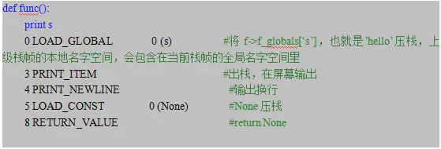

# python程序执行原理

----
Python先把代码（.py文件）编译成字节码，交给字节码虚拟机，然后虚拟机一条一条执行字节码指令，从而完成程序的执行。  

## 字节码
字节码在Python虚拟机程序里对应的是PyCodeObject对象。  
.pyc文件是字节码在磁盘上的表现形式。  

## pyc文件
PyCodeObject对象的创建时机是模块加载的时候，即import。  
Python test.py会对test.py进行编译成字节码并解释执行，但是不会生成test.pyc。  
如果test.py加载了其他模块，如import util，Python会对util.py进行编译成字节码，生成util.pyc，然后对字节码解释执行。  
如果想生成test.pyc，我们可以使用Python内置模块py_compile来编译。  
加载模块时，如果同时存在.py和.pyc，Python会尝试使用.pyc，如果.pyc的编译时间早于.py的修改时间，则重新编译.py并更新.pyc。  

## PyCodeObject
Python代码的编译结果就是PyCodeObject对象。  
加载模块时，模块对应的PyCodeObject对象被写入.pyc文件，格式如下：  
```c++
typedef struct {
    PyObject_HEAD
    int co_argcount;        /* 位置参数个数 */
    int co_nlocals;         /* 局部变量个数 */
    int co_stacksize;       /* 栈大小 */
    int co_flags;  
    PyObject *co_code;      /* 字节码指令序列 */
    PyObject *co_consts;    /* 所有常量集合 */
    PyObject *co_names;     /* 所有符号名称集合 */
    PyObject *co_varnames;  /* 局部变量名称集合 */
    PyObject *co_freevars;  /* 闭包用的的变量名集合 */
    PyObject *co_cellvars;  /* 内部嵌套函数引用的变量名集合 */
    /* The rest doesn't count for hash/cmp */
    PyObject *co_filename;  /* 代码所在文件名 */
    PyObject *co_name;      /* 模块名|函数名|类名 */
    int co_firstlineno;     /* 代码块在文件中的起始行号 */
    PyObject *co_lnotab;    /* 字节码指令和行号的对应关系 */
    void *co_zombieframe;   /* for optimization only (see frameobject.c) */
} PyCodeObject;
```

## 分析字节码
```py
s = "hello"
 
def func():
    print(s)
 
func()
```
使用内置函数compile可以编译Python代码，得到test.py的PyCodeObject： 
  
```py
co.co_argcount    0
co.co_nlocals     0
co.co_names       ('s', 'func')
co.co_varnames    ('s', 'func')
co.co_consts      ('hello', <code object func at 0x2aaeeec57110, file ”test.py”, line 3>, None)
co.co_code        'd\x00\x00Z\x00\x00d\x01\x00\x84\x00\x00Z\x01\x00e\x01\x00\x83\x00\x00\x01d\x02\x00S'
```

Python解释器会为函数也生成的字节码PyCodeObject对象，见上面的co_consts[1]，得到func的PyCodeObject：  
```py
func.co_argcount   0
func.co_nlocals    0
func.co_names      ('s',)
func.co_varnames   ()
func.co_consts     (None,)
func.co_code       't\x00\x00GHd\x00\x00S'
```

co_code是指令序列，是一串二进制流。  
Python内置的dis模块可以解析co_code。  
  
  * 第一列表示以下几个指令在py文件中的行号；
  * 第二列是该指令在指令序列co_code里的偏移量；
  * 第三列是指令opcode的名称，分为有操作数和无操作数两种，opcode在指令序列中是一个字节的整数；
  * 第四列是操作数oparg，在指令序列中占两个字节，基本都是co_consts或者co_names的下标；
  * 第五列带括号的是操作数说明。

## 执行字节码
Python虚拟机的原理就是模拟可执行程序再X86机器上的运行，X86的运行时栈帧如下图：  
  

Python虚拟机的原理就是模拟上述行为。当发生函数调用时，创建新的栈帧，对应Python的实现就是PyFrameObject对象。  
PyFrameObject：  
```c++
typedef struct _frame {
    PyObject_VAR_HEAD
    struct _frame *f_back;    /* 调用者的帧 */
    PyCodeObject *f_code;     /* 帧对应的字节码对象 */
    PyObject *f_builtins;     /* 内置名字空间 */
    PyObject *f_globals;      /* 全局名字空间 */
    PyObject *f_locals;       /* 本地名字空间 */
    PyObject **f_valuestack;  /* 运行时栈底 */
    PyObject **f_stacktop;    /* 运行时栈顶 */
    ...
}
```

执行test.py的字节码时，会先创建一个栈帧。  
test.py的指令序列：  
  
上面的CALL_FUNCTION指令执行时，会创建新的栈帧，并执行func的字节码指令，以下用f表示当前栈帧，func的字节码执行过程如下。  
func函数的指令序列:  
  


若想查看当前栈帧，Python提供了`sys._getframe()`方法可以获取当前栈帧，你只需要在代码里加入代码如下：  
```py
def func():
    import sys
    frame = sys._getframe()
    print(frame.f_locals)
    print(frame.f_globals)
    print(frame.f_back.f_locals)
    #你可以打印frame的各个域
    pass;
```


## 关于函数的调用
函数的调用会为函数局部变量生产一个新的符号表。确切说，所有函数中的变量赋值都是将值存储在局部符号表。变量引用首先在局部符号表中查找，然后是包含函数的局部符号表，然后是全局符号表，最后是内置名字表。因此，局部变量不能在函数中直接赋值（除非用global），尽管他们可以被引用。  

函数引用的实参在函数被调用的时候引入局部符号表，因此实参总是传值调用（该值通常指的是对象的引用，而不是该对象的值），一个函数被另一个函数调用的时候，一个新的局部符号表在调用过程中被创建。python的函数是以传址的方式工作，当调用一个函数的时候，改变指针指向。  

一个函数定义的时候会讲函数名引入当前子都表。函数名指代的值会被解析器当作用户定义函数的类型。这个值可以赋予其他的名字，然后其他的名字也可以被当作函数使用，这可以作为通用的重命名机制。  