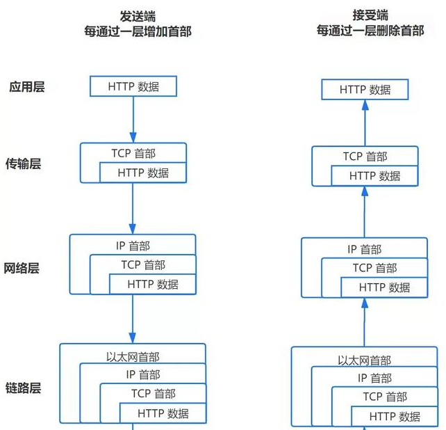
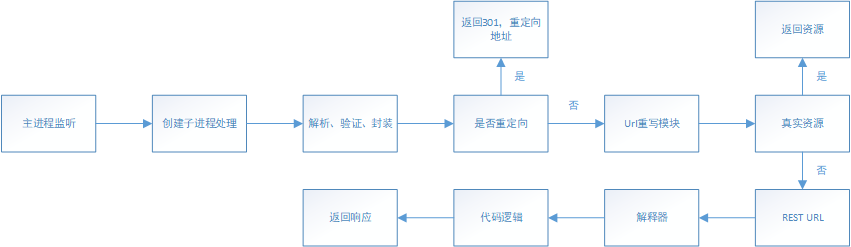
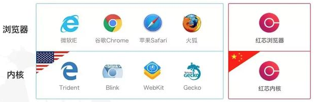
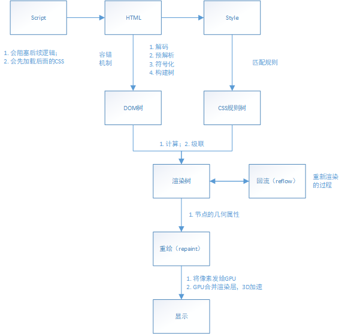
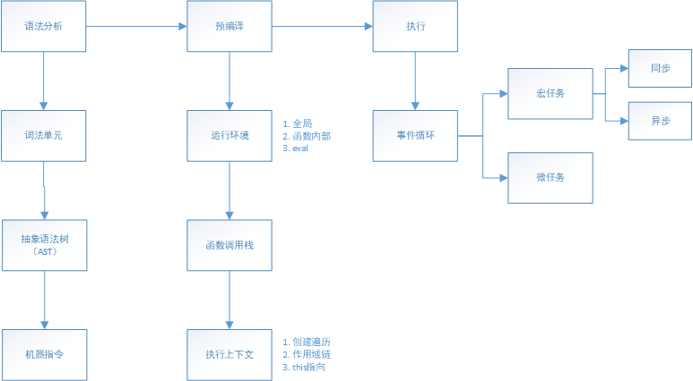
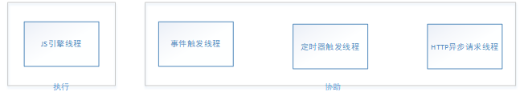

# 从输入Url到页面渲染

----
## 前言
本次流程基于一个简单的`HTTP`请求。  
主要流程为：  
  * (1) `URL`解析
  * (2) `DNS`查询
  * (3) `TCP`连接
  * (4) 处理请求
  * (5) 接受响应
  * (4) 渲染页面

## 1. URL解析
#### 1.1 url解析  
  * 浏览器判断输入的是url还是搜索关键字，并自动对输入内容进行字符编码等操作。

#### 1.2 HSTS
  * 浏览器根据HSTS 强制客户端使用`HTTPS`(`HTTP Strict-Transport-Security`)访问页面。【让浏览器得知，在接下来的一段时间内，当前域名只能通过HTTPS进行访问，并且在浏览器发现当前连接不安全的情况下，强制拒绝用户的后续访问要求。】

#### 1.3 其它操作
  * 浏览器还会进行其他操作，比如安全检查、访问限制（之前国产浏览器限制 996.icu）。

#### 1.4 检查缓存
  * 根据缓存进行页面加载。

## 2. DNS查询
#### 2.1 浏览器缓存
  * 浏览器会先检查是否在缓存中，没有则调用系统库函数进行查询。

#### 2.2 操作系统缓存
  * 先检查域名是否存在本地的`Hosts`文件里，没有则向`DNS`服务器发送查询请求。
  * 然后检查操作系统的`DNS`缓存。

#### 2.3 路由器缓存

#### 2.4 ISP DNS 缓存
  * `ISP DNS`就是在客户端电脑上设置的首选`DNS`服务器，它们在大多数情况下都会有缓存。

#### 2.5 根域名服务器查询
  * 当前面所有步骤没有缓存的情况下，本地`DNS`服务器会将请求转发到互联网上的根域。

注意事项：  
  * 递归方式：一路查下去中间不返回，得到最终结果才返回信息（浏览器到本地DNS服务器的过程）。
  * 迭代方式，就是本地DNS服务器到根域名服务器查询的方式。
  * `DNS`劫持：通过攻击域名解析服务器（`DNS`），或伪造域名解析服务器（`DNS`）的方法，把目标网站域名解析到错误的地址从而实现用户无法访问目标网站的目的。
  * 前端`dns-prefetch`优化：一种DNS 预解析技术，当你浏览网页时，浏览器会在加载网页时对网页中的域名进行解析缓存，这样在你单击当前网页中的连接时就无需进行DNS的解析，减少用户等待时间，提高用户体验。
```
// a标签的默认启动dns-prefetch在HTTPS不起作用。需要如下设置开启：
<meta http-equiv="x-dns-prefetch-control" content="on">
```

## 3. TCP连接
TCP/IP 分为四层，在发送数据时，每层都要对数据进行封装。
  

#### 3.1 应用层：发送 HTTP 请求
在前面的步骤我们已经得到服务器的 IP 地址，浏览器会开始构造一个 HTTP 报文，其中包括：  
  * 请求报头（Request Header）：请求方法、目标地址、遵循的协议等等;
  * 请求主体（其他参数）。

注意：
  * 浏览器只能发送 GET、POST 方法，而打开网页使用的是 GET 方法。

#### 3.2 传输层：TCP 传输报文
  * 传输层会发起一条到达服务器的 TCP 连接，为了方便传输，会对数据进行分割（以报文段为单位），并标记编号，方便服务器接受时能够准确地还原报文信息。
  * 在建立连接前，会先进行 TCP 三次握手。

TCP连接漏洞：在接收到初始SYN数据包之后，服务器将用一个或多个SYN / ACK数据包进行响应，并等待握手中的最后一步。  

SYN Flood（半开放攻击）：是一种拒绝服务（DDoS）攻击，其目的是通过消耗所有可用的服务器资源使服务器不可用于合法流量。通过重复发送初始连接请求（SYN）数据包，攻击者能够压倒目标服务器机器上的所有可用端口，导致目标设备根本不响应合法流量。  
工作原理：  
攻击者向目标服务器发送大量SYN数据包，通常会使用欺骗性的IP地址。  
然后，服务器响应每个连接请求，并留下开放端口准备好接收响应。  
当服务器等待从未到达的最终ACK数据包时，攻击者继续发送更多的SYN数据包。每个新的SYN数据包的到达导致服务器暂时维持新的开放端口连接一段时间，一旦所有可用端口被使用，服务器就无法正常工作。

可以三种不同的方式发生：  
  * 直接攻击：攻击IP地址不被欺骗。在这次攻击中，攻击者根本不掩盖其IP地址。
  * 欺骗性攻击：恶意用户也可以欺骗他们发送的每个SYN数据包上的IP地址，以抑制缓解工作，使其身份更难发现。虽然数据包可能被欺骗，但这些数据包可能会被追溯到其来源。
  * 分布式攻击（DDoS）：如果使用僵尸网络创建攻击，则将攻击溯源到源的可能性很低。对于增加的混淆级别，攻击者可能会使每个分布式设备也欺骗发送数据包的IP地址。

减轻SYN Flood攻击的方式：
  * 增加积压队列：对大量SYN数据包的一个响应是增加操作系统允许的可能半开连接的最大数量。为了成功增加最大积压，系统必须预留额外的内存资源来处理所有新的请求。
  * 回收最早的半开TCP连接：一旦积压已被填补，另一个缓解策略就是覆盖最早的半开式连接。这种策略要求合法连接可以在比可以填充恶意SYN数据包的积压时间更短的时间内完全建立。当攻击量增加时，或者如果积压量太小而不实际，这种特定的防御就会失败。
  * SYN cookie：服务器创建一个cookie。为了避免在积压已经被填满的情况下连接丢失的风险，服务器使用SYN-ACK数据包对每个连接请求进行响应，然后从积压中删除SYN请求，从存储器中删除请求并使端口打开，准备建立新的连接。如果连接是合法请求，并且最终的ACK数据包从客户端计算机发送回服务器，则服务器将重建（有一些限制）SYN积压队列条目。尽管这种缓解措施确实丢失了有关TCP连接的一些信息，但是优于允许合法用户因攻击而发生拒绝服务。

#### 3.3 网络层：IP协议查询Mac地址
  * 将数据段打包，并加入源及目标的IP地址，并且负责寻找传输路线。
  * 判断目标地址是否与当前地址处于同一网络中，是的话直接根据 Mac 地址发送，否则使用路由表查找下一跳地址，以及使用 ARP 协议查询它的 Mac 地址。

注意：  
  * 在 OSI 参考模型中 ARP 协议位于链路层，但在 TCP/IP 中，它位于网络层。

#### 3.4 链路层：以太网协议
##### 以太网协议  
将数据分为以“帧”为单位的数据包，每一帧分为两个部分：  
  * 标头：数据包的发送者、接受者、数据类型；
  * 数据：数据包具体内容。

##### Mac 地址
以太网规定了连入网络的所有设备都必须具备“网卡”接口，数据包都是从一块网卡传递到另一块网卡，网卡的地址就是 Mac 地址。每一个 Mac 地址都是独一无二的，具备了一对一的能力。

##### 广播
发送数据的方法很原始，直接把数据通过 ARP 协议，向本网络的所有机器发送，接收方根据标头信息与自身 Mac 地址比较，一致就接受，否则丢弃。  
注意：接收方回应是单播。  

ARP（Address Resolution Protocol，地址解析协议）攻击：  
通过伪造IP地址和MAC地址实现ARP欺骗，能够在网络中产生大量的ARP通信量使网络阻塞，攻击者只要持续不断的发出伪造的ARP响应包就能更改目标主机ARP缓存中的IP-MAC条目，造成网络中断或中间人攻击。  
ARP攻击主要是存在于局域网网络中，局域网中若有一个人感染ARP木马，则感染该ARP木马的系统将会试图通过“ARP欺骗”手段截获所在网络内其它计算机的通信信息，并因此造成网内其它计算机的通信故障。  

##### 服务器接受请求
  * 接受过程就是把以上步骤逆转过来！

#### 4. 服务器处理请求
主要流程：  
  

##### HTTPD
其会监听得到的请求，然后开启一个子进程去处理这个请求。  
最常见的 HTTPD 有 Linux 上常用的 Apache 和 Nginx，以及 Windows 上的 IIS。  

##### 处理请求
接受 TCP 报文后，会对连接进行处理，对HTTP协议进行解析（请求方法、域名、路径等），并且进行一些验证：  
  * 验证是否配置虚拟主机；
  * 验证虚拟主机是否接受此方法；
  * 验证该用户可以使用该方法（根据 IP 地址、身份信息等）。

##### 重定向
假如服务器配置了 HTTP 重定向，就会返回一个 301永久重定向响应，浏览器就会根据响应，重新发送 HTTP 请求（重新执行上面的过程）。

##### URL 重写
查看 URL 重写规则，如果请求的文件是真实存在的，比如图片、html、css、js文件等，则会直接把这个文件返回。  
否则服务器会按照规则把请求重写到 一个 REST 风格的 URL 上。  
然后根据动态语言的脚本，来决定调用什么类型的动态文件解释器来处理这个请求。  

#### 5. 浏览器接受响应
  * 浏览器接收到来自服务器的响应资源后，会对资源进行分析。
  * 查看 Response header，根据不同状态码做不同的事（比如上面提到的重定向）。
  * 如果响应资源进行了压缩（比如 gzip），还需要进行解压。
  * 对响应资源做缓存。
  * 根据响应资源里的 MIME[3] 类型去解析响应内容（比如 HTML、Image各有不同的解析方式）。
  
#### 6. 渲染页面
##### 浏览器内核
  

##### 基本流程
  
###### HTML 解析
从上往下一行一行地解析。  
解析的过程可以分为四个步骤：  
  * 解码（encoding）：传输回来的其实都是一些二进制字节数据，浏览器需要根据文件指定编码（例如UTF-8）转换成字符串，也就是HTML 代码。
  * 预解析（pre-parsing）：提前加载资源，减少处理时间，它会识别一些会请求资源的属性，比如img标签的src属性，并将这个请求加到请求队列中。
  * 符号化（tokenization）：是词法分析的过程，将输入解析成符号，HTML 符号包括，开始标签、结束标签、属性名和属性值。其通过一个状态机去识别符号的状态，比如遇到<，>状态都会产生变化。
  * 构建树（tree construction）：在上一步符号化中，解析器获得这些标记，然后以合适的方法创建DOM对象并把这些符号插入到DOM对象中。
注意：符号化和构建树是并行操作的，也就是说只要解析到一个开始标签，就会创建一个 DOM 节点。  
  
浏览器容错进制：从来没有在浏览器看过类似”语法无效”的错误，是因为浏览器去纠正错误的语法，然后继续工作。  
事件：当整个解析的过程完成以后，浏览器会通过DOMContentLoaded事件来通知DOM解析完成。

###### CSS 解析
一旦浏览器下载了 CSS，CSS 解析器就会处理它遇到的任何 CSS，根据语法规范解析出所有的 CSS 并进行标记化，然后得到一个规则表。  
CSS 匹配规则：在匹配一个节点对应的 CSS 规则时，是按照从右到左的顺序的，例如：div p { font-size :14px }会先寻找所有的p标签然后判断它的父元素是否为div。  
注意：写 CSS 时，尽量用 id 和 class，千万不要过度层叠。  

###### 渲染树
DOM 树和 CSS 规则树合并的过程。  
注意：渲染树会忽略那些不需要渲染的节点，比如设置了display:none的节点。  

**计算**  
通过计算让任何尺寸值都减少到三个可能之一：auto、百分比、px，比如把rem转化为px。  

**级联**  
浏览器需要一种方法来确定哪些样式才真正需要应用到对应元素，所以它使用一个叫做specificity的公式，这个公式会通过：  
  * 标签名、class、id
  * 是否内联样式
  * !important
然后得出一个权重值，取最高的那个。

**渲染阻塞**
当遇到一个script标签时，DOM 构建会被暂停，直至脚本完成执行，然后继续构建 DOM 树。  
但如果 JS 依赖 CSS 样式，而它还没有被下载和构建时，浏览器就会延迟脚本执行，直至 CSS Rules 被构建。  
故而：  
  * CSS 会阻塞 JS 执行；
  * JS 会阻塞后面的 DOM 解析。
为了避免这种情况，应该以下原则：  
  * CSS 资源排在 JavaScript 资源前面；
  * JS 放在 HTML 最底部，也就是 </body>前。
另外，如果要改变阻塞模式，可以使用 defer 与 async。

###### 布局与绘制
确定渲染树种所有节点的几何属性，比如：位置、大小等等，最后输入一个盒子模型，它能精准地捕获到每个元素在屏幕内的准确位置与大小。  
然后遍历渲染树，调用渲染器的 paint() 方法在屏幕上显示其内容。  

###### 合并渲染层
把以上绘制的所有图片合并，最终输出一张图片。

###### 回流与重绘
**回流(reflow)**  
当浏览器发现某个部分发现变化影响了布局时，需要倒回去重新渲染，会从html标签开始递归往下，重新计算位置和大小。  
reflow基本是无法避免的，因为当你滑动一下鼠标、resize 窗口，页面就会产生变化。  

**重绘(repaint)**
改变了某个元素的背景色、文字颜色等等不会影响周围元素的位置变化时，就会发生重绘。  
每次重绘后，浏览器还需要合并渲染层并输出到屏幕上。  
回流的成本要比重绘高很多，所以我们应该尽量避免产生回流。  

  * eg: display:none 会触发回流，而 visibility:hidden 只会触发重绘。

###### JavaScript 编译执行
主要流程：  
  

主要分成三大部分：  
**词法分析**  
JS 脚本加载完毕后，会首先进入语法分析阶段，它首先会分析代码块的语法是否正确，不正确则抛出“语法错误”，停止执行。  
主要有三个步骤：  
  * 分词，例如将var a = 2，，分成var、a、=、2这样的词法单元。
  * 解析，将词法单元转换成抽象语法树（AST）。
  * 代码生成，将抽象语法树转换成机器指令。
  
**预编译**  
JS 有三种运行环境：  
  * 全局环境
  * 函数环境
  * eval

每进入一个不同的运行环境都会创建一个对应的执行上下文，根据不同的上下文环境，形成一个函数调用栈，栈底永远是全局执行上下文，栈顶则永远是当前执行上下文。  
  
**创建执行上下文**主要事件：  
  * 创建变量对象
  * 参数、函数、变量
  * 建立作用域链
  * 确认当前执行环境是否能访问变量
  * 确定 This 指向
  
**执行**
**JS 线程**：  
  
尽管JS 是单线程的，但实际上参与工作的线程一共有四个：`其中三个只是协助，只有 JS 引擎线程是真正执行的。`  
  * JS 引擎线程：也叫 JS 内核，负责解析执行 JS 脚本程序的主线程，例如 V8 引擎；
  * 事件触发线程：属于浏览器内核线程，主要用于控制事件，例如鼠标、键盘等，当事件被触发时，就会把事件的处理函数推进事件队列，等待 JS 引擎线程执行；
  * 定时器触发线程：主要控制setInterval和setTimeout，用来计时，计时完毕后，则把定时器的处理函数推进事件队列中，等待 JS 引擎线程；
  * HTTP 异步请求线程：通过XMLHttpRequest连接后，通过浏览器新开的一个线程，监控readyState状态变更时，如果设置了该状态的回调函数，则将该状态的处理函数推进事件队列中，等待JS引擎线程执行。

**注意：浏览器对同一域名的并发连接数是有限的，通常为 6 个。**

**宏任务**分为：  
  * 同步任务：按照顺序执行，只有前一个任务完成后，才能执行后一个任务；
  * 异步任务：不直接执行，只有满足触发条件时，相关的线程将该异步任务推进任务队列中，等待JS引擎主线程上的任务执行完毕时才开始执行，例如异步Ajax、DOM事件，setTimeout等。

**微任务**：  
  
微任务是ES6和Node环境下的，主要 API 有：Promise，process.nextTick。  
微任务的执行在宏任务的同步任务之后，在异步任务之前。  

**代码例子**
```js
console.log('1'); // 宏任务 同步
setTimeout(function() { console.log('2'); // 宏任务 异步})
new Promise(function(resolve) { console.log('3'); // 宏任务 同步 resolve();}).then(function() { console.log('4') // 微任务})
console.log('5') // 宏任务 同步
// 以上代码输出顺序为：1,3,5,4,2
```