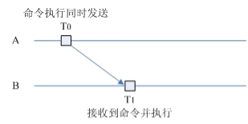
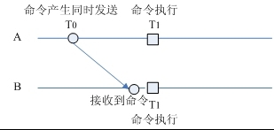
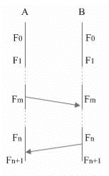

# 游戏同步策略

----
## 1. 关于游戏同步
### 1.1 同步的对象
所谓同步的对象，就是要同步的消息，发送给谁。可以是client-client，client-server，也可以是client-server-client。其中server负责的是验证数据并转发。  
  * 单个用户，比如创建一个用户的消息，某些确认消息，转发给私聊或者好友的聊天信息。
  * 发给同一区域中的所有用户，常见的是同屏。
  * 发给整个游戏世界中的所有用户的消息，比如游戏中的各种通告消息。

### 1.2 同步的数据
  * 命令（输入）同步，即时发送。Client或者server都可以发起。比如一个用户开始行走，将发送一条描述行走的命令给server，server校验合法后，将这条命令转发给其他client中的用户。
  * 状态同步，按照一定频率，可以区分细节度发送，这只能由server发起。
对象属性细分（对象指游戏中的玩家，怪物等）:  
  * 不需同步的属性，服务端和客户端都可根据本地的配置文件载入，比如PVE中怪物的名字、怪物的移动速度、PVP中角色技能等级数据等。
  * 需要在创建时同步一次的，以后不会改变。比如玩家的性别。
  * 需要频繁的同步的属性，比如玩家的生命。

### 1.3 同步的周期
  * 命令（输入）：即时转发
  * 状态：按照一定的频率和细节度发送，具体的数值需要有足够的灵活性来调节
  
要想在有限的网络响应情况下，实现快速实时类游戏，提供完美交互，需要解决好以下几个问题：  
### 1.4 网络延迟问题
  * 网络传输过程中的延迟是一定会发生的，如何减少延迟，以及延迟发生后如何减少客户端的视觉感受是每个具体项目组需要重点研究的课题，一般会采用客户端的预测以及服务器端的矫正。

### 1.5 网络带宽问题
  * 对象的第一次状态同步与平时的状态同步需要区别对待，第一次状态同步需要创建相应的客户端对象，需要完整的客户端信息，以后同步只需传递少量、经常会改变的信息。
  * 每个协议内容的优化，尽量减少传输的内容。
  * 某些复杂数据内容可以通过传递基本数据，服务器端和客户端使用相同的算法计算得到相同的内容。

### 1.6 反外挂问题
  * 关键游戏逻辑只在服务器端完成，但也要尽量保证客户端的流畅度。
  * 协议需要加密，密钥会频繁的改变。
  * 服务端收到不合理的数据，需要立即矫正。

## 2. 常见的同步策略
常见的几种同步策略中涉及到的同步对象可以是C-C(Client-Client)，也可以是C-S-C(Client-Server-Client)。  
C-C就是通常说的P2P，即：client产生行为后，发送到对方client去同步该行为。C-S-C就是client将数据发送给server，然后经过server的处理(通常为校验)，再下发给各个client。至于通信的协议，目前P2P采用UDP协议的占多数，尽管安全性不如TCP，但也可省去一些额外的开销。比如TCP的重传机制带来的开销等，这点可以通过程序本身的控制来模拟实现。  

### 2.1 时间轴同步
  * A产生命令，在发给B的同时，为了增加本地的流畅度，自己预测命令的执行。B收到消息后，将使用同样的算法执行命令，如**图1**所示。
  * 这是最简单的同步方式，缺点是B收到命令再执行时，已经有了延迟。即两者不是在“同一”时刻执行同一个命令的。
  * 
  * 为了克服上述缺点，可以在游戏开始阶段，对A与B进行对时(由于延迟的存在，对时会存在一定的误差，只要误差在容忍的范围内，还是比较好的)。
  * A在T0产生命令的同时发送给B(消息内有A的时间戳)，但不会立即执行命令。跟B约定在T1时刻执行命令。B收到命令后，也不会立即执行。等到T1时，与A“同时”指令该命令，如**图2**所示。
  * 可以根据网络延迟情况，动态调整DeltaT = T1-T0的数值范围。其中：DeltaT >= 单向延迟。
  * 

### 2.2 帧同步
  * 所谓帧同步简单说就是逻辑帧保持一致，如图3所示，A与B均从第0逻辑帧开始。
  * 在B端，如果更新逻辑到第m帧时，需要A的数据，那么此时进行锁帧，不再继续执行逻辑。直到接收到从A发送过来的第m帧数据，处理完后才继续执行第m+1帧。
  * 同理，在A端更新到第n帧时，如果需要B的第n帧数据，也会进行锁帧，收到B的第n帧数据，才继续执行。
  *  逻辑帧序列
  * 优点是保证了逻辑帧的“完全同步”，而缺点也很明显：如果有一个client的网络条件比较差，跟其他client的通信延迟较大时，会导致需要交互的client都要锁帧等待该client，视觉上会有卡帧的感觉。对于网络环境较好，对视觉同步要求较高的游戏，一般会采用帧同步。

### 2.3 Server同步
  * 上述描述的两种为P2P的情况，还有一种常见的同步就是有Server的参与。server可以是中转消息，也可以作为仲裁者。即：client产生命令，并发送给server。server校验通过后，再将命令下发给相关的client(可以是单个client，也可以是同区域的所有client，见1.1)，在本地执行命令。
  * 这也是很多mmog中采用的同步方式，这种策略的缺点是发起命令的client可能会存在一定的等待时间，不能及时表现。也有些游戏，在client产生命令发送给server的同时，为了增加本地流畅度，自己进行简单校验后，立即执行命令进行表现。如果server没有校验通过，则使client之前执行的命令无效，即只有表现，没有血量、经验等数值的改变。
  * Server参与的优点是可以对client的命令进行处理或者校验，然后再下发给client执行，这样所有的client的行为基本一致，也不可能出现作弊。比如伤害计算，升级的判断等关键数据应该通过这种同步策略。

## 3. 扩展内容
最基本的游戏网络同步模型大概可以分为以下4种：  
  * client-server：专用服务器
  * client-server：玩家之一作为服务器
  * peer-to-peer：时间轴同步
  * peer-to-peer：帧同步

### 3.1 client-server
  * 以上的两种client-server模型的相同点都在于有一台机器负责整个游戏世界的模拟，而这台负责整个游戏世界模拟的机器是谁则是这两者最大的区别。需借助其中一个玩家的手机作为服务器的机器，为Master主机，而一般的玩家设备则被称为Client。当然，更常见的一种情景是游戏开发商或发行商管理的计算机作为服务器，这也往往需要更多的计算机和运维人员。
  * 通常，基于这种同步模型的游戏中客户端不能做出真正的决定。一个情景就是当客户端的玩家按下一个按键，客户端并不会真正的执行影响游戏状态的操作，相反操作会被发往服务器，并在服务器执行它，之后服务器将执行完这个操作之后的结果（通常是游戏世界的状态变化）返回给客户端。

由于网络延迟，因此服务器和客户端并非时刻保持一致的，为了使游戏玩家的状态变化自然（主要是指玩家的位置、角度等状态），一般使用一种基于插值的同步算法（影子跟随算法）：  
  * 服务器间隔固定的时间向客户端同步状态数据
  * 客户端收到数据之后进行同步，一般的属性数据例如血量等等直接根据服务器的值来同步。
  * 诸如位置等信息在客户端则保存为ServerPosition或者称为影子，而客户端的位置则不断向ServerPosition靠拢。
  * 位置同步的过程为了更加平滑，要使用插值，步进距为玩家的移动速度。因此，虽然ServerPosition是跳变的，但是在客户端的表现上却是连续平滑的。

当然，将所有的逻辑放到服务器并经过服务器的模拟之后再将结果返回给客户端的过程会带来一些滞后感，当玩家对操作的敏感度要求较高时，这显然不是一个很好的解决方案。  
因此，客户端的输入预测和服务端的延迟补偿开始得到应用。通过在客户端侧的输入预测，可以让玩家的输入得到立刻的反馈。而延时补偿则保证了结果的正确性。  
这个过程可以基本概括为以下几个阶段：
  * 当玩家按下按钮时，客户端立刻执行相应的操作例如开始播放某个动作或是开始移动。与此同时，客户端还会向服务器发送一条包含了时间戳的消息。
  * 服务器经过一段延迟后收到了客户端发来的按钮被按下的消息，于是服务器会回滚到按钮被按下的时刻，在这个时刻执行按钮对应操作，之后再重新模拟到当前时刻。
  * 之后服务器将当前的状态同步给客户端。
  * 客户端收到服务器同步过来的数据，此时由于网络延迟的缘故，客户端收到服务器的消息时也已经过去一段时间。所以客户端同样需要回滚到服务器发出消息的时刻，并根据服务器发送的状态来修正自己的状态。
  * 虽然这样做能够更好的保证玩家的手感，但无论是客户端还是服务器，一旦收到消息包之后都需要回滚。而这种回滚机制相对来说较为复杂。

综上，我们可以看到在这两种同步模型中，服务器获取客户端的操作指令并在服务器内模拟整个游戏世界，之后服务器是将服务器所维护的游戏世界内的**状态同步**给各个客户端，因此这里主要是做状态同步。

### 3.2 Peer to Peer
相对于C/S模型拥有一个计算机负责整个游戏世界的模拟，Peer to Peer模式并没有单一的计算机来负责模拟游戏世界。  
相反它将对游戏世界的模拟分配给了所有玩家，因而每个玩家的客户端都在模拟着自己的游戏世界。  
这样做的一大好处在于玩家的输入总是立刻响应的，我按下一个按钮，按钮造成的结果便发生了，同时我需要做的是将我的操作发送给和我相连的客户端，让他们也去根据我发送的操作模拟游戏世界。  
但是这样做的一大弊端在于不能保证客户端看到的游戏画面是一样的。  
**帧同步**：除了发送玩家的操作之外几乎不需要再发送任何数据。  
  * 采用帧同步模型可以把游戏的过程分为一个一个的回合。游戏的每一步都需要通过网络来收集所有玩家的操作输入，然后再往下执行。当然，一提到“回合”这个词，大家想到往往是所谓的回合制游戏，但事实上只要回合的频率足够快，仍然是可以做出即时游戏的感觉。
  * 由于没有同步游戏的状态，而是同步玩家在游戏内的输入操作，因此实现完全同步还是有一些事情需要注意的。因为一旦一个小小的不同步发生，就会产生蝴蝶效应，从而引起很明显的不同步。一个典型的例子便是我以前在开发一个战斗回放系统时，发现由于一个士兵在寻路的时候稍微走到有点不一样的地方，就导致了一场战斗的结果大不相同。

### 3.3 注意事项
  * 不要使用浮点型数据，这是由于舍入会造成误差，所以建议各位使用整形数据。
  * 随机数的问题。大家都知道帧同步要保证随机数也完全一致。因此，大家都会去**同步随机数生成器的种子和它们的使用方式**。但是一个潜在的可能性是某一方的非游戏逻辑对象使用了随机数生成器，从而造成不同步。例如某一方的移动设备性能更好，也因此屏幕上有一些额外粒子特效，这些粒子特效是有可能会使用随机数发生器的，如果这些游戏逻辑之外的对象使用了随机数发生器就会造成不同步的发生。
  * 帧同步还可以和C/S模型组合使用，我们可以通过服务器来转发客户端的操作数据，而不必让各个客户端直接通讯。