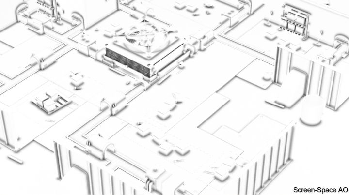
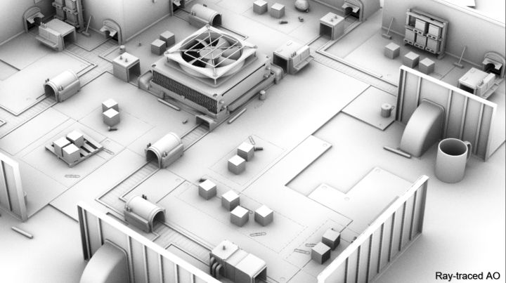

# 实时光线追踪技术

----

## 1. 当前业界产品应用情况

### 虚幻引擎
自4.22版本以来，UE4的实时光线追踪功能已经正式面世。  
UE4中的Ray Tracing技术目前有两种形态：    
  * **混合光线追踪模式（Hybrid Ray Tracer Mode）**，用于将光线追踪功能与现有的光栅化效果相结合，进行混合渲染。
  * **路径追踪参考模式（Path Tracer Reference Mode）**，用于与Ground Truth进行比较。

UE4中的Ray Tracing的KeyFeature可以总结如下：  
  * 光线追踪阴影Ray Traced Shadows
  * 光线追踪反射Ray Traced Reflections
  * 光线追踪半透明渲染Ray Traced Translucency
  * 光线追踪环境光遮蔽Ray Traced Ambient Occlusion
  * 光线追踪全局光照 Ray Traced Global Illumination

### Unity引擎
Unity引擎在Unity 2019.3中正式发布对混合实时光线追踪（Hybrid Real-Time Ray Tracing）的支持。  

Unity Ray Tracing的Key Feature可以总结为：  
  * 光线追踪环境光遮蔽 Ray-Traced Ambient Occlusion
  * 光线追踪接触阴影 Ray-Traced Contact Shadows
  * 光线追踪全局光照 Ray-Traced Global Illumination
  * 光线追踪反射Ray-Traced Reflections
  * 光线追踪阴影Ray-Traced Shadows
  * 递归光线追踪Recursive Ray Tracing

### 3A游戏
  * 到目前为止，不少3A游戏已经加入了实时光线追踪技术，包括《战地5（Battlefield V）》、《使命召唤：现代战争（Call of Duty: Modern Warfare）》、《地铁:离去（Metro Exodus）》、《古墓丽影:暗影(Shadow of the Tomb Raider)》、《雷神之锤2 RTX版 （Quake II RTX）》、《德军总部：新血脉（Wolfenstein: Youngblood）》等。
  * 未来将发布的更多的大作，也将具有实时光线追踪特性，比如《看门狗：军团 Watch Dogs Legion》、《赛博朋克2077（Cyberpunk 2077）》等。

### 主机平台
索尼的Play Station 5和微软的Xbox Scarlett，都宣布了对实时光线追踪技术的支持。  

## 2. 当前业界技术发展近况盘点

技术点包括：  
  * 混合渲染管线 Hybrid Rendering Pipeline
  * 反射 Reflections
  * 环境光遮蔽 Ambient Occlusion
  * 阴影 Shadows
  * 透明渲染Transparency
  * 半透明渲染 Translucency
  * 多光源处理 Many Lights
  * 粒子渲染Particles
  * 基于光线追踪的全局光照 Ray-traced GI
  * 剔除 Culling
  * 贴图LOD | Texture LOD

### 2.1 混合渲染管线
混合渲染管线能充分利用光栅化（Rasterization），计算着色器（Compute Shader）和光线追踪（Ray Tracing）各自的优势，对于管线的每一个渲染阶段，在光栅化，计算着色器和光线追踪中择优使用。  

目前主流的混合渲染管线（Hybrid Rendering Pipeline）架构的渲染流程可以总结为：  
  * 延迟着色阶段（光栅化）Deferred Shading (rasterization)
  * 直接阴影阶段（光线追踪或光栅化）Direct shadows (ray trace or rasterization)
  * 光照阶段（计算着色器+光线追踪）Lighting (compute + ray trace)
  * 反射阶段（光线追踪或计算着色器）Reflections(ray trace or compute)
  * 全局光照阶段（计算着色器+光线追踪）Global Illumination (compute and ray trace)
  * 环境光遮蔽阶段（光线追踪或计算着色器） Ambient occlusion (ray trace or compute)
  * 透明与半透明渲染阶段（光线追踪+计算着色器）Transparency & Translucency (ray trace and compute)
  * 后处理阶段（计算着色器）Post processing (compute)

### 2.2 反射渲染
而业界当前进行实时光线追踪反射的主流思路是，每像素需要多于1条光线才能完全表达基于物理的渲染管线可描述的从粗糙到光滑的材质范围。对于多层材质来说，则会更加复杂。  

下图是实时光线追踪反射渲染管线（Real Time Ray Tracing Reflection Pipeline）的图示：  
  

根据上图，可以将混合光线追踪反射管线的渲染步骤总结为如下六步：  
  * **Step 1**：通过BRDF重要性采样生成光线，以提供符合材质特性的光线。。
  * **Step 2**：通过屏幕空间光线步进（screen-space raymarching）或光线追踪（ray tracing）来完成场景相交运算。
  * **Step 3**：在相交运算找到交点（intersections）之后，便可以重建反射图像。该过程可以就地完成，也可以分别完成，以提高一致性（coherency）。
  * **Step 4**：内核跨像素重用ray hit信息，将图像采样到全分辨率。
  * **Step 5**：为时域累积通道（temporal accumulation pass）计算有用信息。
  * **Step 6**：最终，以交叉双边滤波器（cross-bilateral filter）的形式对噪声进行最后的清理。

### 2.3 环境光遮蔽
Ray Tracing AO(Ambient Occlusion【环境光遮蔽】)可以通过对半球可见度函数的积分，获得更接近Ground Truth的结果，因为采样期间使用的所有随机方向实际上都最终出现在场景中的。  

而这就是Ray Tracing AO与屏幕空间AO技术（如SSAO）的主要不同点，因为在屏幕空间技术中，光线会出射到屏幕之外或几何体的后方，而此时命中点是不可见的。  

在Ray Tracing AO中，可以通过围绕法线进行余弦半球采样来完成运算。光线通常是从G-buffer发出的，miss shader用于找出是否有击中目标。每帧可以发射多于1束光线，但是如果限制了光线的距离，即使每帧只有一条光线，也应该得到一些很好的渐变效果。  

不过，可能最终需要过滤和重建，因为Ray Tracing AO可能会有一些噪声。  

以下是Ray Tracing AO与SSAO对比，我们可以完全看到光线追踪AO将环境光遮蔽的渲染表现提升到了新的高度。  
  
  

### 2.4 阴影渲染
Ray Tracing Shadow 实现起来并不太复杂。 基本思想是向光源发射光线（launch a ray towards the light），如果光线未命中，则不处于阴影中。  

而与硬阴影(Hard shadows)相比，软阴影(soft shadows)可以更好地传达物体的真实感，更加Ground Truth。软阴影(soft shadows)可以通过在朝向光的圆锥中按随机方向进行采样并将其视为区域光一样对待来实现。锥角（cone angle）越宽，阴影越柔和，但噪点越大，因此我们必须对其进行过滤（filtering）。也可以发射多条光线，但仍需要进行一些过滤操作。  

#### 2.4.1 解析直接光照+随机阴影
ric Heitz（在基于物理的渲染领域颇有建树的学术大牛）于2018年提出了一种结合了解析直接光照（analytic direct illumination）和随机阴影（stochastic shadows）的新方法[13]）。在paper中，他们提出了一种比率估计器（ratio estimator），该比率估计器可以将解析光照技术（analytic illumination techniques）与随机光线追踪阴影（stochastic raytraced shadows）正确组合。  

通过将阴影光照分为两个部分——解析部分（analytical part）和随机部分（stochastic part），他们的方法演示了如何通过随机光线追踪在图像的阴影区域部分获得清晰和无噪声，且解析和视觉上逼真的阴影。  

而仅在需要时进行随机求解的优点是，最终结果仅在阴影中有噪声，而其余部分则通过解析进行处理。该项技术还将阴影与光照分开，因此可以保留高频阴影细节。  

#### 2.4.2 透明阴影渲染
在SEED提供的Demo中，在对透明表面阴影进行渲染时，他们用递归光线追踪（recursive ray tracing）方法来替换常规的阴影光线追踪方法。当光穿过介质时，会成倍地进行积累吸收。并进行薄膜近似（thin film approximation），假设所有颜色都在表面上，以得到更好的性能。同时，就像不透明阴影渲染一样，使用类似的SVGF启发式过滤器对其进行**过滤**，可以让透明阴影也变得柔和。  

  
上图左侧为未过滤的结果，右侧为已过滤的结果。

### 2.5 透明渲染和半透明渲染
光线追踪可以准确地进行光的散射，从而在实现透明渲染和次表面半透明渲染（subsurface translucency）上有天生的优势。  

对于**透明渲染（Transparency）**，目前业界的发展近况可以概括为：  
  * 正确表示顺序无关的透明渲染（Order-independent Transparency，OIT）
  * 可变的粗糙度，折射和吸收（Variable roughness , refractions and absorption）
  * 多IOR过渡（Multiple index-of-refraction transitions）

对于粗糙玻璃，推荐使用Walter’s参数化（Walter’s parametrization）和GGX粗糙度重要性采样（importance sample GGX roughness）。而对于特别粗糙的材质，则需要更多的采样来进行降噪，也可以使用时域滤波。实践证明在纹理空间（texture-space）中进行渲染是不错的思路。  

而对于**半透明渲染（Translucency）**，目前业界已可以很好地实现均匀介质内部的光散射（Light scattering inside homogeneous medium），在PICA PICA Demo，同样采用了在纹理空间（texture-space）中进行渲染的方案。  

### 2.6 多光源处理
对于多光源的处理而言，业界现有方案可以总结如下两类：  
  * 基于加速结构的光源选择（Acceleration structure-based selection）
  * 基于重要性采样的光源选择（Light Importance Sampling）

其中，基于加速结构的光源选择（Acceleration structure-based selection）方案的代表性思路可以总结为：  
  * **Unity引擎的方案**：基于相机朝向的加速结构（camera-oriented acceleration structure ）[Benyoub 2019] [Tatarchuk 2019]
  * **《战地5》的方案**：水平面光源列表（horizontal plane light list）[Deligiannis 2019]

而基于重要性采样的光源选择（Light Importance Sampling）的代表性思路，都是HPG 2019的paper：  
  * Dynamic Many-Light Sampling for Real-Time Ray Tracing [Moreau 2019]* Stochastic Lightcuts [Yuksel 2019]

其中，《Dynamic Many-Light Sampling for Real-Time Ray Tracing》描述了一种基于两层BVH的分层光源采样数据结构，该结构能够从10，000个发射三角形进行交互式直接光照。这使得未来的实时场景可以只用自发光网格（emissive meshes）来进行光照。  

### 2.7 粒子系统渲染
对于光线追踪粒子系统的渲染，《战地5》解决方案是将粒子朝向光线，有点类似billboard的思想。  

而一般方案是维护两个顶层加速结构（Top Level Acceleration Structures, TLAS）：一个用于不透明几何体，一个用于粒子系统。  

  * 首先用不透明几何体的TLAS发射光线，如果有命中，则存储该长度
  * 然后，在粒子系统的TLAS中发射另一条光线，并从不透明的命中长度限制该光线长度
  * 最后，便可以相应地混合场景中的粒子系统

值得一提的是，另一个技巧是将奇数粒子旋转90度。  

### 2.8 全局光照
光线追踪硬件的新特性可以给全局光照带来各种便利，诸如依靠各种缓存机制（caching mechanisms）在多个帧上累积渲染结果，并提高采样速度。  

可以将业界主流的基于光线追踪的全局光照分为如下三类：  
  * 基于面元（Surfels）。Stochastic All The Things: Ray Tracing in Hybrid Real-Time Rendering [Stachowiak 2018]
  * 基于网格（Grid）。Experiments with DirectX Raytracing in Remedy’s Northlight Engine [Aalto 2018]
  * 基于探针（Probes）。Dynamic Diffuse Global Illumination with Ray-Traced Irradiance Fields [Majercik 2019]

### 2.9 剔除
因为光线追踪一般是在世界空间中进行的，所以无法使用光栅化方法中比较常用的“视锥剔除（Frustum Culling）”。  

如果无法将所有对象都放在BVH中，则必须找到一种新的启发式剔除方法。《战地5》的方案是基于投影包围球（Projected Bounding Sphere）[Deligiannis 2019]，不失为一种有效的方法。  

### 2.10 Texture LOD
因为从2x2像素块（pixel quad）中求解出的导数（pixel quad derivatives），只能用于光栅化，所以光线追踪无法自动进行Texture LOD。  

  * 目前的主流方案是依赖于光线差分（Ray Differentials）方法，但其对性能有一定的影响。

  * 在《光线追踪精粹 (Ray Tracing Gems)》[Akenine-Möller2019]一书中，有讨论到一种基于光线锥（Ray Cones）的替代技术，其虽有一些可改进的地方，但也算是当前不错的方案。

## 3. 业界当前面临的挑战

### 3.1 实时光线追踪处理透明渲染仍有不少问题
在目前的实时光线追踪领域，在1-2 spp（sample per pixel）的情况下，大多数降噪技术通常对于透明渲染、粒子渲染、体积渲染的渲染效果虽说相较于光栅化有进步，但其实也并算不上特别理想。  

PICA PICA Demo中，虽然采用了具有折射和散射的纹理空间OIT（texture-space OIT）技术，但也并不完美，有改进的空间。  

对于粒子系统和体积特效而言，采用在miss shader中更新体积/裁剪图、或在hit shader中进行光线步进（Ray marching in hit shaders）、以及进行Non-trivial blending & filtering，都是值得尝试的方向。  

当下业界需要研究出更好的降噪技术或者相关方案，以在低spp下带来更佳的透明渲染品质。  

对于局部覆盖（Partial Coverage）效果的渲染方面，当前的降噪技术并不能很好地适用于实时的局部可见性。这是因为通常每像素只有1采样（1 spp），并假设所有内容都是不透明的。 也可以在hit shader中进行Alpha测试，并且可以使用一些预过滤方法。但是，一旦物体开始移动，在性能和视觉表现上就可能出现问题。  

另外，一些去焦效果（Defocus effects ），例如运动模糊和景深，使用实时光线追踪也仍然比较棘手。  

### 3.2 对多变的游戏内容环境的更好兼容
对目前的实时光线追踪领域而言，需要更健壮的技术体系，来支持大量动画角色，丰富的植被，动态的环境，以及对开放大世界，用户生成内容的稳定处理。  

### 3.3 实时光线追踪全局光照：广阔的空间等待探索
首先，实时光线追踪进行全局光照，会遇到即使在离线渲染中也存在的开放性问题。比如离线渲染中暂未解决的过高的方差，小孔全局光照（Pinhole GI）等问题，在实时光线追踪领域目前同样是无法解决。  

而且离线渲染方案中的许多解决方案，不一定都可以运用到实时渲染中。对于实时光线追踪，目前而言必须借助缓存技术摊销着色成本来达以交互速率进行渲染的性能要求。而在PICA PICA Demo中，基于面元缓存GI（caching of GI via surfels）的方案，也存在仅能从看到的内容生成面元的限制。  

同样，业界也需要解决在不借助任何前期参数化行为的前提下，对用户生成的内容进行稳定的实时光线追踪全局光照的问题。  

### 3.4 探索新的实时光线追踪形态
当前的实时光线追踪模型假设光线是与三角形相交的（ray-triangle intersection），但是如果在树的上层结构就让光线停止，会怎样？基于这种思考，可以像体素一样来对待AABB，以扩展到新的追踪类型，比如光束追踪（beam tracing）、射线束（ray bundles），这也就打开了实时光线追踪新的方向。  

另外，实时光线追踪领域还可以解锁广义光线追踪领域一系列新的算法，比如：  
  * Global Illumination Using Ray-Bundle Tracing [Tokuyoshi 2012]
  * Dynamic Diffuse Global Illumination with Ray-Traced Irradiance Fields [Majercik 2019]
  * Cone Tracing [Crassin 2011]

另外，也可以参考声音传播的方案来进行实时光线追踪。  

### 3.5 不断革新混合渲染管线的技术形态
对于目前面世的实时光线追踪的产品来说，《战地5》等第一批搭载实时光线追踪技术的游戏，以及Unity、UE4引擎的实时光线追踪功能，虽说听起来高大上，其实并不算完美。按照形象的比喻来说，可能有点像在现有渲染管线上打补丁，做了大量的缝缝补补。  

在引擎方面，业界还有很多工作要做，以改进现有的渲染方法，最大限度地发挥混合渲染管线的优势。  

### 3.6 未来光线追踪领域的研究方向
就未来的光线追踪研究而言，如果涉及到各类光线追踪的技术文献的使用和改进，须对文献的基础约束进行调整，以适应实时渲染的约束，而不仅仅是“正确的光线追踪”。主要的要点在于制定合理的实时渲染预算以及善用光照传输缓存（Light Transport Caches） 技术。 另外，未来实时光线追踪的一个大方向大概率是对 纹理空间技术（texture space techniques） 和 可变速率光线追踪（variable rate ray tracing） 的探索。如缓存材质（Caching of material）和局部解（partial solutions），以及BRDF拆分（Split the BRDF）。 而在 高效采样和积分策略（efficient sampling and integration strategies） 以及 重建（reconstruction）方面，业界也还有很多事情需要去完成。  

