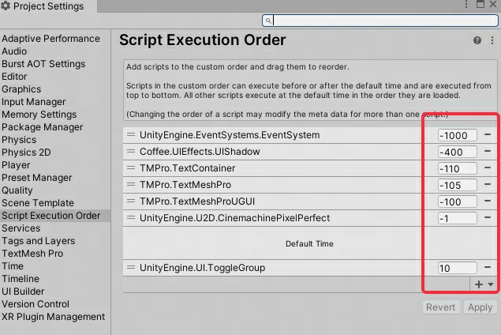

# Unity知识点

----
## Unity组件间数据共享
在Unity中实现组件间的数据共享，可以通过以下几种方式：
  * 公共变量：在一个组件中定义公共变量，在另一个组件中访问这些变量。
  * 事件和委托：使用事件和委托来在组件之间通知和传递数据。
  * 单例模式：通过单例模式创建全局访问点来共享数据。
  * 集成同一个`MonoBehaviour`类：将需要共享数据的组件集成到同一个`MonoBehaviour`类中。

```csharp
using UnityEngine;
 
public class DataSharer : MonoBehaviour
{
    public string sharedData = "默认数据";
}
 
public class DataReceiver : MonoBehaviour
{
    private DataSharer dataSharer;
 
    void Start()
    {
        // 假设DataSharer附着在同一个GameObject上
        dataSharer = GetComponent<DataSharer>();
        if (dataSharer != null)
        {
            Debug.Log(dataSharer.sharedData);
        }
    }
}
```
>上面例子中，`DataSharer`组件有一个公共的字符串变量`sharedData`。`DataReceiver`组件查找同一`GameObject`上的`DataSharer`组件，并访问它的`sharedData`变量。这样，`DataSharer`和`DataReceiver`间实现了数据共享。


## Unity改变脚本执行顺序

#### 1 默认顺序
有4个`GameObject`，依次加脚本1,脚本2,脚本3,脚本4,脚本执行顺序是`4,3,2,1`——后加的脚本,先执行(与栈类似)。

注意：是按照脚本的添加顺序！！
  * 误区一：认为按脚本所在游戏物体，在层级视图位置，由底部向上部执行。
  * 误区二：认为按游戏物体创建的顺序，后创建的先执行。

#### 2 人为排序
`Edit`——>`Project Settings`——>`Script Execution Order`——>面板右下，点“+”号，选择脚本。
**（按数值从小到大的顺序执行）**


#### 3 使用自定义的编辑器脚本
```csharp
using UnityEngine;
using UnityEditor;
using System.Collections.Generic;
 
public class CustomAutoLoad : MonoBehaviour
{
    // 定义需要加载的组件类型列表
    private static List<System.Type> autoLoadOrder = new List<System.Type>()
    {
        typeof(Rigidbody),
        typeof(Collider),
        typeof(MeshRenderer),
        // ... 添加其他需要自动加载的组件类型
    };
 
    [InitializeOnLoadMethod]
    private static void AutoLoadComponents()
    {
        // 获取所有游戏对象
        GameObject[] rootObjects = SceneManager.GetActiveScene().GetRootGameObjects();
 
        foreach (var rootObject in rootObjects)
        {
            // 递归检查每个游戏对象及其子对象
            AutoLoadComponentsRecursive(rootObject);
        }
    }
 
    private static void AutoLoadComponentsRecursive(GameObject obj)
    {
        foreach (var type in autoLoadOrder)
        {
            if (obj.GetComponent(type) == null)
            {
                obj.AddComponent(type);
            }
        }
 
        for (int i = 0; i < obj.transform.childCount; i++)
        {
            AutoLoadComponentsRecursive(obj.transform.GetChild(i).gameObject);
        }
    }
}
```
>这段代码定义了一个自定义组件CustomAutoLoad，其中包含了一个在编辑器模式下将会被执行的静态方法AutoLoadComponents。这个方法会递归地检查当前场景中的每个游戏对象，并且为每个游戏对象检查autoLoadOrder列表中定义的组件类型。如果游戏对象上不存在这些组件，它们将会被自动添加。

>请注意，这个脚本需要Unity编辑器的UnityEditor命名空间，并且只能在Unity编辑器中工作，不能在游戏运行时工作。此外，InitializeOnLoadMethod特性确保了AutoLoadComponents方法会在Unity编辑器启动时自动执行。

>你可以将这个脚本添加到一个新的C#脚本文件中，并将其放置在你的项目Assets/Editor目录下（如果该目录不存在，你需要先创建它），以确保Unity能够识别并在编辑器模式下执行它。