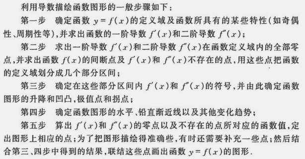

# 微分中值定理与导数的应用

----

## 微分中值定理

### 费马定理
设函数$$f(x)$$在点$$x_0$$的某邻域$$U(x_0)$$内有定义，并且在$$x_0$$处可导，如果对任意的$$x \in U(x_0)$$，有$$f(x) \leq f(x_0) (或 f(x) \geq f(x_0))$$，那么$$f'(x) = 0$$。【通常导数为0的点成为函数的**驻点（或稳定点，临界点）**】

### 罗尔定理
如果函数$$f(x)$$满足
  * (1) 在闭区间$$[a, b]$$上连续；
  * (2) 在开区间$$(a, b)$$内可导；
  * (3) 在区间端点处的函数值相等，即$$f(a) = f(b)$$,
那么在$$(a, b)$$内至少有一点$$\xi (a < \xi < b)$$，使得$$f'(\xi) = 0$$

### 拉格朗日中值定理
如果函数$$f(x)$$满足  
  * (1) 在闭区间$$[a, b]$$上连续；
  * (2) 在开区间$$(a, b)$$内可导；
那么在$$(a, b)$$内至少有一点$$\xi (a < \xi < b)$$，使等式
$$f(a) - f(b) = f'(\xi)(b - a)$$
成立。

### 柯西中值定理
如果函数$$f(x)$$及$$F(x)$$满足  
  * (1) 在闭区间$$[a, b]$$上连续；
  * (2) 在开区间$$(a, b)$$内可导；
  * (3) 对任一$$x \in (a, b), F'(x) \neq 0$$，
那么在$$(a, b)$$内至少有一点$$\xi$$，使等式
$$\frac{f(b) - f(a)}{F(b) - F(a)} = \frac{f'(\xi)}{F'(\xi)}$$
成立。

## 洛必达法则

### 定理1
设  
  * (1) 当$$x \to a$$时，函数$$f(x)$$及$$F(x)$$都趋于零；
  * (2) 在点$$a$$的某去心邻域内，$$f'(x)$$及$$F'(x)$$都存在且$$F'(x) \neq 0$$；
  * (3) $$\lim_{x \to a} \frac{f'(x)}{F'(x)}$$存在（或为无穷大），
那么$$\lim_{x \to a} \frac{f(x)}{F(x)} = \lim_{x \to a} \frac{f'(x)}{F'(x)}$$。

### 定理2
设  
  * (1) 当$$x \to \infty$$时，函数$$f(x)$$及$$F(x)$$都趋于零；
  * (2) 当$$|x| > N$$时，函数$$f'(x)$$及$$F'(x)$$都存在，且$$F'(x) \neq 0$$；
  * (3) $$\lim_{x \to \infty} \frac{f'(x)}{F'(x)}$$存在（或为无穷大），
那么$$\lim_{x \to \infty} \frac{f(x)}{F(x)} = \lim_{x \to \infty} \frac{f'(x)}{F'(x)}$$。

## 泰勒公式

### 泰勒中值定理
如果函数$$f(x)$$在含有$$x_0$$的某个开区间(a, b)内具有直到(n+1)阶的导数，则对任一$$x \in (a, b)$$，有
$$f(x) = f(x_0) + f'(x_0)(x - x_0) + \frac{f''(x_0)}{2!}(x - x_0)^2 + ... + \frac{f^{(n)}(x_0)}{n!}(x - x_0)^n + R_n(x)$$，
其中$$R_n = \frac{f^{(n+1)}(\xi)}{(n+1)!}(x - x_0)^{n+1}$$，
这里$$\xi$$是$$x_0$$与$$x$$之间的某个值。  
  
**泰勒中值定理是拉格朗日中值定理的推广：**  
在泰勒公式中，当$$n=0$$时，泰勒公式变成拉格朗日中值公式：  
$$f(x) = f(x_0) + f'(\xi)(x-x_0) (\xi 在x_0与x之间)$$

## 函数单调性与曲线的凹凸性

### 定理1
设函数$$y = f(x)$$在$$[a, b]$$上连续，在$$(a, b)$$内可导。  
  * (1) 如果在$$(a, b)$$内$$f'(x) > 0$$，那么函数$$y = f(x)$$在$$[a, b]$$上单调增加；
  * (2) 如果在$$(a, b)$$内$$f'(x) < 0$$，那么函数$$y = f(x)$$在$$[a, b]$$上单调减少。

### 曲线凹凸定义
设$$f(x)$$在区间$$I$$上连续，如果对$$I$$上任意两点$$x_1,x_2$$恒有$$f(\frac{x_1+x_2}{2}) < \frac{f(x_1)+f(x_2)}{2}$$，
那么称$$f(x)$$在$$I$$上的图形是（向上）凹的（或凹弧）；
如果恒有$$f(\frac{x_1+x_2}{2}) > \frac{f(x_1)+f(x_2)}{2}$$，
那么称$$f(x)$$在$$I$$上的图形是（向上）凸的（或凸弧）。

### 定理2
设$$f(x)$$在$$[a, b]$$上连续，在$$(a, b)$$内具有一阶和二阶导数，那么  
  * (1) 若在$$(a, b)$$内$$f''(x) > 0$$，那么函数$$f(x)$$在$$[a, b]$$上的图形是凹的；
  * (2) 若在$$(a, b)$$内$$f''(x) < 0$$，那么函数$$f(x)$$在$$[a, b]$$上的图形是凸的。

### 拐点
如果曲线$$y=f(x)$$在经过点$$(x_0, f(x_0))$$时，曲线的凹凸性改变了，那么就称点$$(x_0, f(x_0))$$为这曲线的**拐点**。

## 函数的极值与最大值最小值

### 定理1（必要条件）
设函数$$f(x)$$在$$x_0$$处可导，且在$$x_0$$处取得极值，那么$$f'(x_0) = 0$$。

### 定理2（第一充分条件）
设函数$$f(x)$$在$$x_0$$处连续，且在$$x_0$$的某去心邻域$$\bigcup ^ \circ (x_0, \delta)$$内可导。
  * (1) 若$$x \in \bigcup ^ \circ (x_0 - \delta, x_0)$$时，$$f'(x) > 0$$，而$$x \in \bigcup ^ \circ (x_0, x_0 + \delta)$$时，$$f'(x) < 0$$，则$$f(x)$$在$$x_0$$处取得极大值；
  * (2) 若$$x \in \bigcup ^ \circ (x_0 - \delta, x_0)$$时，$$f'(x) < 0$$，而$$x \in \bigcup ^ \circ (x_0, x_0 + \delta)$$时，$$f'(x) > 0$$，则$$f(x)$$在$$x_0$$处取得极小值。
  * (3) 若$$x \in \bigcup ^ \circ (x_0, \delta)$$时，$$f'(x)$$的符号保持不变，则$$f(x)$$在$$x_0$$处没有极值。

### 求极值
  * (1) 求出导数$$f'(x)$$；
  * (2) 求出$$f(x)$$的全部驻点和不可导点；
  * (3) 考察$$f'(x)$$的符号在每个驻点或不可导点的左、右邻近的情形，以确定该点是否为极值点；如果是极值点，进一步确定是极大值点还是极小值点；
  * (4) 求出各极值点的函数值，就得到函数$$f'(x)$$的全部极值。

### 定理3（第二充分条件）
设函数$$f(x)$$在$$x_0$$处具有二阶导数且$$f'(x_0) = 0, f''(x_0) \neq 0$$，那么
  * (1) 当$$f''(x_0) < 0$$时，函数$$f(x)$$在$$x_0$$处取得极大值；
  * (2) 当$$f''(x_0) > 0$$时，函数$$f(x)$$在$$x_0$$处取得极小值。

### 求f(x)在[a,b]上的最大值和最小值
  * (1) 求出$$f(x)$$在$$(a, b)$$内的驻点$$x_1, x_2, ... , x_m$$及不可导点$$x_1', x_2', ... , x_n'$$；
  * (2) 计算$$f(x_i)(i=1,2,...,m),f(x_j')(j=1,2,...,n)$$及$$f(a), f(b)$$；
  * (3) 比较(2)中诸值的大小，其中最大的便是$$f(x)$$在$$[a, b]$$上的最大值，最小的便是$$f(x)$$在$$[a, b]$$上的最小值。

## 函数图形的描绘

## 曲率

### 弧微分公式
$$\frac{ds}{dx} = \pm \sqrt{1+y'^2}$$

### 曲率公式
$$K=|\frac{d \alpha}{ds}|$$
其中$$\alpha$$为倾角。

### 曲率半径
曲线上一点处的曲率半径与曲线在该点曲率互为倒数。

## 方程的近似解
求方程近似解的步骤：  
  * (1) 确定根的大致范围。亦即确定一个区间[a, b]，使所求的根是位于此区间的唯一实根。这一步工作成为**根的隔离**，区间[a, b]称为所求实根的**隔离区间**。
  * (2) 以根的隔离区间的端点作为根的初始近似值，逐步改善根的近似值的精确度，直至求得满足精确度要求的近似解。

完成第二步工作有多种方法，如二分法和切线法。