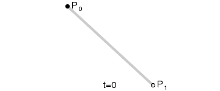
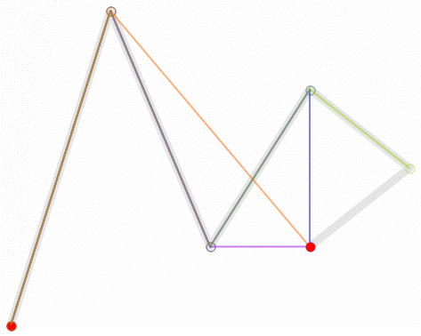

# 贝塞尔曲线
  * 贝塞尔曲线常用于二维或三维图形应用程序，是通过空间上任意多个点，所确定的一条平滑曲线。

----
贝塞尔曲线算法，由法国工程师皮埃尔·贝塞尔（Pierre Bézier）于1962进行发表。

## 设定
  * 以下的`t`为曲线上的某点，距离曲线起点的占比。


## 一阶（线性）贝塞尔曲线
  

两点（P0和P1）所确定的线，即直线。  

曲线上的某点坐标为：$$B(t) = P_0 + (P_1-P_0)t = (1-t)P_0 + tP_1$$


## 二阶贝塞尔曲线
  

三点（P0、P1和P2）所确定的曲线。  

可以通过降维来理解：根据`t`先后通过**一阶定义**确定P0和P1之间的点`P01 = (1-t)P0 + tP1`，以及P1和P2之间的点`P12 = (1-t)P1 + tP2`，然后再将这两点代入**一阶定义**式，即可得到二阶函数式。

二阶曲线上的某点坐标为：$$B(t) = (1-t) P_{01} + t P_{12} = (1-t)^2 P_0 + 2t(1-t) P_1 + t^2 P_2$$


## 三阶贝塞尔曲线
  

四点（P0、P1、P2和P3）所确定的曲线。  

同样可以通过降维来理解：根据`t`先后通过**一阶定义**确定P0和P1之间的点`P01 = (1-t)P0 + tP1`，P1和P2之间的点`P12 = (1-t)P1 + tP2`，以及P2和P3之间的点`P23 = (1-t)P2 + tP3`，然后再将这三点代入**二阶函数式**式，即可得到三阶函数式。

三阶曲线上的某点坐标为：$$B(t) = (1-t)^2 P_{01} + 2(1-t)t P_{12} + t^2 P_{23} = (1-t)^3 P_0 + 3t(1-t)^2 P_1 + 3t^2(1-t) P_2 + t^3 p_3$$


## 任意阶贝塞尔曲线
根据以上函数式，可推导出任意点（P0、P1、...、Pn）所确定的曲线。  

通过降维来解释：首先根据`t`由**一阶定义**，得到每相邻两点之间的点，从而将n+1个点减少为n个，最后代入**n-1阶函数式**，即可得到n阶函数式。  

最后，可得n阶曲线上的某点坐标为：
$$B^n(t) = \sum_{i=0}^n \begin{pmatrix}n \\ i \end{pmatrix} P_i(1-t)^{n-i} t^i$$
，其中$$\begin{pmatrix}n \\ i \end{pmatrix} = \frac{n!}{i!(n-i)!}（二项式系数）$$。  

其中二项式系数表（正整数阶的二项式系数所组成的表），又叫**杨辉三角**。
该表如下所示。
```
                              1  ---------------------------------  n=0
                          1      1  ------------------------------  n=1
                     1       2      1  ---------------------------  n=2
                 1      3       3     1  -------------------------  n=3
              1     4       6     4     1  -----------------------  n=4
           1     5      10    10     5     1  --------------------  n=5
        1     6     15     20    15     6     1  -----------------  n=6
     1     7    21     35     35    21     7    1  ---------------  n=7
  1     8    28    56     70     56    28    8     1  ------------  n=8
1    9    36    84    126    126    84    36    9    1  ----------  n=9
```

多阶贝塞尔曲线  


