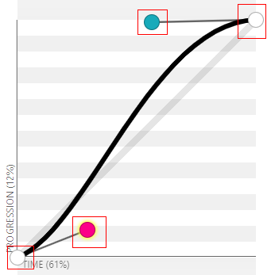
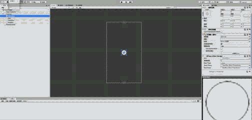

# 贝塞尔曲线的代码实现

----
欲了解贝塞尔曲线的相关概念，请参考[贝塞尔曲线](./README.md)。  

本篇文章主要介绍如何通过代码实现贝塞尔曲线，以及介绍常用缓动效果的3阶贝塞尔曲线参数和函数设计，最后在Unity上展示部分缓动效果。

## 两种方式实现n阶贝塞尔曲线
（注：以下的Vector2是Unity游戏引擎所定义的2维向量类型）  
**第一种**通过递归的方式进行实现。  
```csharp
public Vector2 Bezier(float t, List<Vector2> pList) {
    if (pList.Count == 0) {
        return Vector2.zero;
    } else if (pList.Count < 2) {
        return pList[0];
    }
    List<Vector2> newPList = new List<Vector2>();
    for (int i = 0; i < pList.Count - 1; i++) {
        Vector2 p = (1 - t) * pList[i] + t * pList[i + 1];
        newPList.Add(p);
    }
    return Bezier(t, newPList);
}
```

**第二种**直接根据n阶贝塞尔函数式来实现。  

```csharp
// 获取阶乘结果
public int Factorial(int num) {
    int result = 1;
    for (int i = 1; i <= num; i++) {
        result *= i;
    }
    return result;
}

public Vector2 Bezier(float t, List<Vector2> pList) {
    if (pList.Count == 0) {
        return Vector2.zero;
    } else if (pList.Count < 2) {
        return pList[0];
    }
    Vector2 result = Vector2.zero;
    int n = pList.Count - 1;
    for (int i = 0; i <= n; i++) {
        float coefficient = (float)Factorial(n) / (float)(Factorial(i) * Factorial(n - i));
        result += coefficient * pList[i] * Mathf.Pow(1-t, n-i) * Mathf.Pow(t, i);
    }
    return result;
}
```


## 如何将贝塞尔曲线运用到缓动效果中
从以上的贝塞尔函数可以看出，在确定了定位点位置之后，函数传入的不同`t`值，得到对应贝塞尔曲线中的某点坐标`(x, y)`。  

在实际应用中，一般使用3阶贝塞尔曲线来模拟缓动效果，如下图所示，4个点确定了一条贝塞尔曲线。



通过上图可以发现，在模拟缓动效果​时，贝塞尔曲线的横轴表示的`距离动画开始的时间差与动画总时间的比值`，纵轴表示`缓动效果的进度`。
一般情况下，在某一帧中，我们只知道`距离动画开始的时间差与动画总时间`，这时需要求得`缓动效果的进度`，来确定动画对象在当前帧的状态。  

然而不幸的是，在上面贝塞尔函数的代码实现中，我们只能通过`t`（注意这个`t`不是时间），来确定贝塞尔曲线的横坐标`x`和纵坐标`y`。  

而实际需求是：要通过贝塞尔曲线的横坐标`x`来确定其纵坐标`y`。

#### 那么该如何通过x求y呢？
一种较为简单的方法就是：通过**二分法逼近x值**。
​

这里的二分对象是`t`：让`t`值从`1`开始，每次循环只变化二分之一，然后计算出每次循环的`x`值，直到该`x`值逼近理想值（即达到误差系数允许的范围），即可得到相应的`y`值。

主要代码如下：  
```csharp
public enum EasingType {
    Linear,
    Ease,
}
// 初始化配置
Dictionary<EasingType, float[]> easingConfig = new Dictionary<EasingType, float[]>();
easingConfig.Add(EasingType.Linear, new float[]{0, 0, 1, 1});
easingConfig.Add(EasingType.Ease, new float[]{0.25f, 0.1f, 0.25f, 1});
// ... 其他类型


// 获取对应x的进度值
// @params x 理想值
// @params easingType 缓动类型
// @params err 误差系数
public float GetProgressVal(float x, EasingType easingType, float err = 0.01f) {
    if (!easingConfig.ContainsKey(easingType)) {
        return 0;
    }
    float[] easingCfg = easingConfig[easingType];
    List<Vector2> pList = new List<Vector2>();
    pList.Add(new Vector2(0, 0));
    pList.Add(new Vector2(easingCfg[0], easingCfg[1]));
    pList.Add(new Vector2(easingCfg[2], easingCfg[3]));
    pList.Add(new Vector2(1, 1));
    Vector2 bPos = Vector2.one;
    float t = 1, mid = 1;
    err = Mathf.Max(err, 0);
    int limit = 10000; // 避免函数死循环
    while (Mathf.Abs(bPos.x - x) > err) {
        mid = mid/2f;
        if (bPos.x > x) {
            t -= mid;
        } else {
            t += mid;
        }
        bPos = Bezier(t, pList);
        limit--;
        if (limit < 0) {
            print("GetProgressVal break!");
            break;
        }
    }
    return bPos.y;
}

```

## 缓动效果中常用的贝塞尔曲线
一般情况下， 缓动效果使用3阶的贝塞尔曲线模拟即可。  
这里主要罗列了常用于缓动效果的3阶贝塞尔曲线参数（P1和P2点的坐标）【假定P0和P3的点为(0, 0)和(1, 1)】：  
  * linear -> (0,0), (1,1);
  * ease -> (0.25,0.1), (0.25,1);
  * ease-in -> (0.42,0), (1,1);
  * ease-out -> (0,0), (0.58,1);
  * ease-in-out -> (0.42,0), (0.58,1);

  * easeInSine -> (0.47, 0), (0.745, 0.715);
  * easeOutSine -> (0.39, 0.575), (0.565, 1);
  * easeInOutSine -> (0.445, 0.05), (0.55, 0.95);
  * easeInQuad -> (0.55, 0.085), (0.68, 0.53);
  * easeOutQuad -> (0.25, 0.46), (0.45, 0.94);
  * easeInOutQuad -> (0.455, 0.03), (0.515, 0.955);
  * easeInCubic -> (0.55, 0.055), (0.675, 0.19);
  * easeOutCubic -> (0.215, 0.61), (0.355, 1);
  * easeInOutCubic -> (0.645, 0.045), (0.355, 1);
  * easeInQuart -> (0.895, 0.03), (0.685, 0.22);
  * easeOutQuart -> (0.165, 0.84), (0.44, 1);
  * easeInOutQuart -> (0.77, 0), (0.175, 1);
  * easeInQuint -> (0.755, 0.05), (0.855, 0.06);
  * easeOutQuint -> (0.23, 1), (0.32, 1);
  * easeInOutQuint -> (0.86, 0), (0.07, 1);
  * easeInExpo -> (0.95, 0.05), (0.795, 0.035);
  * easeOutExpo -> (0.19, 1), (0.22, 1);
  * easeInOutExpo -> (1, 0), (0, 1);
  * easeInCirc -> (0.6, 0.04), (0.98, 0.335);
  * easeOutCirc -> (0.075, 0.82), (0.165, 1);
  * easeInOutCirc -> (0.785, 0.135), (0.15, 0.86);
  * easeInBack -> (0.6, -0.28), (0.735, 0.045);
  * easeOutBack -> (0.175, 0.885), (0.32, 1.275);
  * easeInOutBack -> (0.68, -0.55), (0.265, 1.55);

**欲查看对应以上贝塞尔曲线参数的动画效果，可以参考网页【[jdreamheart.com/tech/bezier_anim.html](https://jdreamheart.com/tech/bezier_anim.html)】。**


### 基于Unity制作一个缓动组件EaseEffect
**所需参数：**  
  * 缓动时长
  * 缓动类型
  * 开始位置
  * 结束位置

**编辑器操作：**
  * 在场景中创建一个主角游戏体（如球体或立方体），以及两个用作开始和结束位置的空游戏体。
  * 给主角游戏体添加缓动组件，调整组件参数（如持续时间）。
  * 运行场景，以查看运行结果。



### DoTween插件
为了避免重复造轮子，可以直接使用`Unity`的插件`DoTween`，该插件包含了常用的动画功能，包括允许使用贝塞尔曲线参数来显示相应的动画效果。


## 完整代码
以下是关于自制的缓动组件EaseEffect的源代码：
```csharp
using System.Collections;
using System.Collections.Generic;
using UnityEngine;

public enum EasingType {
    Linear,
    Ease,
}

[AddComponentMenu("GameScripts/EaseEffect")]

public class EaseEffect : MonoBehaviour
{
    Dictionary<EasingType, float[]> easingConfig = new Dictionary<EasingType, float[]>();

    public float m_duration = 2;
    float m_actualDuration;

    public Transform m_startTrans;
    public Transform m_endTrans;
    Vector3 m_startPos;
    Vector3 m_endPos;

    void Awake() {
        easingConfig.Add(EasingType.Linear, new float[]{0, 0, 1, 1});
        easingConfig.Add(EasingType.Ease, new float[]{0.25f, 0.1f, 0.25f, 1f});
        // todo: 添加其他类型的贝塞尔曲线参数
    }

    // Start is called before the first frame update
    void Start()
    {
        m_startPos = m_startTrans.position;
        m_endPos = m_endTrans.position;
        print(string.Format("EaseEffect Start: {0}, {1}", m_startPos, m_endPos));
    }

    // Update is called once per frame
    void Update()
    {
        if (m_duration <= 0 || m_actualDuration > m_duration) {
            return;
        }
        m_actualDuration += Time.deltaTime;
        float rate = GetProgressVal(m_actualDuration/m_duration, EasingType.Ease);
        print(string.Format("EaseEffect Update Rate: {0}", rate));
        Vector3 targetPos = m_startPos + (m_endPos - m_startPos) * rate;
        this.transform.position = targetPos;
    }

    public void ResetActualDuration() {
        m_actualDuration = 0;
    }

    // 获取阶乘结果
    public int Factorial(int num) {
        int result = 1;
        for (int i = 1; i <= num; i++) {
            result *= i;
        }
        return result;
    }

    public Vector2 Bezier(float t, List<Vector2> pList) {
        if (pList.Count == 0) {
            return Vector2.zero;
        } else if (pList.Count < 2) {
            return pList[0];
        }
        // 使用一般定义式
        Vector2 result = Vector2.zero;
        int n = pList.Count - 1;
        for (int i = 0; i <= n; i++) {
            float coefficient = (float)Factorial(n) / (float)(Factorial(i) * Factorial(n - i));
            result += coefficient * pList[i] * Mathf.Pow(1-t, n-i) * Mathf.Pow(t, i);
        }
        return result;
        // 直接使用3阶定义式
        // return Mathf.Pow(1-t, 3) * pList[0] + 3*t*Mathf.Pow(1-t, 2) * pList[1] + 3 * t * t *(1-t) * pList[2] + Mathf.Pow(t, 3) * pList[3];
    }

    
    // 获取对应x的进度值
    // @params x 理想值
    // @params easingType 缓动类型
    // @params err 误差系数
    public float GetProgressVal(float x, EasingType easingType, float err = 0.01f) {
        if (!easingConfig.ContainsKey(easingType)) {
            return 0;
        }
        float[] easingCfg = easingConfig[easingType];
        List<Vector2> pList = new List<Vector2>();
        pList.Add(new Vector2(0, 0));
        pList.Add(new Vector2(easingCfg[0], easingCfg[1]));
        pList.Add(new Vector2(easingCfg[2], easingCfg[3]));
        pList.Add(new Vector2(1, 1));
        Vector2 bPos = Vector2.one;
        float t = 1, mid = 1;
        err = Mathf.Max(err, 0);
        int limit = 10000; // 避免函数死循环
        while (Mathf.Abs(bPos.x - x) > err) {
            mid = mid/2f;
            if (bPos.x > x) {
                t -= mid;
            } else {
                t += mid;
            }
            bPos = Bezier(t, pList);
            limit--;
            if (limit < 0) {
                print("GetProgressVal break!");
                break;
            }
        }
        return bPos.y;
    }
}
```
