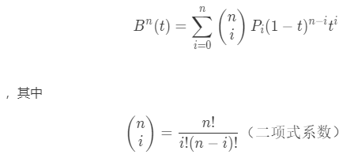
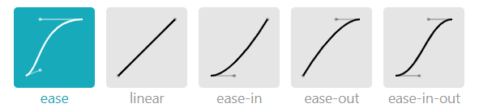

# 贝塞尔曲线的代码实现

----
欲了解贝塞尔曲线的相关概念，请参考[贝塞尔曲线](./README.md)。  

本篇文章主要介绍如何通过代码实现贝塞尔曲线，以及介绍常用缓动效果的3阶贝塞尔曲线参数和函数设计，最后展示部分在Unity上显示的缓动效果。

## 两种方式实现n阶贝塞尔曲线
（注：以下的Vector3是Unity游戏引擎所定义的3维向量类型）  
**第一种**通过递归的方式进行实现。  
```csharp
public Vector3 Bezier(float t, List<Vector3> pList) {
    if (pList.Count == 0) {
        return Vector3.zero;
    } else if (pList.Count < 2) {
        return pList[0];
    }
    List<Vector3> newPList = new List<Vector3>();
    for (int i = 0; i < pList.Count - 1; i++) {
        Vector3 p = (1 - t) * pList[i] + t * pList[i + 1];
        newPList.Add(p);
    }
    return Bezier(t, newPList);
}
```

**第二种**直接根据n阶贝塞尔函数式来实现。  

```csharp
// 获取阶乘结果
public int Factorial(int num) {
    int result = 1;
    for (int i = 1; i <= num; i++) {
        result *= i;
    }
    return result;
}

public Vector3 Bezier(float t, List<Vector3> pList) {
    if (pList.Count == 0) {
        return Vector3.zero;
    } else if (pList.Count < 2) {
        return pList[0];
    }
    Vector3 result = Vector3.zero;
    int n = pList.Count;
    for (int i = 0; i < pList.Count; i++) {
        int coefficient = Factorial(n) / (Factorial(i) * Factorial(n - i));
        result += coefficient * pList[i] * (1-t)^(n-i) * t^i;
    }
    return result;
}
```

## 缓动效果中常用的贝塞尔曲线
一般情况下， 缓动效果使用3阶的贝塞尔曲线模拟即可。  
这里主要罗列了**xy平面**上，常用缓动效果的3阶贝塞尔曲线参数（P1和P2点的坐标）【假定P0和P3的点为(0, 0)和(1, 1)】：  
  * linear -> (0,0), (1,1);
  * ease -> (0.25,0.1), (0.25,1);
  * ease-in -> (0.42,0), (1,1);
  * ease-out -> (0,0), (0.58,1);
  * ease-in-out -> (0.42,0), (0.58,1);

  * easeInSine -> (0.47, 0), (0.745, 0.715);
  * easeOutSine -> (0.39, 0.575), (0.565, 1);
  * easeInOutSine -> (0.445, 0.05), (0.55, 0.95);
  * easeInQuad -> (0.55, 0.085), (0.68, 0.53);
  * easeOutQuad -> (0.25, 0.46), (0.45, 0.94);
  * easeInOutQuad -> (0.455, 0.03), (0.515, 0.955);
  * easeInCubic -> (0.55, 0.055), (0.675, 0.19);
  * easeOutCubic -> (0.215, 0.61), (0.355, 1);
  * easeInOutCubic -> (0.645, 0.045), (0.355, 1);
  * easeInQuart -> (0.895, 0.03), (0.685, 0.22);
  * easeOutQuart -> (0.165, 0.84), (0.44, 1);
  * easeInOutQuart -> (0.77, 0), (0.175, 1);
  * easeInQuint -> (0.755, 0.05), (0.855, 0.06);
  * easeOutQuint -> (0.23, 1), (0.32, 1);
  * easeInOutQuint -> (0.86, 0), (0.07, 1);
  * easeInExpo -> (0.95, 0.05), (0.795, 0.035);
  * easeOutExpo -> (0.19, 1), (0.22, 1);
  * easeInOutExpo -> (1, 0), (0, 1);
  * easeInCirc -> (0.6, 0.04), (0.98, 0.335);
  * easeOutCirc -> (0.075, 0.82), (0.165, 1);
  * easeInOutCirc -> (0.785, 0.135), (0.15, 0.86);
  * easeInBack -> (0.6, -0.28), (0.735, 0.045);
  * easeOutBack -> (0.175, 0.885), (0.32, 1.275);
  * easeInOutBack -> (0.68, -0.55), (0.265, 1.55);

```csharp
// 初始化配置
Dictionary<string, float[]> easingConfig = new Dictionary<string, float[]>();
easingConfig.Add("linear", new float[]{0, 0, 1, 1});
easingConfig.Add("ease", new float[]{0.25f, 0.1f, 0.25f, 1});
easingConfig.Add("ease-in", new float[]{0.42f, 0, 1, 1});
easingConfig.Add("ease-out", new float[]{0, 0, 0.58f, 1});
easingConfig.Add("ease-in-out", new float[]{0.42f, 0, 0.58f, 1});
// ... 其他类型


enum Flat { XY, YZ, XZ };  // 平面类型

// 获取对应t的位置
public Vector3 GetEasingPos(float t, Vector3 startPos, Vector3 endPos, string easingType, Flat flat = Flat.XY) {
    if (!easingConfig.ContainsKey(easingType)) {
        return Vector3.zero;
    }
    float[] easingCfg = easingConfig[easingType];
    Vector3 diff = endPos - startPos;
    List<Vector3> pList = new List<Vector3>();
    pList.Add(startPos);
    Vector3 factor1 = Vector3.zero, factor2 = Vector3.one;
    switch (flat) {
        case Flat.XY:
            factor1 = new Vector3(easingCfg[0], easingCfg[1], t);
            factor2 = new Vector3(easingCfg[2], easingCfg[3], t);
            break;
        case Flat.YZ:
            factor1 = new Vector3(t, easingCfg[0], easingCfg[1]);
            factor2 = new Vector3(t, easingCfg[2], easingCfg[3]);
            break;
        case Flat.XZ:
            factor1 = new Vector3(easingCfg[0], t, easingCfg[1]);
            factor2 = new Vector3(easingCfg[2], t, easingCfg[3]);
            break;
    }
    pList.Add(startPos + diff * factor1);
    pList.Add(startPos + diff * factor2);
    pList.Add(endPos);
    return Bezier(t, pList);
}

// 获取对应t的位置插值
public Vector3[] GetEasingPosList(int count, Vector3 startPos, Vector3 endPos, string easingType, Flat flat = Flat.XY) {
    if (!easingConfig.ContainsKey(easingType) || count <= 0) {
        return new Vector3[0];
    }
    float[] easingCfg = easingConfig[easingType];
    // 遍历获取对应t的位置
    Vector3[] result = new Vector3[count+1];
    result[0] = startPos;
    for (int i = 1; i < count; i++) {
        result[i] = GetEasingPos(i/count, startPos, endPos, easingType, flat);
    }
    result[count] = endPos;
    return result;
}

```

在Unity上显示以上定义的缓动效果：
**制作一个缓动组件**
参数解释：
  * 枚举缓动类型
  * 枚举缓动平面
  * 缓动时长
  * 开始位置
  * 结束位置

编辑器操作：
  * 在场景中创建一个主角游戏体（如球体或立方体），以及两个用作开始和结束位置的空游戏体。
  * 给主角游戏体添加缓动组件，调整组件参数。
  * 运行场景，以查看运行结果。


## 完整代码
GitHub地址：  
