# 观察空间到裁剪空间的投影矩阵推导

## 关于观察空间和裁剪空间
### 观察空间（view space）
  * 观察空间也被称为**摄像机空间（camera space）**，是**模型空间（model space，随着模型移动而移动的空间）**的一个特例。
  * 观察空间是一个三维空间，而屏幕空间是一个二维空间。从观察空间到屏幕空间的转换需要经过一个操作，那就是**投影（projection）**。

### 裁剪空间（clip space）
  * 裁剪空间也被称为**齐次裁剪空间**。
  * 裁剪空间的目标是能够方便地对渲染图元进行裁剪；完全位于这块空间内部的图元将会被保留，完全位于这块空间外部的图元将会被剔除，而与这块空间边界相交的图元则会被裁剪。

## 关于透视投影和正交投影
裁剪空间由**视锥体（view frustum）**决定，而视锥体由六个**裁剪平面（clip planes）**包围而成。  
在视锥体的裁剪平面中，由2块裁剪平面比较特殊，其分别被称为**近裁剪平面（neer clip plane）**和**远裁剪平面（far clip plane）**。它们决定了摄像机可以看到的深度范围。  
视锥体有两种类型，一种是**透视投影（perspective projection）**，另一种是**正交投影（orthographic projection）**。

### 透视投影
  * 在透视投影中，地板上的平行线并不会保持平行，离摄像机越近网格越大，离摄像机越远网格越小。
  * 此投影方式模拟了人眼看世界的方式。
  * 此投影一般应用于追求正式工的3D游戏中。

### 正交投影
  * 在正交投影中，所有的网格大小都一样，而且平行线会一直保持平行。
  * 此投影完全保留了物体的距离和角度。
  * 此投影一般应用于2D游戏或渲染小地图等其他HUD（Head Up Display，平视显示器））元素。

## 关于投影矩阵
**投影矩阵（projection matrx）**又称为**裁剪矩阵（clip matrix）**。  
该矩阵的作用是，将顶点从观察空间转换到裁剪空间。

### 投影矩阵的目的
  * 首先为投影做准备。虽然投影矩阵的名称包含了投影二字，但是它并没有进行真正的投影工作，而是在为投影做准备。真正的投影发生在**齐次除法（homogeneous division）**过程中。而经过投影矩阵的变换后，顶点的w分量将会具有特殊的意义。
  * 其次是对x、y、z分量进行缩放。经过投影矩阵的缩放后，可以直接使用w分量作为一个范围值，如果x、y、z分量都位于这个范围内，就说明该顶点位于裁剪空间内。

## 透视投影矩阵推导
### 投影变换
投影变换主要分为两个步骤。首先，它将所有顶点数据从观察坐标转换到裁减坐标。接着，这些裁减坐标通过除以w分量的方式转换到归一化设备坐标（NDC）。  
基于以上变换，可以得出以下关系：  
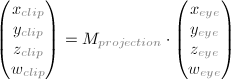  
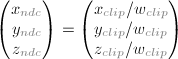

### 透视投影视锥体
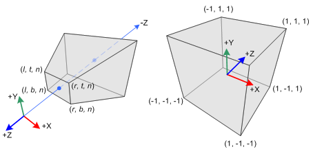*透视视锥体与归一化设备坐标*
  * 在透视投影中，截棱锥体（观察坐标）中的点坐标会被映射到立方体（NDC）中。x坐标的范围从[l,f]到[-1,1]，y坐标的范围从[b,t]到[-1,1]，z坐标的范围从[n,f]到[-1,1]。

### 观察空间中的点(xe,ye,ze)投影至近平面上的点(xp,yp,zp)
#### 点坐标的映射关系
以下为观察空间中的点被投影到近平面（投影平面）上的示意图：  
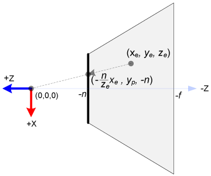*透视视锥体的俯视图*  
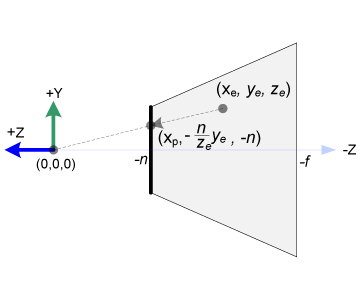*透视视锥体的侧视图*  

利用三角形相似的性质，可以得出以下对应关系：  
xp = -n/ze \* xe  
yp = -n/ze \* ye  
zp = -n  

### 观察坐标、裁剪坐标、归一化坐标（NDC）
这里，将观察坐标变量的下标简化为e，裁剪坐标变量简化为c，归一化坐标简化为n。

#### 裁减坐标的w分量（推导投影矩阵的第4行）
由以上得出的观察空间中的点(xe,ye,ze)投影至近平面上的映射关系，可知xp和yp都整除于-ze。  
故而，可以将裁减坐标的w分量设置为-ze。  
这样，投影矩阵的第4行为(0,0,-1,0)。如下所示。  
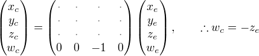*投影矩阵第4行*

### xp与yp映射到NDC的xn与yn
对于近平面上的点，可以通过**线性关系**进行映射。
xp与yp映射到NDC中的xn与yn：[l,r]=>[-1,1]，[b,t]=>[-1,1]。如下图所示。  
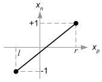*xp映射到xn*  
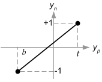*yp映射到yn*

#### 推导裁剪坐标的xc与yc（推导投影矩阵的第1、2行）
根据以上映射关系，可以推导出：  
xn = 2\*xp / (r-l) - (r+l)/(r-l)  
yn = 2\*yp / (t-b) - (t+b)/(t-b)  
将以上得出的观察空间中的点(xe,ye,ze)投影至近平面上的映射关系得出的方程，代入以上方程，可推导得：  
xn = (2\*n\*xe/(r-l) + (r+l)\*xe/(r-l)) / -ze  
yn = (2\*n\*ye/(t-b) + (t+b)\*ye/(t-b)) / -ze  
如此，可以得出投影矩阵的第1、2行：  
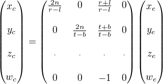*投影矩阵第1-2-4行*

### 逆投影（逆变换）操作找寻zn与ze之间的关系
### 推导投影矩阵的第3行
由于观察空间中的ze总是投影到近平面上的-n点，zn的计算方法与其他坐标的计算方法有稍许不同。  
因为，z并不依赖于x与y的值，故而可借助w分量找寻zn与ze之间的关系。即指定投影矩阵的第三行（如下所示），并通过逆投影（逆变换）操作，找出zn与ze之间的关系。  
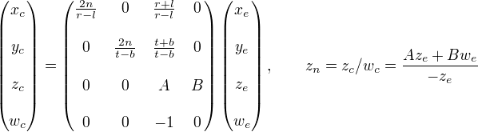*投影矩阵第3行*  
由于在观察空间中，we等于1。因而可以得出：  
zn = (A\*ze + B) / -ze  
将(ze,zn)的对应关系值(-n,-1)、(-f,1)代入以上方程，可得：  
A = - (f+n) / (f-n)  
B = - 2\*f\*n / (f-n)  

### 完整投影矩阵
由以上的推导结果，可以得到完整的投影矩阵：  
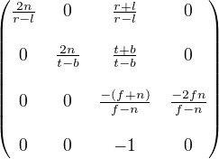*完整投影矩阵*

### 小结
由ze与zn之间的关系可以看出，它是一个有理数方程，且ze与zn为非线性关系。  
也就是说，近平面具有较高精度，而远平面的精度则很低。若[-n,-f]的范围变得很大，会引起深度精度问题（深度冲突）：远平面附近ze的小变化不会影响zn值。  
因此，为了最小化深度缓存精度问题，n与f的距离应该尽可能小。  
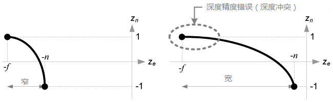*深度缓存精度比较*

## 正交投影矩阵推导
### 正交投影视锥体
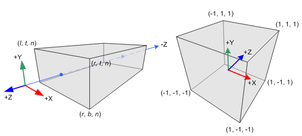*正交视锥体与归一化设备坐标*
  * 观察空间的xe、ye与ze分量都**线性映射**到NDC。我们只需将长方体缩放为正方体，然后移动它到原点。

### 观察空间的xe、ye与ze分量线性映射到NDC
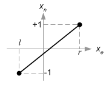*xe映射到xn*  
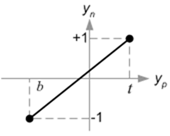*ye映射到yn*  
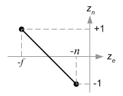*ze映射到zn*  
可以得出：  
xn = 2\*xe / (r-l) - (r+l)/(r-l)  
yn = 2\*ye / (t-b) - (t+b)/(t-b)  
zn = - 2\*ze / (f-n) - (f+n)/(f-n)  

### 正交投影并不需要w分量

### 完整正交矩阵
由以上的推导结果，可以得到完整的正交矩阵：  
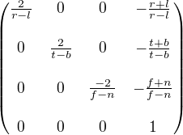*完整正交矩阵*